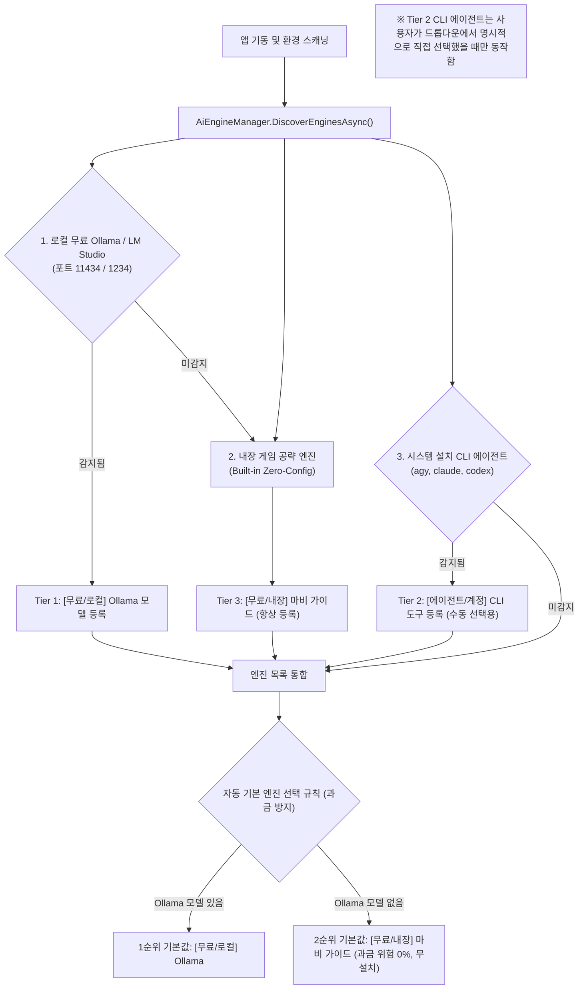

# 모비노기 AI도우미 (MobiMate) — 다중 AI 엔진 자동 감지 및 비용 최적화 폴백 상세설계서 (v3.1)

## 1. 개요 및 설계 배경

### 1.1 사용자 피드백 및 문제 정의
1. **타 PC 환경 호환성 결여**:
   - 개발 PC와 달리 지인이나 다른 사용자의 컴퓨터에는 Ollama가 설치되어 있지 않아 `⚠️ Ollama 오프라인 (미설치/중지)` 메시지가 출력되며 AI 질문 기능이 완전히 불능 상태가 됨.
2. **다양한 AI 에이전트 존재**:
   - PC마다 설치된 도구가 다름 (Ollama, LM Studio, Claude Code, Codex, Antigravity CLI 등).
   - 로컬에 설치된 AI 도구들을 자동으로 감지하여 사용자가 원하는 도구를 선택할 수 있어야 함.
3. **비용 및 접근성 최적화 ("가능하면 저렴하고 무료인 것")**:
   - 유료 API나 구독 없이도 완전히 무료로 동작하는 로컬 오프라인 엔진을 최우선 기본값으로 설정.
   - **자동 기본 선택(Default Auto-Selection)은 의도치 않은 과금 방지를 위해 100% 무료 엔진(Ollama 또는 내장 가이드)으로만 한정**.
   - 아무런 AI 툴이 설치되지 않은 일반 게이머 PC에서도 에러 없이 100% 동작하는 **내장 공략 지식베이스 엔진(Built-in Game Guide Engine)**을 제로-컨피그 기본 폴백으로 탑재.

---

## 2. 계층별 AI 엔진 감지 및 엄격한 무료 기본 선택 아키텍처



### 2.1 엔진 티어별 정의 및 비용/선택 정책

| 티어 | 엔진 구분 | 감지 방식 | 비용 / 네트워크 | 기본 선택 정책 | 비고 |
|---|---|---|---|---|---|
| **Tier 1** | **로컬 무료 Ollama / LM Studio** | `localhost:11434` REST API 조회 (1.5초) | **완전 무료 (0원)** / 오프라인 | **최우선 기본값** (감지 시) | PC 자원 활용 로컬 LLM |
| **Tier 3** | **내장 마비 가이드 엔진** | 앱 자체 내장 (Zero-Config) | **완전 무료 (0원)** / 오프라인 | **차순위 기본값** (Ollama 미감지 시 상시) | AI 미설치 일반 PC 100% 정상 작동 보장 |
| **Tier 2** | **AI 코딩 에이전트 CLI** | `where.exe agy/claude/codex` 탐색 (1초) | 각 에이전트 계정/토큰 정책 | **수동 선택 전용** (자동 기본값 제외) | 사용자가 명시적으로 선택 시에만 실행 |

---

## 3. 세부 컴포넌트 및 인터페이스 설계

### 3.1 공통 응답 및 인터페이스 계약 (`IAiEngine`)
```csharp
public record AiResponse(bool Success, string Reply, string? ErrorMessage = null);

public enum AiEngineType
{
    Ollama,         // 로컬 Ollama HTTP
    CliAgent,       // agy, claude, codex 프로세스 실행
    BuiltInGuide    // 내장 룰베이스/공략 DB
}

public record AiEngineInfo(
    string Id,              // 고유 식별자 (예: "ollama:gemma4:12b", "cli:agy", "builtin:guide")
    string DisplayName,     // 화면 표시명 (예: "[무료/로컬] 🦙 Ollama: gemma4:12b")
    AiEngineType Type,      // 엔진 타입
    string TargetModel,     // 모델명 또는 실행 커맨드
    string Description,     // 설명 및 비용 안내 (예: "완전 무료 오프라인 로컬 LLM")
    bool IsZeroCost         // 100% 무료 여부 (기본값 자동 선택 후보 판단)
);

public interface IAiEngine
{
    AiEngineInfo Info { get; }
    Task<AiResponse> GenerateResponseAsync(string prompt, string gameContext, CancellationToken ct = default);
}
```

### 3.2 안전한 CLI 프로세스 실행기 (`CliAgentEngine`)
- **보안 및 커맨드 인젝션 차단**:
  - `ProcessStartInfo.UseShellExecute = false` 설정.
  - 문자열 결합(`Arguments = ...`) 금지, **`ProcessStartInfo.ArgumentList`**를 사용하여 운영체제 API 레벨에서 인자 안전 분리.
    - 예: `info.ArgumentList.Add("-p"); info.ArgumentList.Add(fullPrompt);`
  - `CreateNoWindow = true`로 콘솔 창 깜빡임 차단.
- **프로세스 트리 누수 방지**:
  - 20초 비동기 타임아웃 적용.
  - 타임아웃 또는 사용자 취소 시 **`process.Kill(entireProcessTree: true)`**를 호출하여 스폰된 모든 하위 런타임(Node.js, Python 등) 즉시 강제 정리.
- **동시성 제어**:
  - `SemaphoreSlim(1, 1)` 기반 단일 진입 락 적용으로 질문 연타 시 중복 프로세스 생성 차단.

### 3.3 내장 마비 가이드 엔진 (`BuiltInGuideEngine`)
- **목적**: 다른 컴퓨터에서 실행 시 "Ollama 오프라인" 오류로 멈추지 않고, 즉각 친절한 공략과 실시간 캐릭터 데이터 해석을 100% 무료로 제공.
- **동작 방식**:
  - 실시간 주입된 게임 컨텍스트(현재 직업, 전투력, 가방 무게, 일일 미션, 생산 대기열 등)를 분석하여 상태별 조언 생성.
  - 마비노기 모바일 핵심 게임 룰 매칭:
    - 전투력 성장: 장비 각인, 룬 장착 순서, 칭호 보너스 가이드.
    - 골드 및 재화 파밍: 요일 던전, 일일/주간 미션 보상 극대화 팁.
    - 생산 및 가공: 가죽/천/금속 가공 시설 효율 및 쿨타임 관리.
    - 채집 위치: 광석, 약초, 목재 채집 추천 필드.
  - 추가로 "더 정교한 AI 대화를 원하시면 완전 무료 로컬 AI인 Ollama를 설치하실 수 있습니다 (https://ollama.com)" 안내 포함.

### 3.4 `AiEngineManager` (오케스트레이터)
- `DiscoverEnginesAsync(ct)`:
  1. `Ollama` 프로빙 (`http://localhost:11434/api/tags`, 타임아웃 1.5초).
  2. `where.exe` 비동기 프로빙 (`agy`, `claude`, `codex`, 타임아웃 1초, `CreateNoWindow = true`).
  3. `BuiltInGuideEngine` 상시 등록.
  4. **기본 엔진 선정**:
     - 이전 저장된 설정(`SavedAiEngineId`)이 유효하면 해당 엔진 선택.
     - 없거나 유효하지 않은 경우:
       - Ollama 모델이 존재하면 첫 번째 Ollama 모델 선택 (`IsZeroCost == true`).
       - Ollama가 없으면 **`BuiltInGuideEngine`을 기본값으로 자동 선택** (`IsZeroCost == true`, 유료 CLI 자동 선택 절대 배제).

---

## 4. UI/UX 개선 상세

1. **ComboBox 가시성 및 비용 명확 배지**:
   - `[무료/로컬] 🦙 Ollama: gemma4:12b`
   - `[무료/내장] 💡 내장 마비 가이드 (즉시 사용)`
   - `[에이전트/계정] 🤖 Antigravity (agy)`
   - `[에이전트/계정] 🟣 Claude Code (claude)`
   - `[에이전트/계정] 🟢 OpenAI Codex (codex)`
2. **지능형 상태 피드백 (인앱 토스트)**:
   - 로컬 Ollama 감지 시: `"💡 로컬 무료 AI(Ollama)가 감지되어 기본 엔진으로 설정되었습니다."`
   - AI 미설치 PC 감지 시: `"💡 완전 무료 내장 마비 가이드가 기본 엔진으로 설정되었습니다. (설치 불필요)"`
   - CLI 에이전트 선택 시: `"⚠️ CLI 에이전트가 선택되었습니다. (각 에이전트의 계정/토큰 정책이 적용됩니다)"`

---

## 5. 단계별 구현 및 검증 계획

- **1단계 (설계 승인)**: 본 개정 상세설계서 서브에이전트 재검토 및 최종 승인.
- **2단계 (엔진 모듈화)**:
  - `AiEngineInterfaces.cs` (`IAiEngine`, `AiEngineInfo`, `AiResponse`)
  - `BuiltInGuideEngine.cs` (룰베이스 & 캐릭터 상태 분석 가이드)
  - `CliAgentEngine.cs` (ArgumentList + Kill(entireProcessTree: true) 기반 안전 실행기)
  - `OllamaAiEngine.cs` (기존 Ollama 연동 추상화)
  - `AiEngineManager.cs` (엔진 검색, 우선순위, 캐싱)
- **3단계 (UI 연동)**: `MainWindow.xaml.cs`의 `CmbAiEngine` 및 질문 발송 로직을 `AiEngineManager`로 일원화.
- **4단계 (검증 및 리뷰)**:
  - Ollama 실행 환경 및 오프라인 환경 모의 테스트.
  - 서브에이전트 최종 코드/테스트 리뷰 및 `dotnet publish` 배포.
