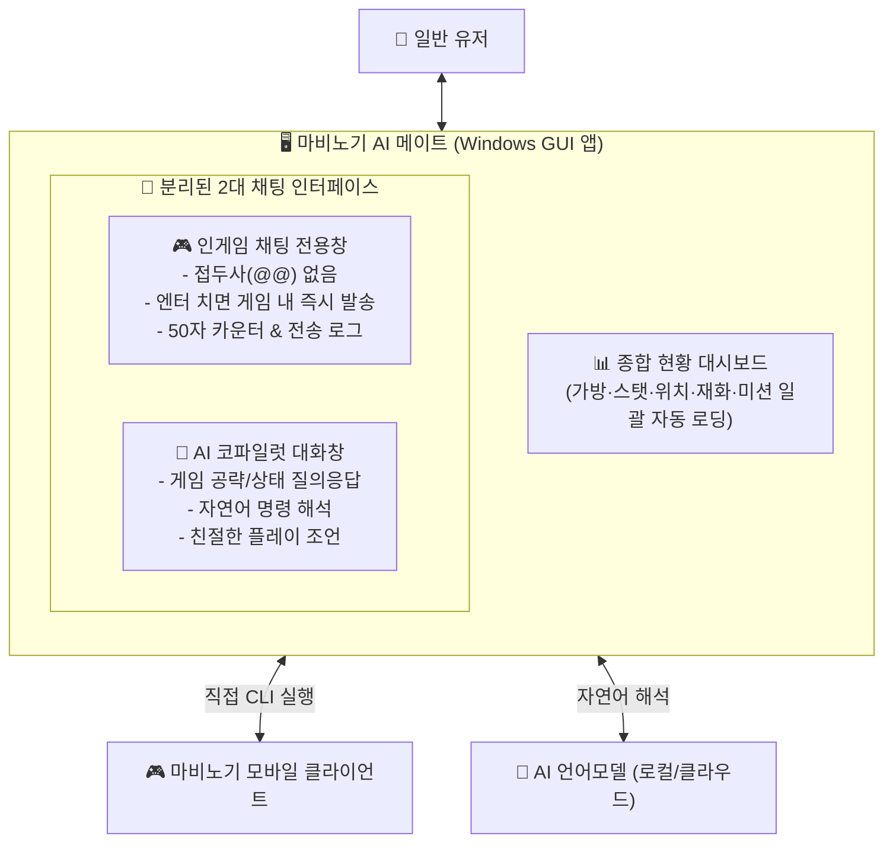

# 마비노기 모바일 AI 메이트 — 요구사양서 (v2.1 대시보드 & 분리 채팅)

> **"한눈에 보는 종합 상황판 + 원클릭 인게임 채팅 + 똑똑한 AI 코파일럿"**  
> AI 프롬프트나 복잡한 명령어 없이, 일반 유저가 마비노기 모바일을 플레이하며 옆에 띄워두고 사용하는 올인원 윈도우 보조 앱입니다.

---

## 1. 제품 개요 및 핵심 요구사항



### v2.1 핵심 개선 사항 (피드백 반영)
1. **일괄 현황 대시보드 (Dashboard)**:
   - 정보를 하나씩 버튼 눌러 확인하지 않고, 앱 시작 및 새로고침 시 **캐릭터 스탯, 가방 무게, 위치/날씨, 주요 재화, 일일 미션**을 한 번에 모두 가져와 직관적인 카드 형태로 표시.
2. **채팅창의 완전한 역할 분리**:
   - **`@@` 접두사 제거**: 더 이상 번거롭게 골뱅이를 붙일 필요 없음.
   - **인게임 채팅 전용창**: 여기에 타이핑하고 엔터를 치면 즉시 게임 내 전체 채팅으로 전송.
   - **AI 코파일럿 대화창**: AI에게 질문하거나 조언을 구할 때 쓰는 일반 대화창으로 완전히 분리.
3. **안정적인 게임 연동**:
   - `write_chat` CLI 규격(커맨드라인 인자 전달)에 맞추어 즉시 전송 보장.

---

## 2. 화면 레이아웃 설계 (1080x750)

```
┌────────────────────────────────────────────────────────────────────────────────────────┐
│ 🟢 [아이라] 격투가 Lv.100 (전투력: 88,737) │ 📍 페카 고분 심층 (맑음 ☀️)  │ [🔄 전체 새로고침] │
├───────────────────────────────┬────────────────────────────────────────────────────────┤
│ 📊 종합 현황 대시보드         │ 💬 채팅 & 대화 (탭 분리)                                │
│                               ├──────────────────────────┬─────────────────────────────┤
│ 🎒 [가방 무게]                │ [🎮 인게임 채팅] (선택됨) │ [🤖 AI 코파일럿 대화]       │
│   ■■■■■■■■□□ 83.0%           ├──────────────────────────┴─────────────────────────────┤
│   854.6 / 1030.0 (여유 부족)  │ 📢 [15:20] 던바튼 광장 가실 분 계신가요? (전송됨)        │
│                               │ 📢 [15:22] 길드 레이드 파티 구합니다~ (전송됨)          │
│ 💰 [보유 재화]                │                                                        │
│   • 골드: 11,144,590 G        │                                                        │
│   • 정령의 날개: 18,854개     │                                                        │
│   • 냥 토큰: 124,017개        │                                                        │
│                               │                                                        │
│ 📜 [일일 미션 현황]           │                                                        │
│   • 11 / 11개 완료 (100% 🎉)  │                                                        │
│                               ├────────────────────────────────────────────────────────┤
│ 🛑 [긴급 행동 정지]           │ [ 인게임으로 보낼 채팅을 입력하세요 (최대 50자)... ] [전송]│
└───────────────────────────────┴────────────────────────────────────────────────────────┘
```

---

## 3. 세부 기능 요구사양

### (1) 좌측: 실시간 종합 현황 대시보드
- **자동 로딩**: 앱 실행 시 백그라운드 스레드에서 `get_my_info`, `get_current_environment`, `get_currencies`, `get_daily_missions`를 동시에 호출하여 화면에 렌더링.
- **가방/무게 게이지**:
  - 현재 무게 / 최대 무게 및 퍼센티지 바 표시.
  - 80% 이상 주황색, 90% 이상 빨간색 시각적 경고.
- **보유 재화**: 골드, 정령의 날개, 냥 토큰 등 필수 화폐 콤팩트 요약.
- **일일 미션**: 완료 개수 / 전체 개수 프로그레스 및 진행 상태 한눈에 확인.
- **긴급 버튼**: 클릭 즉시 캐릭터의 모든 동작을 멈추는 `[🛑 행동 즉시 정지]` 버튼 상시 노출.

### (2) 우측 탭 1: 인게임 채팅 전용창 (Game Chat)
- **전송 메커니즘**:
  - 별도의 `@@` 없이 입력창에서 엔터를 누르면 `MabinogiMobile_CLI.exe write_chat "<문구>"` 실행.
  - 불필요한 [y/N] 확인 단계 완전 제거.
- **안전 및 편의 장치**:
  - 50자 글자 수 카운터 (게임 내 50자 제한 초과 방지).
  - 전송 완료 문구에 타임스탬프와 함께 녹색 체크 표시.
  - 빈 문자열 또는 공백만 입력 시 전송 차단.

### (3) 우측 탭 2: AI 코파일럿 대화창 (AI Copilot)
- **자연어 상담 & 도우미**:
  - "가방 비우려면 어디로 가야 해?", "오늘 미션 뭐 남았어?", "사과 어디서 캐?" 등 질문 응답.
  - 추천 명령어 및 팁을 카드 형식으로 제공.
  - 추후 Ollama / LLM API 연동 스위치 지원.
