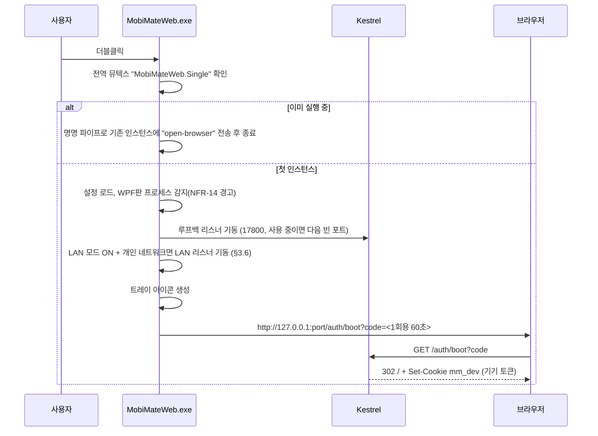
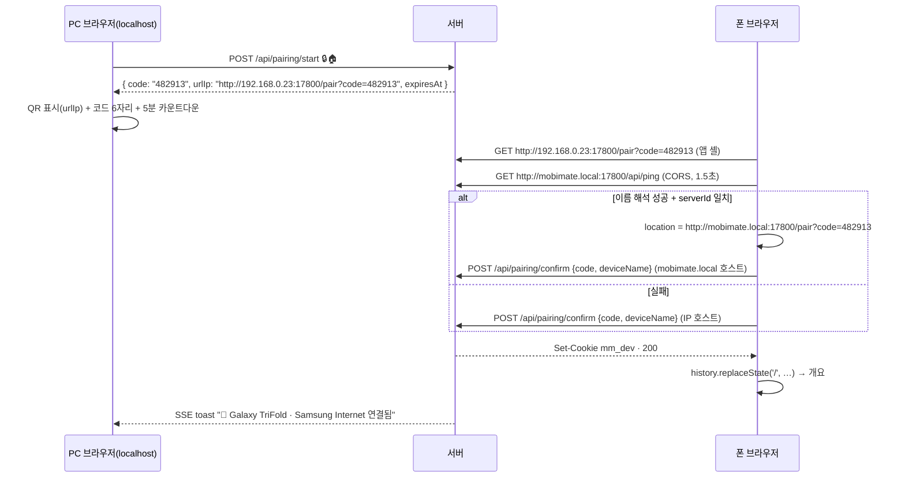

# MobiMate Web — 상세설계서 (S1, v1.0)

> **입력**: [`REQUIREMENTS.md`](./REQUIREMENTS.md) v1.3 (v1.3 반영분: §2.8 숙제 트래커, §3.8 API, §4.2 라우팅) · **화면 시안**: [`design/mockup.html`](./design/mockup.html)
> **범위**: S2~S6 구현에 필요한 구조·인터페이스·흐름·화면 규칙. WPF판(`master`)과는 코드를 공유하지 않는다 (요구사양서 Q2).
> 요구사항 ID(FR-·NFR-·SEC-·TST-)는 요구사양서를 가리킨다.

---

## 1. 솔루션 구성

```
web/
├─ MobiMate.Web.sln
├─ src/
│  ├─ MobiMate.Core/            net8.0          (UI 의존 0, Windows 전용 API는 인터페이스 뒤로)
│  ├─ MobiMate.Web/             net8.0-windows  (ASP.NET Core + 트레이 + 내장 정적 파일)
│  └─ client/                   Vite + React 18 + TS 5
├─ tools/
│  └─ FakeCli/                  net8.0 콘솔     (가짜 MabinogiMobile_CLI.exe)
└─ tests/
   ├─ MobiMate.Core.Tests/      xUnit
   ├─ MobiMate.Web.Tests/       xUnit + WebApplicationFactory
   └─ e2e/                      Playwright
```

| 프로젝트 | 참조 | 주요 패키지 |
|---|---|---|
| Core | — | `System.Text.Json` (내장) |
| Web | Core | `Makaretu.Dns.Multicast`(mDNS, S2 실측 후 확정), `QRCoder`(QR PNG), WinForms `NotifyIcon`(트레이) |
| FakeCli | Core(모델만) | — |
| client | — | `react-router`, `@tanstack/react-query`, `@tanstack/react-virtual`, `zustand`, `markdown-it`(HTML 비활성), `@fontsource/ibm-plex-sans-kr`·`@fontsource/barlow-semi-condensed`(폰트 번들) |

- Core는 `net8.0`으로 둔다. WPF판 파일을 복사해 출발했지만 WPF판과 코드를 공유하지 않으며, 이후 독립적으로 고친다.
- 배포: `MobiMate.Web`을 `PublishSingleFile=true`, `SelfContained=false`로 게시한다. 클라이언트 빌드 결과(`client/dist`)는 **임베디드 리소스**로 넣고 `ManifestEmbeddedFileProvider`로 서빙한다. 산출물은 `MobiMateWeb.exe` + `MobiMateWeb.zip`이다. WPF판 `MobiMate.exe`와 이름이 겹치지 않게 한다.

---

## 2. MobiMate.Core 설계

### 2.1 이관 대상과 변경점

| 원본(WPF 루트) | Core 위치 | 변경 |
|---|---|---|
| `Models.cs` | `Models/GameModels.cs` | 그대로. `NearPcItem`에 `IsInParty`·`IsFriend`는 이미 있음. `ActivityInfo`에 `IsDead` 추가 |
| `GameCliService.cs` | `Cli/GameCli.cs` + `Cli/CliLanes.cs` | `IGameCli` 인터페이스 추출, 레인 구조(§2.2), JSON 본문을 `JsonSerializer`로 생성(D-02), 채팅 절단을 `ChatText`로 위임 |
| `ChatPlanService.cs` | `Chat/ChatPlanService.cs` | 절단을 `ChatText.Truncate`로 교체(FR-GC-02). 규칙표는 그대로 |
| — (신규) | `Chat/ChatText.cs` | 글자 수 세기·절단 단일 규칙 (§2.4) |
| `ChatterPersona.cs`, `PersonaTemplatesData.cs` | `Chatter/` | 그대로 + `NeutralLines` 풀 추가(D-03) |
| `InGameChatterService.cs` | `Chatter/ChatterLineService.cs` | `DispatcherTimer`, `IntervalSeconds`, `TriggerChatterAsync`, `send_chat` 제거(D-01·D-05). `GenerateLineAsync(persona, custom?, ctx, ct)`만 남김. 결과에 `UsedFallback` 플래그 |
| `CustomPersona.cs` | `Chatter/CustomPersona.cs` | 그대로 |
| `SnapshotManager.cs` | `Storage/SnapshotManager.cs` + `Storage/JsonFileStore.cs` | 파일 입출력을 `JsonFileStore`(원자적 쓰기·손상 격리)로 위임. 공개 API 유지 |
| `AiEngineInterfaces.cs`, `AiEngineManager.cs`, `BuiltInGuideEngine.cs`, `CliAgentEngine.cs`, `OllamaAiEngine.cs`, `OllamaService.cs` | `Ai/` | `IAiEngine`에 스트리밍 메서드 추가(§2.5). 엔진 선택 저장은 `ISettingsStore` 경유 |
| `AdaptiveRefreshController.cs` | `Refresh/` | 그대로 (TS 구현의 기준 테스트 벡터 제공용) |
| — (신규) | `Intent/CommandIntentParser.cs` | 자연어 디스패치 판정(FR-AI-05, D-07) |
| — (신규) | `Game/GameStateCache.cs` | 헤더·가방·재화 등 최신 스냅샷 보관, 컨텍스트 문자열 생성 |

### 2.2 CLI 레인 (NFR-06)

```csharp
public enum CliLane { General, LongRunning, Priority }

public interface IGameCli
{
    bool IsAvailable { get; }
    string CliPath { get; }
    Task<CliResult> RunAsync(CliCommand cmd, CancellationToken ct = default);
}

public sealed record CliCommand(string Name, IReadOnlyList<string> Args, object? Body, CliLane Lane, TimeSpan Timeout);
public sealed record CliResult(bool Ok, string Stdout, string? Error, TimeSpan QueueWait, TimeSpan Exec);
```

- `GameCli`는 레인마다 `SemaphoreSlim(1,1)`을 따로 둔다. `Priority`는 세마포어를 쓰지 않는다.
- 레인은 명령 이름으로 자동 결정한다: `execute_gathering` → LongRunning, `stop_action`·`stand_up` → Priority, 나머지 → General. 호출자는 레인을 지정하지 않는다.
- `Body`는 `JsonSerializer.Serialize(Body)`로 만든 문자열을 `ArgumentList` 마지막 인자로 넣는다 (현행 CLI 규격 유지).
- `QueueWait`·`Exec`를 결과에 담아 NFR-09 로그에 쓴다.
- **S2 실측 1**: 채집 중 `stop_action` 병행 실행. 실패하면 대안으로 `execute_gathering` 프로세스를 `Kill(entireProcessTree)`한 뒤 `stop_action`을 보내는 방식을 검토한다.

### 2.3 저장 계층

```csharp
public sealed class JsonFileStore
{
    // 읽기: 없으면 null. 0바이트·손상 파일은 *.corrupted.yyyyMMdd_HHmmss.bak 으로 격리하고 null (WPF판 이름 규칙 유지)
    public T? Load<T>(string path) where T : class;
    // 쓰기: 같은 폴더 임시 파일 → 대상이 있으면 File.Replace(백업 *.bak 1개), 없으면 File.Move. 실패하면 false
    public bool Save<T>(string path, T value);
}
```

- 저장 폴더는 `%APPDATA%\MobiMateWeb\`이다(WPF판과 분리). 웹 전용 파일은 `web_settings.json`, `devices.json`, `chat_log_session.json`(선택)이다.
- 쓰기는 프로세스 안에서 파일별 `lock`으로 직렬화한다. 웹앱은 전용 폴더(`%APPDATA%\MobiMateWeb`)를 쓰므로 WPF판과 같은 파일을 동시에 쓰지 않는다. 서버는 기동할 때 `SnapshotManager.ImportMissingFrom(SnapshotManager.WpfStorageDirectory)`(없는 파일만 복사)와 `HomeworkStore.ImportFromWpfIfMissing`(형식 변환)으로 WPF판 기록을 가져온다.

### 2.4 채팅 글자 수 규칙 (FR-GC-02)

```csharp
public static class ChatText
{
    public const int MaxLength = 50;
    public static ChatCountMode Mode { get; set; } = ChatCountMode.CodePoint; // S6 실측(TST-07) 후 확정
    public static int Count(string s);                // Mode 기준 길이
    public static string Truncate(string s, int max); // 서러게이트 페어를 쪼개지 않음
    public static string Sanitize(string s);          // 개행→공백, 앞뒤 공백 제거
}
```

- 클라이언트는 이 규칙을 복제하지 않는다. 입력 중 카운트는 `Intl.Segmenter` 없이 `[...s].length`(코드포인트)로 **즉시** 표시하고, 전송 직전과 미리보기 API 응답으로 서버 값을 확인한다. 모드가 바뀌면 `/api/meta`의 `chatCountMode`로 클라이언트 계산식을 바꾼다.

### 2.5 AI 엔진 스트리밍

```csharp
public interface IAiEngine
{
    AiEngineInfo Info { get; }
    Task<AiResponse> GenerateResponseAsync(string prompt, string gameContext, CancellationToken ct = default);
    IAsyncEnumerable<string> StreamAsync(string prompt, string gameContext, CancellationToken ct = default)
        => Fallback(); // 기본 구현: GenerateResponseAsync 결과를 한 조각으로 반환
}
```

- `OllamaAiEngine`만 `/api/chat` `stream:true`의 NDJSON을 줄 단위로 읽어 토큰을 넘긴다.
- `CliAgentEngine`은 기본 구현을 쓴다. 취소 시 `Kill(entireProcessTree:true)`는 현행 그대로다(FR-AI-08).
- `AiEngineInfo`에 `CostTier`(`Builtin | LocalFree | Paid`)를 추가한다. 비용 배지(FR-AI-03)에 쓴다.

### 2.6 자연어 명령 판정 (FR-AI-05, D-07)

```csharp
public enum IntentKind { None, Stop, CheckDailyMissions, InventoryDiet, CollectWorks, Gather }
public sealed record CommandIntent(IntentKind Kind, string? ItemName = null, int? Count = null);

public static class CommandIntentParser
{
    public static CommandIntent Parse(string input, IReadOnlyCollection<string> gatherableNames);
}
```

| 의도 | 판정 | 결과 |
|---|---|---|
| Stop | 공백·문장부호 제거 후 정규식 `^(긴급)?(정지|멈춰|스톱|그만)(해|해줘|해라)?$` | 즉시 실행 (안전 기능) |
| CheckDailyMissions | `숙제`, `일일 미션`, `일일미션` 포함 | 숙제 화면(`/homework`) 이동 + 남은 숙제 요약 (부작용 없음) |
| InventoryDiet | `다이어트`, `가방 정리`, `무게 줄여` 포함 | 가방 화면 다이어트 필터 |
| CollectWorks | `수거`, `작업대`, `가공물` 포함 | 수거 가능 목록 카드 (실행 안 함) |
| Gather | 동사 키워드(채집·캐줘·캐라·캐러·모아줘·수집·낚시·낚아) + 채집 가능 이름(긴 이름 우선) | 확인 카드 (실행 안 함) |

- 수량은 `(\d+)\s*(개|마리)?`를 뽑아 `Count`에 넣는다. 없으면 채집 도우미의 목표치 기준 부족 수량을 쓴다.
- 판정 순서는 표 위에서 아래다. "정지 기능 알려줘"는 Stop 정규식에 맞지 않아 LLM으로 넘어간다.

### 2.7 게임 상태 캐시

`GameStateCache`(싱글턴)는 조회 결과를 받을 때마다 갱신한다. 다음 두 가지를 한곳에서 만든다.

- `BuildAiContext()`: AI 시스템 컨텍스트 문자열 (WPF `ProcessAiQueryAsync`의 내용과 동일)
- `BuildChatterContext()`: `ChatterContext` (WPF `GetCurrentChatterContext`와 동일)

AI 질의나 한마디 생성 때 캐시가 30초보다 오래됐으면 `header` 조회를 한 번 먼저 한다.

### 2.8 스마트 숙제 트래커 (REQUIREMENTS §5.11, §4.3)

```
Homework/
├─ homework_catalog.json      내장 리소스. 31종 정의 (FR-HW-01)
├─ HomeworkCatalog.cs         카탈로그 로드·검증(TST-10), override 병합(P2)
├─ KstClock.cs                KST 현재 시각, 마지막/다음 일일(06:00)·주간(월 06:00) 리셋
├─ HomeworkStore.cs           homework_records.json (JsonFileStore), 캐릭터별 + 계정 공통 레코드, WPF 형식 변환
└─ HomeworkEvaluator.cs       순수 함수: (카탈로그, 레코드, 관측 스냅샷, 시각) → (새 레코드, 변경 목록, 진행 신호)
```

- **KstClock**: 한국은 일광절약시간이 없으므로 OS 시간대 데이터에 의존하지 않고 `DateTimeOffset.UtcNow.ToOffset(TimeSpan.FromHours(9))` 고정 오프셋으로 계산한다. 저장은 UTC로 하고, 테스트는 시각 함수를 주입한다.
- **리셋 적용**: 레코드에 `LastDailyReset`·`LastWeeklyReset`(KST)을 둔다. 평가 때마다 현재 KST 기준 마지막 리셋 시각과 비교해 지났으면 해당 주기 항목을 전부 초기화한다(H-5). 서버가 꺼져 있던 동안 밀린 리셋도 이 비교 한 번으로 처리된다.
- **평가 규칙** (FR-HW-04~06):

| 판정 방식 | 입력 | 결과 |
|---|---|---|
| `DirectMission` | 일일·주간 미션 목록에서 카탈로그의 `missionTitles`와 정규화 후 **정확히 일치**하는 항목 | 진행도 동기화, 목표 도달 시 자동 완료 |
| `MissionTotal` | 일일·주간 미션 전체 완료 개수 | 진행도 동기화, 전부 완료 시 자동 완료 |
| `QuestAllObjectives` | `questTitlePatterns`와 일치하는 퀘스트의 **모든 목표** 완료 | 자동 완료 |
| `AlteringCollected` | 서버의 수거 성공 이벤트, 또는 같은 캐릭터 키의 연속 성공 조회 두 번에서 (시설, 작업명)별 완료 개수 감소 | 자동 완료 |
| `ManualStepCounter` | — (사용자가 0~목표 단계 입력) + 진행 신호 | 목표 단계 도달 시 수동 완료 |
| (보조) `ProgressSignal` | `bossNames`와 `AutoPlayTargetDisplayName` 일치 + 전투 중, 또는 `spaceNames`와 `GameSpaceDisplayName` 정확히 일치 + 전투 중 | "진행 중" 표시만 (완료 안 함) |
| `ManualOnly` | — | 수동 체크만 |

- **정규화**: `Regex.Replace(text, "<[^>]+>", "")` → 공백 제거 → 대소문자 무시.
- **수동 우선**: 항목 상태에 `ManualOverride`를 두고, 설정되면 평가기가 그 항목을 건드리지 않는다. 리셋 때 해제된다.
- **판정 방식은 항목당 하나**: 평가기는 카탈로그의 `mode`에 해당하는 규칙만 돈다(H-10). `ProgressSignal`은 어느 모드에도 덧붙일 수 있는 보조 신호다. 목표가 0개인 퀘스트는 `QuestAllObjectives` 근거가 되지 않는다.
- **공유 풀**: 풀 완료 여부는 "풀 안 항목 중 하나라도 완료"로 계산한다. 형제 항목의 상태를 복사해 두지 않는다(WPF판의 형제 동기화 방식은 해제할 때 상태가 꼬인다).
- **판정 근거**: 자동 완료 때 `Evidence` 문자열을 저장한다(FR-HW-13).
- **가공 수거 판정의 한계**: 조회 실패나 빈 응답은 판정 근거로 쓰지 않는다(오탐 방지). 그래서 마지막 완료 작업을 수거해 대기열이 **완전히 비면** 자동 완료되지 않는다. 앱에서 수거했거나 대기열에 다른 작업이 남아 있으면 자동 완료된다. 나머지 경우는 사용자가 한 번 눌러 완료한다.
- **저장**: 기록은 메모리에 두고, 항목·리셋·가공 개수가 바뀌었을 때만 저장한다. 파일을 읽지 못하면 빈 기록으로 덮어쓰지 않는다(판정은 건너뛰고, 수동 조작은 오류로 알린다). 저장에 실패하면 메모리 변경을 버리고 다음 호출에서 다시 읽는다.
- **가져오기**: 파일별로 웹앱 쪽 파일이 없을 때만 `%APPDATA%\MobiMate\homework_records.json`(WPF, 캐릭터 키 → 레코드)을 읽는다. 카탈로그에서 계정 공통인 항목은 가장 최근에 완료된 값을 계정 레코드로 옮긴다. 이번 주기에 해당하지 않는 완료 기록과 `Default_Player` 레코드는 버린다. `SnapshotManager.ImportMissingFrom`도 파일별 규칙이다. WPF판 자동 판정 완료는 오탐 가능성이 있어 가져오지 않고 수동 완료만 가져온다(자동 항목은 웹앱 규칙으로 재판정).

---

### 2.9 컷오프 추천 (REQUIREMENTS §5.12, WPF v1.2.0)

```csharp
public sealed record CutoffTier(string Name, long MinCombat, long RecCombat, long OverCombat, long MinMdef, long OverMdef);
public sealed record CutoffContent(string Id, string Name, string Icon, IReadOnlyList<CutoffTier> Tiers);
public enum CutoffStatus { Locked, Marginal, Near, Overwhelm }   // 입장 불가 / 턱걸이 / 압도 근접 / 압도
public sealed record CutoffResult(string Id, string Name, string? MaxEntryTier, string? RecommendedTier, CutoffStatus Status,
    int OverwhelmPct, long CombatToOverwhelm, long MdefShort, CutoffNext? Next, CutoffShort? EntryShort);
public static class CutoffEvaluator { public static CutoffResult Evaluate(CutoffContent c, long combat, long mdef); }
```

- 카탈로그: `Cutoff/cutoff_catalog.json`(임베디드) + 사용자 폴더 `cutoff_catalog.override.json`(콘텐츠 ID 단위로 교체). 로드 시 난이도 순서(입장 전투력 오름차순)와 음수 값 검증.
- 판정은 문구·색을 만들지 않는다. WPF판 `DungeonCutoffService`의 색(`#39D353` 등)·문장은 클라이언트가 토큰과 문구 템플릿으로 만든다.
- 스냅샷: `CharacterSnapshot.ArcaneResistance`, `SessionDelta.ArcaneResistanceDiff` 추가(WPF판 v1.2.0과 같은 이름). 기존 파일에 필드가 없으면 0으로 읽는다.
- 에린 시간: `DisplayFormat.ErinnTime`은 원형 문자열 + 낮·밤 배지(K-11). 아무말 대잔치 컨텍스트도 같은 함수를 쓴다.
- 레이드 확인 제안(FR-HW-17): `HomeworkEvaluator`가 캐릭터 장부에 레이드 증표 수량(`RaidTokens`)과 관찰 시각을 저장한다. 비교 조건은 같은 캐릭터 연속 관찰(`HomeworkFile.LastObservedCharacter`로 재기동 뒤에도 판단) + 같은 주간 주기(10분 규칙은 쓰지 않음, 레이드 중 조회가 끊겨도 놓치지 않게). 목록에 없는 증표는 기준값 유지. 증가를 보면 항목에 `HomeworkSuggestion("raidTokenIncreased", 재화 이름, 이전, 현재)`을 단다. 완료 상태는 바꾸지 않는다. 캐릭터 전환이 감지되면 `get_currencies` 캐시를 비운다.

## 3. 로컬 서버 설계 (MobiMate.Web)

### 3.1 기동 흐름



- 트레이 메뉴: `브라우저 열기`(새 기동 코드), `📱 폰으로 보기`(QR 창), `LAN 모드 켜기/끄기`, `로그 폴더 열기`, `종료`.
- 콘솔 창은 띄우지 않는다(`OutputType=WinExe`). 로그는 파일로 남긴다.

> **v1.5 안내 (요구사양 Q8):** 아래 §3.2·§3.3의 Host·Origin 검증, 세션·기기 토큰, CSRF, 기동 코드, 페어링, 기기 폐기는 **모두 제거했다.** 현재 서버에는 LAN을 껐을 때 요청을 거절하는 `LanGate`(421)와 CLI 경로 변경의 PC 전용 규칙만 남아 있다. 아래는 구현 이력으로 남긴다.

### 3.2 요청 파이프라인

```
요청 → HostFilter(SEC-01, 421)
     → OriginCheck(SEC-02, GET·HEAD 외 요청의 Origin 불일치·누락 시 403)   ← 예외 경로(/api/pairing/confirm 포함)보다 먼저
     → StaticFiles(인증 불필요, index.html·자산)
     → /auth/boot, /api/ping, /api/pairing/confirm (예외 경로: 세션·CSRF 면제)
     → DeviceAuth(SEC-03·05, 401) → CsrfCheck(SEC-04, 비GET 403)
     → LoopbackOnly 필터(🏠 엔드포인트만, SEC-08, 403) → 엔드포인트
```

- 정적 파일은 인증 없이 준다. 앱 셸이 떠야 401 안내 화면을 보여줄 수 있기 때문이다. 셸에는 개인 데이터가 없다.
- 응답 헤더: `Cache-Control: no-store`(API), `X-Content-Type-Options: nosniff`, `Referrer-Policy: no-referrer`, `Content-Security-Policy: default-src 'self'; img-src 'self' data:; media-src 'self' blob:; style-src 'self' 'unsafe-inline'; connect-src 'self' http://<실제 mDNS 이름>:<port>; frame-ancestors 'none'`. `connect-src`의 mDNS 이름은 실제로 광고 중인 이름으로 요청마다 만든다(§3.6). 화면 켜두기용 음소거 영상은 번들 파일로 넣는다(`media-src 'self'`).

### 3.3 인증·기기 관리

| 요소 | 설계 |
|---|---|
| 기기 토큰 | 32바이트 난수(Base64Url). 쿠키 `mm_dev`, `HttpOnly; SameSite=Strict; Path=/`. 서버는 `SHA-256(token)`만 `devices.json`에 저장 |
| 기기 레코드 | `{ id, name, kind: local|lan, createdAt, lastSeenAt, expiresAt, hash }`. LAN 기기는 `expiresAt = 발급 + 30일`(SEC-10), 로컬은 만료 없음 |
| CSRF 값 | 기기 세션마다 `HMAC(serverSecret, deviceId)`. `GET /api/session`이 반환하고, 클라이언트는 메모리에만 들고 헤더로 보낸다 |
| 기동 코드 | 메모리 딕셔너리, 60초, 1회용. `/auth/boot`는 루프백 요청만 받는다 |
| 페어링 코드 | 6자리 숫자, 5분, 1회용. 코드별 실패 5회 또는 IP별 실패 5회면 10분 잠금 |
| 폐기 | 레코드 삭제 → `SseHub.Disconnect(deviceId)` 즉시 호출 (SEC-07) |
| 만료 | 10분마다 도는 정리 작업이 `expiresAt`이 지난 기기를 지우고 같은 방식으로 SSE를 닫는다. 요청 시에도 만료를 검사한다 |
| 기기 이름 | 페어링 때 UA로 추정(`Android · Samsung Internet` 등). 설정에서 수정 가능 |

### 3.4 조회 캐시와 단일 비행 (NFR-07)

```csharp
public sealed class QueryCache
{
    // 같은 키의 동시 요청은 하나의 Task를 공유하고(단일 비행), 완료 후 TTL(기본 3초) 동안 재사용
    public Task<CliResult> GetAsync(string key, Func<CancellationToken, Task<CliResult>> factory, TimeSpan? ttl = null);
    public void Invalidate(params string[] keys); // 조작 후 관련 키 무효화
}
```

- 공유 작업(factory)에는 **호출자 토큰이 아닌 독립 토큰**(명령 타임아웃만 적용)을 준다. 각 호출자는 `task.WaitAsync(callerCt)`로 기다린다. 그래서 먼저 요청한 기기가 화면을 옮겨 요청을 취소해도, 같은 결과를 기다리는 다른 기기의 요청은 끊기지 않는다.

| 조작 | 무효화 키 |
|---|---|
| 채집 완료 | `get_items`, `get_my_info`, `get_currencies`, `get_activity` |
| 수거 | `get_altering_works`, `get_items`, `get_my_info` |
| 정지 | `get_activity` |
| 채팅 전송 | (없음) |

### 3.5 SSE 허브

- 엔드포인트 `GET /api/events`. 연결마다 `deviceId`와 `connectionId`를 갖는다.
- 이벤트(`event:` 이름 / `data:` JSON):

| 이벤트 | 데이터 | 발생 |
|---|---|---|
| `hello` | `{ serverId, connectionId }` | 연결 직후 |
| `status` | `{ state: connected|disconnected|cli_missing, since }` | 10초 폴링 결과가 바뀔 때 (FR-CN-01) |
| `header` | `HeaderDto` | 누군가 header를 새로 조회했을 때 (다른 기기도 최신화) |
| `toast` | `{ level, message }` | 서버발 알림 (채집 결과, 수거 결과 등) |
| `gather` | `{ jobId, state: running|completed|stopped|failed, gained, item }` | 채집 작업 상태 변경 |
| `chat.logged` | `ChatLogEntryDto` | 채팅 전송 로그 추가 |
| `state.changed` | `{ keys: ["persona","engine","settings"] }` | FR-MB-15 공유 상태 변경 → 클라이언트가 재조회 |
| `homework.changed` | `{ characterKey, ids: [...], reason: "auto" \| "manual" \| "reset" }` | 자동 판정·수동 설정·리셋으로 숙제 상태가 바뀜 → `['homework']`·`['overview']` 무효화 |
| `ping` | — | 20초마다 (프록시·절전 감지용) |

- 연결 끊김 감지: 쓰기 실패 시 제거. 클라이언트는 `ping`이 45초 동안 없으면 스스로 재연결한다.

### 3.6 LAN 모드·네트워크 감시

- **앱은 하나만 둔다**(DI 컨테이너·HostedService 하나). Kestrel 엔드포인트는 메모리 설정 공급자에서 읽고 `KestrelServerOptions.Configure(config.GetSection("Kestrel"), reloadOnChange: true)`로 묶는다. LAN 모드를 켜고 끌 때, 또는 네트워크가 바뀔 때 설정 공급자의 값을 바꾸고 `OnReload()`를 호출한다. 그러면 Kestrel이 바뀐 엔드포인트만 다시 바인딩한다(.NET 6+ 지원). 루프백 엔드포인트는 바뀌지 않으므로 PC 브라우저 연결은 유지된다. LAN 엔드포인트가 다시 바인딩되면 LAN 기기의 SSE가 끊기지만, 클라이언트가 자동으로 재연결한다(FR-MB-12).
- LAN 엔드포인트는 `0.0.0.0`이 아니라 **현재 개인 네트워크 어댑터의 IPv4 주소들**에만 바인딩한다.
- **네트워크 프로필 판정**: `NetworkListManager` COM 인터페이스(`INetworkListManager`, `INetwork`, `INetworkConnection`)를 `[ComImport]`로 직접 선언해 쓴다. `COMReference`는 `dotnet publish`에서 빌드되지 않기 때문이다(NFR-02).
  - `INetworkConnection.GetAdapterId()`의 GUID와 `NetworkInterface.Id`를 대응시켜 어댑터별 카테고리(`NLM_NETWORK_CATEGORY_PRIVATE` 등)를 구한다.
  - 변경 감지: `INetworkEvents.NetworkPropertyChanged`(카테고리 변경)를 연결점(`IConnectionPointContainer`)으로 구독한다. 주소 변경은 `NetworkChange.NetworkAddressChanged`로 받는다. 이벤트를 놓치는 경우에 대비해 30초마다 다시 판정한다.
  - COM 호출이 실패하면 LAN 모드를 켜지 않는다. 안전한 쪽으로 실패하게 하는 것이다(SEC-10).
- 고정 포트 충돌 시 LAN 엔드포인트를 띄우지 않고 `lanError`를 `/api/meta`에 싣는다(NFR-04). Kestrel은 설정을 다시 읽은 뒤 바인딩에 실패해도 로그만 남기므로, **설정을 바꾸기 전에** 대상 주소·포트에 `TcpListener`를 잠깐 열었다 닫아 사용 가능 여부를 먼저 확인한다. 확인에 실패하면 설정을 바꾸지 않고 `lanError`를 채운다.
- **mDNS**: LAN 엔드포인트가 떠 있는 동안 **개인 네트워크 어댑터에서만** `mobimate.local` A 레코드를 알린다. 라이브러리가 이름 충돌 검사(probing)를 하지 않으므로, 광고하기 전에 서버가 직접 `mobimate.local`을 1초 동안 질의한다. 다른 호스트가 응답하면 `mobimate-2.local`, `mobimate-3.local` 순으로 시도한다. **실제로 광고 중인 이름**을 `IMdnsNameProvider`로 노출하고, SEC-01 Host 허용 목록·CORS(`/api/ping`)·CSP `connect-src`·QR URL을 모두 이 값으로 만든다. 라이브러리 선택(Makaretu 등)과 동작은 M7에서 확정한다.

#### S3b 구현 결정 (2026-09-25)

- **Kestrel 엔드포인트**: `UseUrls` 대신 전용 설정 공급자(`LanEndpointConfig`, 값 바꾸면 `OnReload`)의 `Kestrel:Endpoints`를 `reloadOnChange: true`로 묶는다. `Loopback` 엔드포인트는 고정, `Lan0..n`만 넣고 뺀다.
- **포트**: LAN 모드가 켜져 있으면 기동 때 루프백도 설정 포트(17800)를 먼저 시도한다. 사용 중이면 루프백은 다음 빈 포트로 뜨고 LAN은 켜지 않으며 `lanError = PORT_IN_USE`. 실행 중 LAN을 켤 때는 `ServerIdentity.Port == 설정 포트`여야 하고, 대상 IP:포트를 `TcpListener`로 미리 열어 본 뒤에만 설정을 바꾼다.
- **LAN 내리기 순서 (계획 리뷰 High 반영)**: ① 허용 호스트(`ILanHosts`)에서 먼저 뺀다(새 요청은 즉시 421) → ② LAN 주소로 들어온 SSE 연결을 즉시 닫는다 → ③ Kestrel 설정을 바꾼다. 미들웨어는 요청의 `LocalIpAddress`가 루프백이 아니고 현재 연 LAN 주소도 아니면 거부한다(Kestrel이 연결을 정리하는 동안 남은 keep-alive 연결 차단).
- **LAN 올리기 순서**: 개인 판정 2회 연속 → 포트 사전 확인 → Kestrel 설정 변경 → 그 주소:포트로 TCP 연결이 되는지 최대 3초 확인 → 확인되면 허용 호스트에 넣고 `active=true`. 연결이 안 되면 설정을 되돌리고 `lanError=BindFailed`.
- **포트 사전 확인 실패 구분**: `AddressAlreadyInUse` → `PortInUse`, `AccessDenied`(Hyper-V 등 예약 범위) → `PortReserved`. 기동 때 17800이 사용 중이라 다른 포트로 떴다면 `PortChanged`이고, 화면에 "앱을 다시 시작해야 LAN을 켤 수 있음"을 안내한다.
- **네트워크 프로필**: `[ComImport]` NLM 인터페이스(`INetworkListManager`·`IEnumNetworkConnections`·`INetworkConnection`·`INetwork`)로 어댑터 GUID → 카테고리를 구한다. **`INetworkEvents` 연결점 구독 대신** `NetworkAddressChanged`·`NetworkAvailabilityChanged` + **10초 주기 재판정**으로 한다(판정 호출은 수 ms, 연결점 구현의 COM 스레드 문제를 피함). 카테고리가 공용으로 바뀐 뒤 최대 10초 안에 LAN 엔드포인트를 내린다. `Private`만 허용(`DomainAuthenticated`도 제외). COM 실패 = 비공개로 보지 않음(SEC-10).
- **변경 이벤트 처리**: 이벤트가 오면 LAN을 즉시 내리고(위 순서), 2초 디바운스 뒤 개인 판정이 두 번 연속(2초 간격) 나오면 다시 올린다.
- **테스트**: `WebApplicationFactory`는 Kestrel을 TestServer로 바꾸므로 바인딩 자체는 검증할 수 없다. `INetworkProfileSource`·`IPortProbe`를 가짜로 바꿔 상태 전이·허용 호스트·SSE 차단을 검증하고, 실제 바인딩·mDNS는 실행 스모크로 확인한다. NLM 호출은 실제 PC에서 한 번 실행해 본다.
- **대상 주소**: 개인 네트워크 카테고리이고 `Up` 상태인 어댑터의 IPv4 유니캐스트(루프백·169.254.x 제외).
- **mDNS**: 라이브러리 없이 최소 응답기를 직접 구현한다(`MdnsResponder`: UDP 5353, 224.0.0.251 가입, 개인 어댑터 주소에서만 A 질의 응답, TTL 120초, 종료 시 TTL 0 알림). 광고 전 1초 질의로 충돌을 검사하고 `mobimate-2.local` 순으로 바꾼다. 패킷 인코딩·디코딩은 순수 함수로 두고 단위 테스트한다. Makaretu 등 외부 패키지를 쓰지 않는다(NFR-02 단일 exe, 유지보수 중단 라이브러리 회피).
- **`ILanHosts`**: 현재 LAN IP들 + 광고 중인 mDNS 이름. Host·Origin 검사, `/api/ping` CORS(허용 출처만 에코), CSP `connect-src`, 페어링 URL(`urlIp`·`urlName`)이 이 값을 쓴다.
- **트레이**: WinForms `NotifyIcon`을 전용 STA 스레드에서 `Application.Run`. 메뉴 = 브라우저 열기 · 📱 폰으로 보기(LAN 켜고 `/#/pair` 열기) · LAN 모드 켜기/끄기(체크) · 로그 폴더 열기 · 종료. 툴팁에 버전·포트·LAN 상태. 옵션 `MobiMate:Tray=false`로 끈다(테스트).
- **단일 인스턴스**: 명명 뮤텍스 `Local\MobiMateWeb.Single` + 명명 파이프 `MobiMateWeb.Pipe.<사용자 SID>`. 두 번째 실행은 `open-browser`를 보내고 끝난다. 이 판단은 호스트 빌드 전에 하므로 환경변수 `MobiMate__SingleInstance=false`로 끈다(테스트).
- **`OutputType=WinExe`**: 콘솔 창 없음. 치명 오류는 로그 파일 + 메시지 상자.
- **받아들인 한계 (S3b 구현 리뷰)**: ① 다른 프로그램이 `0.0.0.0:17800`을 쓰고 있으면 Windows는 특정 주소 바인딩을 허용하므로 포트 사전 확인과 연결 확인이 그 프로그램 때문에 통과할 수 있다(드묾, 로그로 확인). ② 같은 망의 공격자가 `mobimate.local`을 위조 응답하고 `/api/ping`의 serverId를 흉내 내면, 이름 주소로 옮겨 갈 때 페어링 코드가 공격자에게 갈 수 있다. SEC-10(가정용 신뢰 네트워크 전제)의 범위로 받아들이고, S4에서 이름 주소로 옮길 때 코드를 싣지 않는 흐름을 검토한다. ③ mDNS는 RFC 6762의 3회 프로브·알려진 답 억제·응답 속도 제한을 구현하지 않는다(단일 이름·저빈도라 영향 작음). ④ `Tailscale` 같은 VPN 어댑터도 Windows가 '개인'으로 분류하면 LAN 대상이 된다(인증은 그대로 필요).
- **API**: `GET /api/meta`의 `lan = { enabled, active, hosts, mdnsName, port, error, networkPrivate }`. `PUT /api/lan { enabled }` 🔒🏠 (SEC-08). `POST /api/pairing/start`는 `urlIp`·`urlName`을 준다(LAN이 꺼져 있으면 409 `LAN_OFF`).

### 3.7 채집 작업 (FR-DT-08)

```csharp
public sealed class GatherJobService
{
    // 진행 중 작업이 있으면 Conflict. 없으면 LongRunning 레인에서 비동기 실행 후 SSE로 결과 통지.
    public Result<GatherJob> Start(string displayName, int? count, string requestedByDeviceId);
    public GatherJob? Current { get; }
}
```

- 요청 본문 `{ displayName, count }`. `displayName`이 최근 `get_gatherable_items` 목록에 없으면 `400`이다.
- 결과 해석은 WPF판과 같다 (`result`: completed/started/stopped + `gained`).

### 3.8 엔드포인트 요약

요구사양서 §7 표를 그대로 구현한다. 추가로 다음 두 가지를 둔다.
- `GET /api/meta`: `{ version, serverId, chatCountMode, lan: { enabled, active, reason, port, hosts[] }, wpfRunning }`
- `GET /api/session`: `{ deviceId, deviceName, kind, csrf }`

오류 형식: `{ error: { code: "CLI_TIMEOUT" | "CLI_MISSING" | "CLI_FAILED" | "PARSE_ERROR" | "CONFLICT" | "VALIDATION" | "UNAUTHORIZED" | "FORBIDDEN", message } }`.

---

## 4. 클라이언트 설계

### 4.1 구조

> **S4 구현 기준 (2026-09-25)**: 폴더는 `web/src/client/src/{api, state, hooks, layout, components, features, lib, styles}`. 라우팅은 외부 라이브러리 없이 `state/router.ts`(History API + zustand)로 한다. 화면이 8개뿐이라 의존성을 늘리지 않았다. 서버는 `/api`·`/auth` 외 경로를 `index.html`로 돌려준다(`MapFallbackToFile`, 정적 파일 뒤에 `UseRouting`). 시안 갱신(숙제·4대 점수·콘텐츠 추천 카드)은 시안 파일 대신 실제 화면으로 했다(가짜 CLI로 확인).

```
client/src/
├─ app/            App.tsx, routes.tsx, providers.tsx
├─ api/            http.ts(fetch 래퍼·CSRF·오류 매핑), endpoints.ts, types.ts, sse.ts
├─ state/          ui.ts(zustand: 시트·도크·초안·글랜스), device.ts(localStorage 설정)
├─ hooks/          useSizeClass, useFoldPosture, useAdaptiveRefresh, useWakeLock, useVisualViewport
├─ layout/         AppShell, TopBar, NavRail, BottomTabs, Dock, Sheet, AlertStrip, StopFab
├─ components/     Card, Stat, Gauge, Ring, Badge, Chip, Segmented, Button, Toast, Skeleton, EmptyState
├─ features/
│  ├─ overview/  character/  inventory/  currencies/  homework/(missions 탭 포함)  life/  nearby/
│  ├─ chat/        GameChatPanel, ChatComposer, ChatLog, PersonaBar
│  ├─ ai/          AiPanel, GuideShelf, EngineSelect, MessageList, IntentCard
│  ├─ pairing/     PairingDialog(QR), PairLanding, OnboardingCard
│  └─ settings/
└─ styles/         tokens.css, base.css, sizes.css
```

### 4.2 라우팅

| 경로 | 화면 | 단축키 |
|---|---|---|
| `/` | 개요 | `1` |
| `/stats` | 스탯 | `2` |
| `/homework?tab=` | 숙제 (인게임 미션 탭 포함) | `5` |
| `/inventory?loc=bag|account|character|diet&q=` | 가방·창고 | `3` |
| `/currencies` | 재화 | `4` |
| `/missions` | → `/homework?tab=missions`로 이동 (호환) | — |
| `/life` | 생활 | `6` |
| `/nearby` | 레이더 | `7` |
| `/settings` | 설정 | — |
| `/pair?code=` | 페어링 착륙 | — |

- 채팅·AI 도크는 라우트가 아니라 UI 상태(`dock: closed|game|ai`)로 관리한다. 그래서 화면을 오가도 도크가 유지되고, 폴더블을 접었다 펴도 상태가 이어진다(FR-MB-03).

### 4.3 서버 상태 (TanStack Query)

| 쿼리 키 | 엔드포인트 | 사용 화면 |
|---|---|---|
| `['header']` | `/api/header` | 상단 바 (항상) |
| `['overview']` | `/api/overview` | 개요 |
| `['character']` … `['nearby']` | 각 상세 | 해당 화면 (미션은 숙제 화면의 탭) |
| `['chatLog']` | `/api/chat/game/log` | 게임 채팅 |
| `['homework', tab]` | `/api/homework?category=` | 숙제 |
| `['personas']`, `['engines']`, `['settings']`, `['meta']` | — | 도크·설정 |

- `staleTime: 2s`(서버 캐시 3초와 맞춤), `retry: 1`, `refetchOnWindowFocus: false`. 갱신은 적응형 훅이 책임진다.
- SSE `state.changed`·`gather`·`chat.logged`·`homework.changed`를 받으면 해당 키를 `invalidateQueries`한다.

### 4.4 적응형 갱신 훅 (FR-RF)

```ts
// Core AdaptiveRefreshController와 같은 규칙. 같은 테스트 벡터를 Vitest로 검증한다.
useAdaptiveRefresh({ keys: activeKeys, base: 15, step: 15, max: settings.maxRefreshSec ?? 300 })
```

- 활동 이벤트: `pointerdown`, `keydown`, `touchstart`, 라우트 변경.
- `document.hidden`이면 타이머를 멈추고, 다시 보이면 즉시 1회 갱신 후 기본 주기로 돌아간다.
- `activeKeys` = `['header']` + 현재 화면 키.

### 4.5 반응형·폴더블 훅

```ts
type SizeClass = 'compact' | 'medium' | 'expanded' | 'large';
useSizeClass(): { size: SizeClass; short: boolean /* height < 480 */; coarse: boolean /* pointer: coarse */ }

type Posture = 'flat' | 'book' | 'tabletop';
useFoldPosture(): { posture: Posture; segments?: DOMRect[] }
// matchMedia('(horizontal-viewport-segments: 2)') → book
// matchMedia('(vertical-viewport-segments: 2)')   → tabletop
// 미지원/단일 구역 → flat
```

| 조건 | 셸 구성 |
|---|---|
| compact | TopBar(축약) + 본문 + BottomTabs + StopFab. 도크 = 전체 화면 Sheet |
| medium | TopBar + NavRail + 본문. 도크 = 오른쪽 오버레이 Sheet(폭 min(420px, 90vw)) |
| expanded | TopBar + NavRail + 본문 + Dock(320px 고정) |
| large | TopBar + NavRail + 본문 + Dock(360px 기본, 280~560px 드래그) |
| short(높이<480) | 위 규칙에 더해 TopBar 1줄, 도크는 항상 Sheet |
| book | `grid-template-columns: 72px calc(env(viewport-segment-width 0 0) - 72px) calc(env(viewport-segment-left 1 0) - env(viewport-segment-right 0 0)) env(viewport-segment-width 1 0)` → 레일 + 좌 본문 / 접힌 선 간격 / 우 도크. 레일을 남겨 화면 이동 수단을 유지한다 |
| tabletop | 2행 그리드: 위 = 개요(글랜스), 아래 = 채팅 입력·퀵 액션·정지 |

- 폴더블 연속성(FR-MB-03): 입력 초안·도크 상태·스크롤 위치는 zustand(메모리)에 있으므로 레이아웃이 바뀌어도 유지된다. 스크롤 위치는 라우트별로 `sessionStorage`에도 남긴다(새로고침 대비).

### 4.6 디자인 토큰

`styles/tokens.css`에 정의하고 `[data-theme]`로 전환한다. 값은 시안(`design/mockup.html`)의 `:root`가 기준이다.

| 그룹 | 토큰 |
|---|---|
| 배경 | `--bg-0`(앱) `--bg-1`(레일·도크) `--bg-2`(카드) `--bg-3`(입력·호버) `--bg-inset` |
| 선 | `--line`, `--line-strong` |
| 글자 | `--text-1` `--text-2` `--text-3` |
| 강조 | `--accent` `--accent-soft` `--gold` `--cyan` |
| 상태 | `--ok` `--warn` `--danger` + 각 `-soft`, `--on-danger`(위험색 위 글자) |
| 반경 | `--r-card: 16px` `--r-ctl: 10px` `--r-pill: 999px` |
| 간격 | `--s-1..8` = 4, 8, 12, 16, 20, 24, 32, 40px |
| 글자 크기 | `--fs-xs 12` `--fs-sm 13` `--fs-md 15` `--fs-lg 17` `--fs-xl 22` `--fs-num 30` `--fs-hero 36` × `--scale`(보통 1 / 크게 1.15 / 아주 크게 1.3) |

- 숫자는 `font-variant-numeric: tabular-nums`를 쓴다.
- **폰트 (S1 결정)**: 본문은 **IBM Plex Sans KR**, 큰 수치는 **Barlow Semi Condensed**(게임 HUD 느낌의 좁은 숫자)를 쓴다. 둘 다 OFL 라이선스라 앱에 번들한다(NFR-12). 요구사양서 초안의 Pretendard는 대체 폰트 목록으로 내린다. 시안(`mockup.html`)만 아티팩트 제약 때문에 Google Fonts에서 불러온다.
- **강조색 (S1 결정)**: 요구사양서 초안의 인디고(`#7C8CFF`) 대신 **정령의 날개를 닮은 청록**(다크 `#4FC4BA` / 라이트 `#10827A`)을 주 강조색으로 쓴다. 골드(`#E9B65A`)는 재화에만 쓴다. 상태색(ok·warn·danger)은 강조색과 따로 둔다.
- **아이콘 (S1 결정)**: 내비·카드·버튼 아이콘은 **인라인 SVG 선 아이콘**(1.8px 획)을 쓴다. WPF판의 이모지 아이콘은 OS마다 모양이 달라서다(윈도우·iOS·삼성). 이모지는 게임 채팅 내용과 페르소나 이름에만 쓴다.

### 4.7 주요 컴포넌트 규칙

| 컴포넌트 | 규칙 |
|---|---|
| `StatCard` | 라벨(12px, text-2) / 값(30px) / 변화 배지. 변화 배지는 `▲ +150`(ok) · `▼ -50`(danger). 가방 무게는 **감소가 ok** |
| `Gauge` | 0~100%. <95 ok, 95~99.9 warn, ≥100 danger. 색 + 아이콘(✓/⚠/⛔) + 문구 동시 표기 |
| `Ring` | 미션 완료율. 중앙에 `8/11` |
| `AlertStrip` | 경고 칩 가로 나열(넘치면 가로 스크롤). 칩 탭 → 퀵 액션 |
| `ChatComposer` | 입력 + 카운터 + 미리보기 칩 `😊 /손인사1` + 전송. **카운터는 이모지를 붙인 최종 문장 길이**를 보여 준다. 자동 부착이 켜져 있으면 본문 한도를 `50 - 접미사 길이`로 두어 끝 글자가 몰래 잘리지 않게 한다. 한글 조합 중(`isComposing`)에는 자르지 않고 `compositionend`에서 자른다(iOS·삼성 키보드의 글자 중복 방지). 45자 이상이면 warn |
| `StopButton` | 빨강 계열 고정. 누르면 즉시 호출, 0.8초 동안 "정지 요청됨" 표시. compact에서는 FAB(56px) |
| `IntentCard` | AI 대화 안에 들어가는 확인 카드. 제목·설명·주 버튼(실행)·보조 버튼(취소). 실행 후에는 결과 문구로 바뀜 |
| `Sheet` | 아래에서 올라오는 시트. 손잡이, 아래로 쓸어 닫기, `Esc` 닫기, 포커스 가두기. 시트가 스크림과 함께 화면을 덮으므로 **시트 헤더에 정지 버튼을 둔다**(FR-AC-01). 모달 대화상자는 짧게 떴다 닫히므로 정지 버튼을 넣지 않고, `Esc` 한 번이면 닫히고 두 번째 `Esc`로 정지한다 |
| `Dialog` | `aria-labelledby`(제목), 열 때 첫 조작 요소에 포커스, 닫을 때 연 요소로 포커스 복귀, Tab 순환 가두기. Compact에서는 하단 시트 모양으로 연다 |

### 4.8 모바일 구현 규칙 (FR-MB, SEC-09)

| 요구 | 구현 |
|---|---|
| FR-MB-07 터치 | `@media (pointer: coarse)`에서 버튼·칩·세그먼트·스테퍼 최소 높이 44px, 아이콘 버튼 44×44. 호버 툴팁은 `pointer: coarse`이면 길게 누르기(500ms)로 연다 |
| FR-MB-08 뷰포트 | `index.html`에 `viewport-fit=cover, interactive-widget=resizes-content`. 셸 높이는 `100dvh`. `useVisualViewport` 훅이 `visualViewport.resize`로 `--kb-inset`을 계산해 입력창 하단 여백에 더한다(iOS Safari는 `interactive-widget`을 지원하지 않으므로 필수) |
| FR-MB-09 화면 켜두기 | `isSecureContext && 'wakeLock' in navigator`이면 `navigator.wakeLock.request('screen')`을 쓰고, `visibilitychange` 때 다시 요청한다. 아니면 번들된 1초짜리 무음 영상(`muted playsinline loop`)을 토글을 누르는 순간(사용자 조작) 재생한다 |
| FR-MB-11 홈 화면 | `manifest.webmanifest`(이름·아이콘·`display: standalone`·테마색) + `apple-touch-icon`(180px). LAN HTTP에서는 서비스 워커를 등록하지 않는다 |
| FR-MB-14 알림 | `'vibrate' in navigator`이고 페이지에서 사용자 조작이 한 번 이상 있었으면 `navigator.vibrate([80,40,80])`. iOS는 인앱 토스트만 |
| SEC-09 경로 검증 | `Path.IsPathFullyQualified` && `!path.StartsWith(@"\\")` && `new DriveInfo(Path.GetPathRoot(path)).DriveType == DriveType.Fixed` && `File.Exists` && 확장자 `.exe`. 심볼릭 링크는 `FileInfo.LinkTarget`으로 풀어서 같은 검사를 다시 한다 |

### 4.9 접근성

- 모든 아이콘 버튼에 `aria-label`. 게이지는 `role="meter"` + `aria-label` + `aria-valuenow`.
- 눌러서 이동하는 카드는 `<a>`(화면 이동) 또는 `<button>`(대화상자)로 만든다. `div`에 클릭만 거는 방식은 쓰지 않는다.
- 도크 탭은 `role="tablist"`/`role="tab"`/`aria-selected`. 엔진 선택은 `aria-expanded` + `role="listbox"`에서 방향키 이동.
- AI 응답을 스트리밍하는 동안 대화 목록에 `aria-busy="true"`를 걸고, 끝나면 풀어서 화면 낭독기가 완성된 답만 읽게 한다.
- 색 대비: 본문·보조·비활성 글자와 칩 글자 모두 4.5:1 이상. 위험색 버튼 글자는 `--on-danger` 토큰(라이트 흰색 / 다크 짙은 적갈색)으로 테마마다 대비를 맞춘다.
- 토스트는 `aria-live="polite"`, 오류는 `assertive`.
- 포커스 링은 `:focus-visible`에 2px `--accent` 외곽선.
- `prefers-reduced-motion`이면 카운트업·펄스·시트 애니메이션을 끈다.

---

## 5. 핵심 흐름

### 5.1 QR 페어링 + mDNS 판정 (FR-MB-10·13)



- **S5 구현 기준 (2026-09-25)**: `urlIp`에 광고 중인 이름을 `&n=<mdns 이름>`으로 함께 싣는다(폰 페이지가 확인할 이름을 알아야 하므로). 폰 페이지(`/pair`)는 세션 없이 열리고, 이름 주소의 `/api/ping` serverId가 같으면 그 주소로 옮겨 가서 페어링하고 아니면 지금 주소에서 페어링한다. 성공하면 주소에서 코드를 지우고 "홈 화면에 추가" 안내를 보여 준다(FR-MB-11). 실측: 내장 브라우저는 `.local` 요청을 막아 IP로 페어링됐다(설계대로의 대체 경로). 실제 폰 동작은 M4에서 확인한다.

### 5.2 채팅 전송 (FR-GC-04)

1. 클라이언트: `POST /api/chat/game { text, autoEmote: true }`
2. 서버: `Sanitize` → 빈 문자열이면 400 → `ChatPlanService.BuildChatPlan` → `write_chat(FinalMessage)`(General 레인)
3. 성공하고 `BehaviourCommand`가 있으면 150ms 뒤 `write_chat(BehaviourCommand)`
4. 로그 항목 저장 → SSE `chat.logged` → 응답 `{ ok, finalMessage, behaviour, error? }`
5. 중복 방지: 같은 기기에서 같은 `text`가 1초 안에 다시 오면 409 (FR-GC-06)

### 5.3 AI 질의 (FR-AI-04·05)

1. `POST /api/ai/ask { text }` → 응답은 `application/x-ndjson` 스트림
2. 서버: `CommandIntentParser.Parse`
   - `Stop` → 정지 실행 → `{"type":"action","kind":"stop","ok":true}`
   - `Gather`·`CollectWorks` → `{"type":"intent", ...카드 데이터}` (실행 안 함)
   - `CheckDailyMissions` → `{"type":"navigate","to":"/homework?tab=daily"}` + 남은 숙제 요약
   - `InventoryDiet` → `{"type":"navigate","to":"/inventory?loc=diet"}` + 요약 텍스트
   - `None` → 엔진 호출. `{"type":"token","t":"..."}` 반복 → `{"type":"done"}`
3. 클라이언트는 `AbortController`로 중지한다(FR-AI-08). 서버는 `HttpContext.RequestAborted`로 엔진 호출을 취소한다.

### 5.4 한마디 (FR-CH-02)

`POST /api/chatter/line { persona, customId? }` → `ChatterLineService.GenerateLineAsync`(2.5초) → `ChatPlanService`까지 거친 문장 → 응답 `{ text, usedFallback }` → 클라이언트가 입력창에 채운다. `usedFallback && persona==Custom`이면 토스트를 띄운다(D-03).

---

## 6. 화면 설계 요약

시안: `design/mockup.html`. 한 파일 안에서 **기기 프레임을 바꿔 가며** 같은 화면을 보는 방식이다. 프레임은 承雲 보유 기기(아이폰 12, 아이패드 에어 4, 갤럭시 탭 S10 울트라, 갤럭시 트라이폴드) 기준이다. 앱 DOM 하나를 프레임 사이로 옮기므로, 프레임을 바꿔도 입력 초안과 도크 상태가 유지된다(FR-MB-03 시연).

| 프레임 | 크기(CSS px) | 크기 클래스 · 보이는 것 |
|---|---|---|
| PC | 1440 × 900 | Large: 레일 + 개요 3열 + 도크 360 |
| 갤럭시 탭 S10 울트라 가로 | 1480 × 924 (추정) | Large: PC와 같은 배치 |
| 아이패드 에어 4 가로 | 1180 × 820 | Expanded: 레일 + 개요 2열 + 도크 320 |
| 아이패드 에어 4 세로 | 820 × 1180 | Medium: 레일 + 개요 2열, 채팅은 오버레이 시트 |
| 트라이폴드 완전히 펼침 | 1080 × 790 (추정) | Expanded. 접힌 선 2개는 무시하고 한 화면으로 취급 |
| 트라이폴드 접힘 | 384 × 850 (추정) | Compact: 하단 탭, 정지 FAB, 채팅 시트 |
| 아이폰 12 | 390 × 844 | Compact |
| 테이블톱 (참고) | 720 × 800 (위아래 분할) | 보유 기기에 없는 자세. 규칙 확인용 |
| 좁은 커버 (참고) | 344 × 882 | 글랜스 모드(360px 미만) 규칙 확인용 |
| 내 화면 | 실제 뷰포트 | 상단에 CSS 폭·높이·배율·화면 구역 수·입력 방식 표시 → M8 실측에 사용 |

화면별 핵심 배치:
- **개요**: 경고 스트립 → 핵심 수치 카드(전투력·가방·골드) → 진행 카드(숙제 일일·주간 + 리셋 카운트다운·가공·주변) → 퀵 액션 4개.
- **게임 채팅 도크**: 페르소나 바(선택 + 💬 한마디) → 로그 → 입력(카운터·미리보기·전송).
- **AI 도크**: 엔진 선택(비용 배지) → 가이드 쉘프(내장 모드) → 대화 → 입력.

---

## 7. 로깅·오류 처리

| 상황 | 서버 | 클라이언트 |
|---|---|---|
| CLI 없음 | `status=cli_missing` 푸시, 조회 API는 `CLI_MISSING` | 전체 화면 안내 (FR-CN-02) |
| 게임 미연결 | `status=disconnected` | 마지막 데이터를 흐리게 + "N분 전" (FR-CN-03) |
| CLI 타임아웃 | `CLI_TIMEOUT`, 로그 경고 | 카드 인라인 재시도 |
| JSON 파싱 실패 | `PARSE_ERROR`, stdout 앞 500자만 로그 | 카드 인라인 오류 |
| 서버 연결 끊김 | — | 상단 배너 + 조작 비활성 (FR-MB-12) |
| 401 | — | 로컬: "트레이에서 브라우저 열기" / LAN: "다시 페어링" |

- 로그: `Microsoft.Extensions.Logging` + 파일 싱크(일 단위, 7일 보관). 채팅 본문과 AI 대화 본문은 기록하지 않는다(NFR-15). CLI 호출은 명령명·레인·대기·실행 시간·성공 여부만 남긴다.

---

## 8. 테스트 설계

| 대상 | 방법 |
|---|---|
| Core 이관 | WPF 테스트 5개 파일을 복사한다. `InGameChatterTests`의 `TriggerChatterAsync`·`IntervalSeconds` 테스트 2건은 `ChatterLineService` 테스트로 대체하고 사유를 주석으로 남긴다 (TST-01) |
| 신규 Core | `ChatText`(이모지·서러게이트 경계), `CommandIntentParser`(오탐 표: "정지 기능 알려줘", "사과 파이 채집" 등), `JsonFileStore`(손상 격리·원자적 교체), `CliLanes`(가짜 CLI로 채집 중 정지 1초 이내) |
| 가짜 CLI | `tools/FakeCli`: 명령별로 `API_SPEC_SAMPLES.md` 응답을 재생한다. 환경변수로 동작을 바꾼다: `FAKECLI_DELAY_<CMD>=ms`, `FAKECLI_FAIL_<CMD>=exit`, `FAKECLI_STATE=disconnected`. 호출 기록을 `FAKECLI_LOG` 파일에 남겨 테스트가 검증한다 |
| API | `WebApplicationFactory` + 가짜 CLI. 보안 행렬(Host·Origin·CSRF·세션·루프백)을 표 기반 테스트로 검증 (TST-03) |
| 클라이언트 | Vitest: 적응형 갱신 벡터, 게이지 경계값, 카운터, 필터·정렬 |
| E2E | Playwright: 7개 뷰포트(TST-05), 접힘 선 주입(TST-05a) |

---

## 9. 실측·확인 항목 (S2에서 먼저 처리)

| # | 항목 | 방법 | 실패 시 대안 |
|---|---|---|---|
| M1 | 채집 중 `stop_action` 병행 실행 | 실기: 채집 시작 → 3초 후 정지 | 채집 프로세스 종료 후 정지 |
| M2 | `execute_gathering`의 `count` 반영 | 실기: count=3 → gained 확인 | 목표 도달 시 서버가 `stop_action` 전송 |
| M3 | 채팅 50자 단위 | 실기: 이모지 포함 49·50·51자 전송 | 모드 확정(`ChatText.Mode`) |
| M4 | `mobimate.local` 해석 | 아이폰 12·아이패드(iOS는 기본 지원 예상), 탭 S10 울트라·트라이폴드(Samsung Internet·Chrome) | IP QR 유지 |
| M5 | Viewport Segments 지원 | 트라이폴드 실기(펼침·부분 펼침에서 구역 수 확인) | 폭 기준 레이아웃만 |
| M6 | LAN HTTP에서 화면 켜두기 대체 방식 | 아이폰 12·탭 S10 울트라 5분 방치 | 설정 안내 |
| M8 | 기기별 실제 CSS 뷰포트 | 시안의 "내 화면" 모드 상단 표시값(폭×높이·배율·구역 수)을 4종 기기에서 기록 | — (프레임·TST-05 값 교체) |
| M7 | ~~`Makaretu.Dns.Multicast`~~ 직접 구현한 mDNS 응답기 광고 동작 | ✅ PC(2026-09-25): `Resolve-DnsName mobimate.local` → 192.168.0.4. 남은 확인: 4종 모바일 기기(M4) | IP만 |
| M9 | 레이드 증표 재화 (K-12) | 실기: 레이드 클리어 전후 `get_currencies`에서 `원정의 증거: <보스> 레이드`의 정확한 이름·수량 변화, 다른 캐릭터로 바꿨을 때 같은 수량인지(계정 재화 여부), 주를 넘겨 남는지 | 이름이 다르면 카탈로그 `tokenCurrency` 수정, 계정 재화면 FR-HW-17 끔 |
| M10 | 컷오프 기준표 갱신 | 게임 업데이트 때 난이도별 입장·권장·압도 수치 확인 | `cutoff_catalog.override.json`으로 덮어쓰기 |

M1~M3은 게임이 필요하고, M4~M6·M8은 모바일 기기가 필요하다. M8은 S1 시안으로 바로 할 수 있다. 가짜 CLI 기반 개발을 막지 않으므로 S2~S4와 나란히 진행한다.

---

## 10. 작업 분해 (S2~S6)

| 단계 | 작업 | 산출물 |
|---|---|---|
| S2 | 솔루션 생성, Core 이관·리팩터링(§2), 가짜 CLI, Core 테스트 | `MobiMate.Core`, `FakeCli`, 테스트 통과 |
| S3 | 서버: 파이프라인·인증·기기·페어링, 캐시·레인, SSE, 채집 작업, 엔드포인트, LAN 리스너·mDNS·트레이 | `MobiMate.Web`, API 테스트 통과 |
| S4 | 클라이언트 셸(토큰·레이아웃·훅), 개요, 상세 6화면 | P0 화면 |
| S5 | 게임 채팅·아무말·AI 도크, 페어링 UI, 설정 | P0 전체 |
| S6 | 단일 exe 게시·zip, E2E·접근성, 실기 스모크(M1~M7) | 배포물 |
