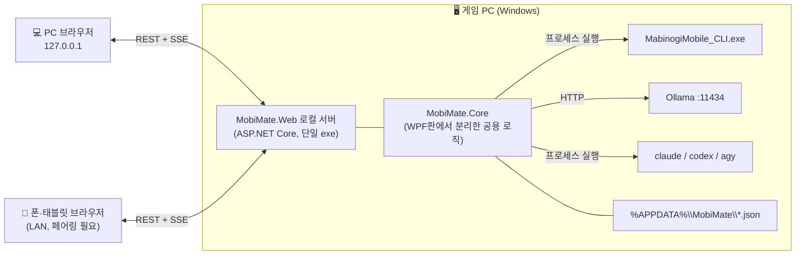

# MobiMate Web — 요구사양서 (v1.0 초안)

> **브랜치**: `webapp` · **기준 버전**: `master@f64d2f7` (WPF 데스크톱판) · **리뷰**: 서브에이전트 2차 리뷰 승인 (높음 0건)
> **목표**: WPF판의 기능과 UI 골격을 그대로 이어받아 **브라우저에서 동작하는 웹앱**으로 옮긴다. 이 과정에서 UI를 예쁘고 효율적으로 다시 설계한다.
> **원칙**: `master`의 WPF판은 건드리지 않는다. 웹앱 코드는 모두 `web/` 아래에 둔다.

---

## 0. 용어

| 용어 | 뜻 |
|---|---|
| 게임 CLI | 넥슨 제공 `MabinogiMobile_CLI.exe` (MM AI 에이전트). 게임 데이터 조회·조작의 유일한 통로 |
| 로컬 서버 | 게임 PC에서 실행되는 웹앱 백엔드. 게임 CLI·Ollama·CLI 에이전트를 대신 호출한다 |
| 클라이언트 | 브라우저에서 열리는 웹 UI (PC 브라우저, 같은 네트워크의 폰·태블릿) |
| WPF판 | `master` 브랜치의 기존 데스크톱 앱 |

---

## 1. 배경과 목표

### 1.1 왜 웹앱인가
1. **세컨드 스크린**: 게임은 PC 전체 화면으로 두고, 상황판과 채팅은 **폰·태블릿 브라우저**로 본다. WPF판은 게임과 같은 모니터를 나눠 써야 했다.
2. **UI 표현력**: 반응형 레이아웃, 부드러운 전환, 차트, 다크/라이트 테마를 WPF보다 적은 비용으로 구현한다.
3. **배포 단순화 유지**: 여전히 단일 실행 파일 하나로 배포한다. 실행하면 로컬 서버가 뜨고 브라우저가 자동으로 열린다.

### 1.2 핵심 제약 (아키텍처를 결정하는 사실)
- 게임 CLI는 **게임이 실행 중인 Windows PC의 로컬 프로세스**다. 브라우저는 로컬 exe를 실행할 수 없다.
- 따라서 웹앱은 **"게임 PC의 로컬 서버 + 브라우저 UI"** 구조가 필수다. 순수 정적 웹사이트나 클라우드 호스팅으로는 성립하지 않는다.
- Ollama(`localhost:11434`)와 CLI 에이전트(`claude`, `codex`, `agy`)도 게임 PC에 있으므로 모두 로컬 서버를 거쳐 호출한다. 클라이언트가 직접 호출하지 않는다 (CORS 문제와 LAN 노출을 함께 해결).

### 1.3 목표 / 비목표

| 구분 | 내용 |
|---|---|
| 목표 | WPF판 기능 100% 이식 (§4 이식 매트릭스), UI 전면 재설계 (§6), PC와 모바일 반응형, LAN 세컨드 스크린 |
| 목표 | WPF판과 같은 저장 파일 형식 유지 → 두 앱이 같은 캐릭터 기록·페르소나를 공유 |
| 비목표 | 인터넷 공개 호스팅, 다중 사용자 계정, 클라우드 동기화 |
| 비목표 | 게임 CLI 명령 추가·변경 (넥슨 제공 28종 스펙 안에서만 동작) |
| 비목표 | WPF판 폐기 (당분간 병행 유지) |

---

## 2. 시스템 구성



### 2.1 기술 스택 (권장안)

| 계층 | 선택 | 이유 |
|---|---|---|
| 공용 로직 | **`MobiMate.Core` 클래스 라이브러리 (.NET 8)** | `GameCliService`, `ChatPlanService`, `PersonaTemplates(Data)`, `SnapshotManager`, `AiEngineManager`, `BuiltInGuideEngine`, `AdaptiveRefreshController`를 WPF 의존성 없이 분리해 재사용. 870개 대사 풀과 기존 테스트 자산을 다시 쓰지 않는다 |
| 백엔드 | **ASP.NET Core Minimal API (.NET 8)** | Core를 그대로 참조. 정적 파일 내장 후 단일 exe로 배포 |
| 실시간 전송 | **SSE (Server-Sent Events)** | 서버→클라이언트 단방향 푸시(상태 갱신·토스트·채집 진행)에 충분하고 WebSocket보다 단순 |
| 프론트엔드 | **Vite + React + TypeScript** | 컴포넌트 단위 UI, 타입 안정성, 빌드 결과를 exe에 내장 |
| 스타일 | **CSS 변수 기반 디자인 토큰 + CSS Modules** | 다크/라이트 테마 전환, 외부 UI 프레임워크 의존 최소화 |
| 서버 상태 | **TanStack Query** | 영역별 캐시, 재시도, 백그라운드 갱신 |
| 폰트 | **Pretendard (내장 번들)** | 한글 가독성. 오프라인에서도 동작하도록 CDN 대신 번들 |
| 테스트 | xUnit (Core·API) · Vitest (프론트) · Playwright (E2E) | 기존 xUnit 테스트를 Core로 옮겨 계속 통과시킨다 |

> **대안 검토**: Node.js 백엔드로 새로 짜는 방안도 있다. 하지만 대사 풀 1,126줄과 스냅샷·엔진 로직을 다시 옮겨야 하고, WPF판과 로직이 갈라진다. 그래서 채택하지 않았다.

### 2.2 디렉터리 구조 (예정)

```
web/
├─ REQUIREMENTS.md            ← 본 문서
├─ src/
│  ├─ MobiMate.Core/          ← WPF판에서 분리한 공용 로직 (UI 의존 0)
│  ├─ MobiMate.Web/           ← ASP.NET Core 로컬 서버 + 내장 정적 파일
│  └─ client/                 ← Vite + React + TS
└─ tests/
   ├─ MobiMate.Core.Tests/    ← 기존 xUnit 이관 + 신규
   ├─ MobiMate.Web.Tests/     ← API 통합 테스트 (가짜 CLI 사용)
   └─ e2e/                    ← Playwright
```

> WPF판(`/*.cs`, `/tests/MobiMate.Tests`)은 이 브랜치에서도 수정하지 않는다. Core는 **파일을 복사해 분리**하고, master 역병합은 별도 과제로 판단한다.

---

## 3. 비기능 요구사항

| ID | 항목 | 요구 |
|---|---|---|
| NFR-01 | 실행 | exe 더블클릭 → 로컬 서버 기동 → 기본 브라우저 자동 오픈까지 **3초 이내** |
| NFR-02 | 배포 | 단일 exe(.NET 8 런타임 의존) + 메신저 전송용 zip. `dotnet publish` 한 번으로 둘 다 생성 |
| NFR-03 | 네트워크 기본값 | **`127.0.0.1`에만 바인딩**. LAN 노출은 사용자가 명시적으로 켰을 때만 (NFR-05) |
| NFR-04 | 포트 | 기본 `17800`. 사용 중이면 다음 빈 포트를 자동 선택하고 콘솔·트레이에 표시 |
| NFR-05 | 보안 | **§3.1 보안 요구사항**을 따른다 (localhost 포함 모든 요청 인증) |
| NFR-06 | CLI 직렬화 | 게임 CLI 호출은 **2개 레인**으로 나눈다. ① 일반 레인: 조회·짧은 조작을 서버 전역 단일 큐(`SemaphoreSlim(1,1)`)로 직렬화. ② 장시간 레인: `execute_gathering`(최대 120초) 전용, 동시 1건. `stop_action`은 두 레인을 모두 우회하는 **우선 경로**로 즉시 실행한다 (채집 중 병행 실행 가능 여부는 S2에서 가짜 CLI + 실기로 실측하고, 불가하면 대안을 상세설계에 기록) |
| NFR-07 | 중복 조회 방지 | 같은 조회 명령은 서버 캐시(TTL 3초)로 합친다. PC와 폰이 동시에 열어도 CLI 호출이 두 배가 되지 않는다 |
| NFR-08 | 안전한 인자 전달 | CLI·에이전트 인자는 `ArgumentList`로만 전달. JSON 본문은 **반드시 직렬화기로 생성** (문자열 보간 금지) |
| NFR-09 | 응답성 | 조회 API p95 ≤ CLI 실행 시간 + 50ms (**큐 대기 시간 제외**, 서버 로그에 대기·실행 시간을 따로 기록). UI 첫 화면(스켈레톤) 표시 ≤ 1초 |
| NFR-10 | 반응형 | 360px(폰) ~ 2560px(와이드) 전 구간에서 가로 스크롤 없이 동작 |
| NFR-11 | 접근성 | 키보드만으로 전 기능 조작 가능. 색 대비 WCAG AA. 상태를 색에만 의존하지 않고 아이콘·텍스트를 함께 쓴다 |
| NFR-12 | 오프라인 | 인터넷 없이 100% 동작 (폰트·아이콘·라이브러리 모두 번들). 외부 요청은 사용자가 고른 AI 엔진뿐 |
| NFR-13 | 저장 호환 | `%APPDATA%\MobiMate\` 파일(`character_snapshots.json`, `character_history_db.json`, `custom_personas.json`) 형식을 WPF판과 동일하게 유지. 손상 파일 격리·복구 동작도 이식 |
| NFR-14 | 동시 실행 | 웹앱은 원자적 쓰기(임시 파일 → 교체)로 **저장 파일 손상을 막는다**. 다만 WPF판을 수정하지 않는 한 두 앱이 서로의 갱신을 덮어쓰는 문제(lost update)와 CLI 호출 경합은 막을 수 없다. 그래서 **동시 실행은 비권장**으로 두고, 웹앱이 기동할 때 WPF판 프로세스(`MobiMate.exe`)가 감지되면 경고 배너를 띄운다. 근본 해결은 Q2에서 결정한다 |
| NFR-15 | 로깅 | 서버 로그는 `%APPDATA%\MobiMate\logs\`에 일 단위 저장. 채팅 본문 등 개인 대화는 기본적으로 기록하지 않는다 |

### 3.1 보안 요구사항 (SEC)

로컬 서버는 **게임 채팅 발송, 정령의 날개를 쓰는 채집, 유료 AI 호출, 실행 파일 경로 변경**을 할 수 있다. 그래서 localhost라도 신뢰하지 않는다. 게임 PC 브라우저로 연 외부 웹페이지가 `127.0.0.1`로 요청을 보내는 공격(CSRF, DNS 리바인딩)을 막아야 한다.

| ID | 요구 |
|---|---|
| SEC-01 | **Host 검증**: 모든 요청의 `Host` 헤더를 허용 목록(`127.0.0.1:<port>`, `localhost:<port>`, LAN 모드일 때 현재 LAN IP:`<port>`)과 대조한다. 불일치면 421. LAN IP 목록은 네트워크 변경 이벤트(`NetworkChange.NetworkAddressChanged`) 때 다시 계산한다 |
| SEC-02 | **Origin 검증**: 상태를 바꾸는 요청(GET·HEAD 외 전부)은 `Origin`이 허용 출처와 일치해야 한다. 불일치·누락이면 403 |
| SEC-03 | **세션 필수**: 접속 모드와 관계없이 **모든 API와 SSE는 세션이 있어야 한다** (localhost 포함). 세션이 없으면 401. 예외는 기동 코드 교환과 `/api/pairing/confirm`뿐이다 |
| SEC-04 | **CSRF 헤더**: 상태를 바꾸는 요청은 커스텀 헤더 `X-MobiMate-Csrf`(세션별 값)를 요구한다. 세션이 아직 없는 `/api/pairing/confirm`은 이 검사를 면제하고 SEC-02 Origin 검사만 적용한다 |
| SEC-05 | **기기 토큰**: 세션은 기기별 장기 토큰(`HttpOnly; SameSite=Strict` 쿠키)으로 유지한다. 서버는 토큰의 **해시만** `%APPDATA%\MobiMate\devices.json`에 저장하므로 서버를 재시작해도 로그인이 유지된다. 로컬 브라우저는 최초 1회 기동 코드로, LAN 기기는 페어링으로 토큰을 받는다 |
| SEC-06 | **기동 코드**: exe를 실행하거나 트레이·콘솔의 "브라우저 열기"를 누르면 새 1회용 코드(60초 유효)를 URL에 담아 브라우저를 연다. 코드를 교환한 뒤에는 `302`로 코드를 URL에서 지워 브라우저 기록에 남지 않게 한다. 401 화면에는 "트레이의 '브라우저 열기'를 누르세요"라고 안내한다 |
| SEC-07 | **페어링**: 6자리 코드 + QR로 한다. 코드는 **5분 후 만료, 1회용, 5회 실패 시 10분 잠금**. 페어링된 기기 목록에서 기기를 개별 폐기할 수 있다. 기기를 폐기하거나 세션이 만료되면 **그 기기에 열린 SSE 스트림을 즉시 닫는다** |
| SEC-08 | **localhost 전용 작업**: CLI 경로 변경, LAN 모드 켜기/끄기, 페어링 시작, 기기 목록 조회·폐기는 원격 주소가 루프백일 때만 허용한다 |
| SEC-09 | **경로 검증**: CLI 경로는 로컬 드라이브의 존재하는 `.exe` 파일만 허용한다. UNC(`\\`)·네트워크 드라이브·상대 경로는 거부한다 |
| SEC-10 | **LAN 평문 HTTP 위험**: LAN 통신은 HTTP 평문이다. 같은 망에 있는 공격자가 쿠키를 가로챌 수 있다. 가정용 신뢰 네트워크를 전제로 **이 위험을 수용한다**. 대신 LAN 기기 토큰은 30일 뒤 만료하고, LAN 모드 화면에 "공용 와이파이에서는 켜지 마세요"라고 안내한다. HTTPS 지원 여부는 Q5에서 정한다 |

---

## 4. 기능 이식 매트릭스 (WPF판 → 웹앱)

우선순위 **P0** = 첫 릴리스 필수 · **P1** = 첫 릴리스 목표 · **P2** = 후속

| 영역 | WPF판 기능 | 웹앱 | 우선 |
|---|---|---|---|
| 헤더 | 캐릭터 식별(서버·직업·레벨·칭호), 전투력 + 세션 변화량, 위치·날씨·에린 시간, 연결 램프 | 상단 바로 이식 | P0 |
| 헤더 | 캐릭터 별칭(닉네임) 설정 팝업 + 온보딩 말풍선 | 인라인 편집으로 이식 | P1 |
| 헤더 | 📌 항상 위 | 브라우저 한계로 대체: **PiP 미니 상황판**(FR-OV-04) + PWA 창 | P2 |
| 헤더 | 🛑 긴급 정지 (ESC) | 상시 버튼 + 페이지 포커스 시 ESC | P0 |
| 스탯 | 4대 점수, 전투 9대 스탯, 성기사 6종, 실시간 행동 상태 | 이식 | P0 |
| 가방 | 무게 게이지(95% 주의 / 100% 위험), 세션 변화량 | 이식 | P0 |
| 가방 | 가방·계정창고·캐릭터창고 600여 종 검색·필터, 잠금 표시 | 가상 스크롤로 이식 | P0 |
| 가방 | ⚖️ 무게 다이어트 필터 (세션 급증 → 대량 보유 순 정렬) | 이식 | P0 |
| 재화 | 28종 재화 카드, 세션 누적 획득(골드·날개·냥토큰) | 이식 | P0 |
| 미션 | 일일 11 / 주간 15 진행률, **완료 미션 제외** 목록, 전부 완료 배너 | 이식 | P0 |
| 생활 | 가공 대기열 + 남은 시간 카운트다운 + 수거 | 이식 (클라이언트 1초 카운트다운) | P0 |
| 생활 | 스마트 채집 도우미: 150종, 5개 분류(벌목·채광·농축산·약초·기타), 목표치 프리셋(5/50/100/200/300, ±1/±5), 가방 합산 부족 수량, 채집 시작 | 이식 + **부족 수량을 `count`로 실제 전달** (D-06) | P0 |
| 레이더 | 주변 플레이어(거리순), 길드원 강조 | 이식 + **신규**: 파티·친구 배지, 전투 중 표시 (CLI 응답에 이미 있는 필드) | P0 |
| 매크로 | 📋 일일 숙제 점검 · ⚖️ 가방 다이어트 · 📥 작업대 수거 · 🛑 긴급 행동 정지 | 퀵 액션으로 이식 | P0 |
| 게임 채팅 | 50자 제한, 카운터, 빈 입력 차단, 전송 로그(성공/실패) | 이식 | P0 |
| 게임 채팅 | 10대 감정 → 이모지 + 소셜 액션 자동 부착, 부정어·제외어 방어, 실시간 미리보기, 2단계 전송 | 이식 (Core `ChatPlanService` 재사용) | P0 |
| 아무말 | 페르소나 5종 + 커스텀, 12대 상황 분류, 870개 대사 풀, LLM 생성 + 내장 폴백 | 이식 | P0 |
| 아무말 | 💬 한마디 → 입력창에 채우기 (자동 전송 아님) | 이식 | P0 |
| 아무말 | 커스텀 페르소나 생성·저장 (AppData) | 이식 + **수정·삭제 UI 추가** | P1 |
| AI | 엔진 자동 감지(내장 가이드 / Ollama / claude·codex·agy), 기본값 = 내장 가이드, 유료 엔진은 수동 선택만 | 이식 | P0 |
| AI | 내장 가이드 모드에서는 커스텀 페르소나 추가 버튼 숨김 + 커스텀 선택 중이면 기본 페르소나로 자동 롤백 + 안내 배지 | 이식 | P0 |
| AI | 게임 상태를 시스템 컨텍스트로 주입해 질의응답 | 이식 | P0 |
| AI | 문장형 가이드 쉘프(6개 카드) | 이식 | P0 |
| AI | 자연어 명령 디스패치(정지·숙제·다이어트·수거·채집) | 이식 | P0 |
| 갱신 | 적응형 자동 새로고침 (15초 → 활동 없으면 +15초씩, 최대 300초, 활동 시 리셋) | 이식 (페이지 숨김 시 일시정지 추가) | P0 |
| 갱신 | 탭 전환 시 이전 요청 취소 | 이식 (`AbortController`) | P0 |
| 알림 | 인앱 토스트 | 이식 | P0 |
| 기록 | 캐릭터 히스토리 DB (저장만 하고 UI 없음) | **신규: 성장 추이 차트** | P2 |

### 4.1 이식하면서 함께 고칠 WPF판 결함

| # | 결함 | 조치 |
|---|---|---|
| D-01 | `InGameChatterService.TriggerChatterAsync`는 CLI 스펙에 없는 `send_chat` + JSON 본문을 쓴다. UI에서는 호출하지 않고 테스트에서만 쓰는 **죽은 코드이자 잠재 결함**이다 (실제 "한마디"는 입력창만 채운다) | Core로 옮길 때 이 경로를 제거한다. 모든 채팅 전송은 `SendGameChatAsync`(`write_chat` + argv) 하나로 통일한다 |
| D-02 | `execute_gathering`·`complete_altering_work` JSON 본문을 문자열 보간으로 만든다 (아이템명에 `"`가 있으면 깨짐) | `JsonSerializer`로 생성 (NFR-08) |
| D-03 | 커스텀 페르소나로 LLM 호출이 실패하거나 2.5초 타임아웃이 나면 내장 폴백이 **악덕영애 대사**로 나간다 (내장 엔진 모드에서는 자동 롤백 덕분에 드러나지 않는다) | 커스텀 페르소나의 폴백은 중립 일반 대사 풀을 쓰고, "AI 응답 지연으로 기본 대사를 넣었습니다" 토스트를 띄운다 |
| D-04 | 가방 경고 기준이 문서(80/90%)와 코드(95/100%)에서 다르다 | 최신 피드백을 반영한 코드 기준 **95% 주의 / 100% 위험**으로 확정 |
| D-05 | `InGameChatterService`가 WPF `DispatcherTimer`에 의존한다 | Core에서는 타이머와 `IntervalSeconds`를 제거하고, 수동 "한마디" 전용인 현재 동작만 이식한다 |
| D-06 | 채집 도우미가 부족 수량을 계산만 하고 `execute_gathering`에는 `displayName`만 보낸다. CLI 스펙은 `{"displayName","count"}`라서 목표치 기능이 실제로는 동작하지 않는다 | 부족 수량을 `count`로 전달한다. `count` 미지원·무시 여부는 S2에서 실측한다 |
| D-07 | 자연어 디스패치가 `Contains("정지")`로 판정해서 "정지 기능 알려줘" 같은 질문도 긴급 정지를 실행한다. 자연어 채집은 확인 없이 날개를 쓴다 | FR-AI-05의 판정 규칙과 확인 절차로 바꾼다 |

---

## 5. 기능 요구사항 상세

### 5.1 연결·상태 (FR-CN)
- **FR-CN-01** 서버는 게임 CLI `status`를 **고정 10초 주기**로 확인한다 (서버의 유일한 자체 폴링). 결과를 `connected | disconnected | cli_missing` 셋 중 하나로 SSE 푸시한다. 데이터 갱신은 서버가 폴링하지 않고 클라이언트가 요청한다 (FR-RF).
- **FR-CN-02** `cli_missing`이면 전체 화면 안내를 띄운다: CLI 기본 경로, 환경변수 `MABINOGI_MOBILE_CLI` 설정법, "MM AI 에이전트" 활성화 방법.
- **FR-CN-03** `disconnected`이면 데이터를 지우지 않는다. 마지막 값을 흐리게 표시하고 "N분 전 데이터" 배지를 단다.
- **FR-CN-04** 모든 조회 응답에 `fetchedAt`을 포함한다. 카드마다 신선도(상대 시간)를 표시한다.

### 5.2 개요 대시보드 (FR-OV) — 신규 기본 화면
WPF판은 6개 탭 중 하나만 보여서, v2.1 요구사양의 "한눈에 보는 상황판" 목표가 흐려졌다. 웹앱은 **개요 화면을 첫 화면으로** 되살린다.
- **FR-OV-01** 한 화면에 요약 카드 7종: 전투력(+세션 변화), 가방 무게 게이지, 재화 3종(+세션 획득), 일일·주간 미션 진행 링, 가공 대기열(다음 완료까지 남은 시간), 주변 길드원·파티원 수, 현재 행동 상태.
- **FR-OV-02** 카드를 클릭하면 해당 상세 화면으로 이동한다.
- **FR-OV-03** 경고 요약 스트립: 가방 95% 이상, 수거 가능한 가공물, 남은 일일 미션이 있으면 상단에 칩으로 표시한다. 칩을 누르면 해당 퀵 액션을 실행한다.
- **FR-OV-04 (P2)** Document Picture-in-Picture(크로미움 계열)로 전투력·무게·미션 미니 상황판을 띄운다. "항상 위"를 대체한다. 지원하지 않는 브라우저에서는 버튼을 숨긴다.

### 5.3 상세 화면 (FR-DT)
WPF판 6개 탭을 그대로 옮기되 개요와 같은 카드 언어로 통일한다.

| ID | 화면 | 요구 |
|---|---|---|
| FR-DT-01 | 📊 스탯 | 4대 점수 대형 수치, 전투 스탯 9종 그리드, 성기사 6종, 체력·만복도 바, 버프 개수, 행동 상태 램프 |
| FR-DT-02 | 🎒 가방·창고 | 무게 게이지 + 세션 변화, 위치 세그먼트(전체/가방/계정창고/캐릭터창고/⚖️다이어트), 검색(이름·카테고리, 150ms 디바운스), 가상 스크롤 표, 잠금 아이콘, 세션 증가량 배지 |
| FR-DT-03 | 💰 재화 | 28종 카드 그리드, 핵심 3종 상단 고정, 세션 누적 증감 색상(증가 초록 / 감소 빨강) |
| FR-DT-04 | 📋 미션 | 일일·주간 진행 바, 미완료만 목록, 전부 완료 시 축하 배너, "완료 포함 보기" 토글 |
| FR-DT-05 | 🌿 생활 | 가공 대기열(카운트다운, 완료 강조, 개별·일괄 수거), 스마트 채집 도우미(분류 칩, 검색, 목표치 프리셋·±조정, 보유/목표/부족, 도구 미보유 비활성, 채집 시작 확인) |
| FR-DT-06 | 👥 레이더 | 거리순 목록, 길드원·파티원·친구 배지, 전투 중 표시, 길드원만 보기 필터 |

- **FR-DT-07** 채집 시작 전에 "정령의 날개 5개 소모"를 확인 다이얼로그로 알린다 (자연어 채집 포함, FR-AI-05). `execute_gathering` 결과(`completed / started / stopped`, `gained`)를 토스트로 보여준다.
- **FR-DT-08** 채집은 최대 120초 걸리는 장시간 요청이다. 서버는 즉시 `202 Accepted` + 작업 ID를 반환하고, 장시간 레인(NFR-06)에서 실행한 뒤 결과를 SSE로 알린다. 그동안 조회와 긴급 정지는 막히지 않는다. 채집이 이미 진행 중이면 새 채집 요청은 `409`로 거절한다.

### 5.4 퀵 액션·긴급 정지 (FR-AC)
- **FR-AC-01** 상단 바에 상시 표시: 🛑 긴급 정지. 누르면 확인 없이 바로 `stop_action`을 호출한다 (안전 기능이므로).
- **FR-AC-02** 퀵 액션 4종: 📋 일일 숙제 점검, ⚖️ 가방 다이어트, 📥 작업대 수거, 🛑 행동 정지. 동작은 WPF판과 동일하다.
- **FR-AC-03** 단축키: `Esc` 긴급 정지 (단, 입력창·다이얼로그에 포커스가 있으면 먼저 그것을 닫음), `Ctrl+K` 명령 팔레트 (P1), `1`~`7` 화면 전환, `/` 채팅 입력 포커스. `1`~`7`과 `/`는 입력 요소(`input`, `textarea`, `contenteditable`)에 포커스가 있으면 동작하지 않는다.
- **FR-AC-04 (P1)** 명령 팔레트: 화면 이동, 퀵 액션, 채집 아이템 이름 검색 → 채집 시작, 페르소나 전환을 한 곳에서 검색·실행한다.

### 5.5 인게임 채팅 (FR-GC)
- **FR-GC-01** 입력 → Enter 또는 전송 버튼 → `write_chat`. 빈 입력·공백 전송 차단. 개행은 공백으로 치환한다.
- **FR-GC-02** 글자 수 카운터 `n / 50`. 45자 이상 경고색, 50자 초과 입력 차단. 글자 수 규칙은 **서버 Core 한 곳에서 정의**하고 클라이언트 카운터와 서버 절단이 같은 규칙을 쓴다. 잠정 규칙은 "유니코드 코드포인트 기준, 이모지 1자, 서러게이트 페어를 쪼개지 않음"이다. 게임이 실제로 세는 단위(코드포인트 / UTF-16 / 바이트)는 TST-07에서 실측하고 규칙을 확정한다. 현재 WPF판은 UTF-16 `Length`로 자르는데, 이 경우 이모지가 2자로 계산된다.
- **FR-GC-03** 입력 중 실시간 미리보기 `자동: 😊 /손인사1` (Core `ChatPlanService.GetPreviewHint`). 미리보기를 끄고 원문 그대로 보내는 토글을 둔다 (P1).
- **FR-GC-04** 2단계 전송: ① 이모지를 붙인 대사 → ② 성공 시에만 150ms 뒤 소셜 액션. 로그에 `✓ 안녕하세요 😊 (행동: /손인사1)` 형태로 기록한다.
- **FR-GC-05** 전송 로그: 시각, 결과(성공/실패 + 사유), 출처(직접 / 아무말:페르소나). 실패 항목에는 "다시 보내기" 버튼. 로그는 세션 동안 서버가 보관하고 새로 접속한 기기에도 보인다.
- **FR-GC-06** 연타 방지: 전송 중에는 버튼을 비활성화한다. 1초 안에 같은 문구를 다시 보내면 무시한다.

### 5.6 아무말 대잔치 (FR-CH)
- **FR-CH-01** 페르소나 선택: 🌹 악덕영애, 💰 구두쇠 영감, ☀️ 안녕하닝 모닝이야, 🌊 갱상도 아재, ✨ 아이돌 댄서, 커스텀 목록.
- **FR-CH-02** 💬 한마디: 현재 상황(직업·위치·행동·가방·골드·에린 시간)으로 12대 카테고리를 판정한다. 선택된 AI 엔진(2.5초 타임아웃) 또는 내장 대사 풀로 대사를 만들어 **입력창에 채운다** (자동 전송 안 함).
- **FR-CH-03** 생성된 대사도 FR-GC 규칙(50자, 이모지·액션)을 똑같이 거친다.
- **FR-CH-04** 커스텀 페르소나: 이름, 이모지, 말투 프롬프트 입력 → `custom_personas.json`에 저장. 목록에서 수정·삭제 (P1). 커스텀은 AI 엔진이 연결되었을 때만 고유 말투가 나온다고 UI에 안내한다 (D-03).
- **FR-CH-05** 가방 과적 판정은 `(\d+)%` 파싱 결과가 100 이상일 때만 (WPF v7 규칙 유지).

### 5.7 AI 도우미 (FR-AI)
- **FR-AI-01** 엔진 감지: 서버 기동 시 + "다시 찾기" 버튼. 내장 가이드(항상) / Ollama 모델들(1.5초 프로빙) / `where.exe claude·codex·agy`(1초 프로빙).
- **FR-AI-02** 기본 엔진은 **내장 가이드 고정**. 사용자가 고른 엔진은 서버 설정에 저장하고 다음 기동 때 복원한다. 유료 CLI 엔진은 자동 선택 대상에서 절대 제외한다.
- **FR-AI-03** 엔진 목록에 비용 배지를 붙인다: `무료·내장`, `무료·로컬`, `계정 과금`. 유료 엔진을 고르면 1회 확인한다.
- **FR-AI-04** 질의 시 현재 게임 상태(서버·직업·레벨·전투력·행동·위치·가방)를 시스템 컨텍스트로 주입한다. 응답은 **`POST /api/ai/ask`의 응답 본문 스트림**(`fetch` + `ReadableStream`, NDJSON)으로 요청한 클라이언트에게만 보낸다. 브로드캐스트 채널(`/api/events`)로는 보내지 않는다. Ollama는 `stream: true`로 토큰 단위로, CLI 엔진은 완료 후 한 번에 보낸다.
- **FR-AI-05** 자연어 명령 디스패치를 LLM 호출 전에 가로챈다. 판정 규칙은 다음과 같다.
  - **정지**: 입력 전체가 명령형 단문일 때만 실행한다. 공백·문장부호를 뺀 입력이 `정지`, `멈춰`, `스톱`, `그만`에 선택적 어미(`해`, `해줘`, `!`)만 붙은 형태여야 한다. "정지 기능 알려줘"처럼 질문이면 LLM으로 넘긴다.
  - **숙제 점검**: 숙제, 일일 미션, 일일미션 → 미션 화면 이동 + 요약. 조회만 하므로 부작용이 없다.
  - **다이어트**: 다이어트, 가방 정리, 무게 줄여 → 가방 화면 다이어트 필터. 조회만 한다.
  - **수거**: 수거, 작업대, 가공물 → 수거 가능 목록 카드와 [수거] 버튼을 보여준다. 바로 실행하지 않는다.
  - **채집**: 채집, 캐줘, 캐라, 캐러, 모아줘, 수집, 낚시, 낚아 + 채집 가능 아이템명(긴 이름 우선 매칭) → **확인 카드**(아이템명, 목표 수량, 날개 5개 소모)를 보여준다. 사용자가 [시작]을 눌러야 실행한다 (D-07).
- **FR-AI-06** 가이드 쉘프 6개 문장 카드. 내장 가이드 모드에서는 대화 영역 상단에 크게, LLM 모드에서는 입력창 위 칩으로 작게 보인다.
- **FR-AI-07** 대화 말풍선에 Markdown(목록·굵게·코드)을 렌더링한다. HTML은 이스케이프한다. 답변 복사 버튼을 둔다.
- **FR-AI-08** 생성 중 "중지" 버튼으로 요청을 취소한다. CLI 에이전트는 프로세스 트리를 종료하고 Ollama는 요청을 끊는다.
- **FR-AI-09** 웰컴 메시지는 1줄. 엔진 전환 알림은 대화창이 아니라 토스트로만 보낸다.

### 5.8 자동 갱신 (FR-RF)
- **FR-RF-01** 적응형 주기는 **클라이언트마다 따로** 돈다: 기본 15초, 그 클라이언트에서 활동이 없으면 틱마다 +15초 (최대 300초), 그 클라이언트에서 클릭·키 입력·터치·화면 전환이 있으면 15초로 리셋. 규칙은 Core `AdaptiveRefreshController`와 같게 TS로 구현하고, 같은 테스트 벡터로 검증한다. 여러 기기의 중복 조회는 서버 캐시(NFR-07)가 합친다.
- **FR-RF-02** 브라우저 탭이 숨겨지면(`visibilitychange`) 해당 클라이언트의 갱신을 멈춘다. 다시 보이면 즉시 1회 갱신한다.
- **FR-RF-03** 갱신 범위: 상단 바(`status`·`get_my_info`·`get_activity`·`get_current_environment`) + **현재 보고 있는 화면**의 데이터만. 개요 화면은 요약에 필요한 명령을 모두 조회한다.
- **FR-RF-04** 수동 새로고침 버튼은 현재 화면만 즉시 갱신하고 주기를 리셋한다.

### 5.9 캐릭터 기록 (FR-HS)
- **FR-HS-01** 캐릭터 식별은 `서버명_직업` 키 + 레벨·칭호 보조 매칭 (WPF판 `SnapshotManager` 그대로).
- **FR-HS-02** 세션 기준점(앱 기동 후 첫 수신)과 직전 틱 두 기준을 유지한다. UI에는 세션 누적을 기본으로 보이고, 툴팁에 직전 대비 변화를 보인다.
- **FR-HS-03 (P2)** 성장 추이: 히스토리 DB로 전투력·골드·생활력 추이를 7일/30일 차트로 그린다.

### 5.10 설정 (FR-ST)
- **FR-ST-01** 설정 화면: 테마(시스템/다크/라이트), 글자 크기(보통/크게/아주 크게 — WPF판 대형 폰트 요구 계승), CLI 경로, LAN 모드와 페어링 기기 관리, 자동 갱신 최대 주기, 이모지·액션 자동 부착 기본값.
- **FR-ST-02** 설정은 서버의 `%APPDATA%\MobiMate\web_settings.json`에 저장한다. 테마·글자 크기처럼 기기마다 다른 값은 브라우저 `localStorage`에 둔다.

---

## 6. UI/UX 재설계

### 6.1 WPF판 UI의 문제
1. **화면 절반을 채팅이 고정 점유한다**: 상하 1:1 분할 때문에 정보 탭이 좁고 스크롤이 잦다.
2. **정보가 탭 뒤에 숨는다**: 가방 무게와 미션을 동시에 보려면 탭을 오가야 한다.
3. **대형 폰트를 일괄 적용했다**: 모든 글자를 키워서 핵심 수치와 보조 정보의 위계가 사라졌다.
4. **버튼 스타일이 제각각이다**: 퀵 액션, 필터, 프리셋 버튼의 크기·색이 섞여 있다.
5. **색만으로 상태를 전한다**: 초록/주황/빨강만으로 정상·주의·위험을 구분한다.

### 6.2 설계 원칙
- **한눈에 → 한 번에**: 개요 화면이 첫 화면이다. 경고는 요약 스트립으로 올리고, 조치는 원클릭으로 한다.
- **위계 있는 타이포**: 핵심 수치만 크게(28~36px), 라벨은 작게(12~13px), 본문 15~16px. "글자 크기" 설정으로 전체 배율을 조정한다.
- **채팅은 도크로**: 게임 채팅과 AI를 오른쪽 **접이식 커뮤니케이션 도크**로 옮긴다. 필요할 때 펼치고, 폭은 드래그로 조절한다.
- **일관된 컴포넌트**: 버튼·칩·세그먼트·카드·배지 5종을 디자인 토큰 하나로 통일한다.
- **상태 = 색 + 아이콘 + 문구**: 예) `⚠ 96% 주의`.

### 6.3 레이아웃

**데스크톱 (≥ 1200px)**
```
┌──────────────────────────────────────────────────────────────────────────────────────┐
│ ● 아이라 · 격투가 Lv.100  "이거밖에 안 되심?"   ⚔ 88,737 ▲150   📍페카 고분 ☀ 15:51 │ 🛑 정지 │ ⟳ │ ⚙ │
├────┬─────────────────────────────────────────────────────────────┬───────────────────┤
│ ◉  │ ⚠ 가방 96%  ·  📥 수거 가능 2건  ·  📋 일일 미션 3개 남음     │ [게임 채팅 | AI]   │
│개요│─────────────────────────────────────────────────────────────│                   │
│ 📊 │ ┌──────────┐ ┌──────────┐ ┌──────────────────────┐           │ 15:20 ✓ 던바튼…😊 │
│ 🎒 │ │ ⚔ 전투력  │ │ 🎒 가방   │ │ 💰 골드 11,144,590   │           │ 15:22 ✓ 길드…🥳   │
│ 💰 │ │ 88,737   │ │ ███████▒ │ │    ▲ +120,000        │           │                   │
│ 📋 │ │ ▲ +150   │ │ 96% 주의 │ │ 날개 18,854 · 냥 124K │           │ 페르소나 🌹 ▾  💬 │
│ 🌿 │ └──────────┘ └──────────┘ └──────────────────────┘           │ ┌───────────────┐ │
│ 👥 │ ┌──────────┐ ┌──────────┐ ┌──────────┐ ┌──────────┐          │ │ 입력…   12/50 │ │
│    │ │ 📋 일일   │ │ 📆 주간   │ │ ⚗ 가공    │ │ 👥 주변   │          │ └───────────────┘ │
│ ⚙  │ │ ◔ 8/11   │ │ ◑ 9/15   │ │ 2:25 남음 │ │ 길드 3명  │          │ 자동: 😊 /손인사1 │
│    │ └──────────┘ └──────────┘ └──────────┘ └──────────┘          │                   │
└────┴─────────────────────────────────────────────────────────────┴───────────────────┘
 내비 레일(64px)            메인 콘텐츠 (유동)                        도크(360px, 접기·폭조절)
```

**태블릿 (768 ~ 1199px)**: 내비 레일은 유지하고 도크는 오른쪽 오버레이 시트(토글)로 바꾼다.

**모바일 (< 768px)**: 하단 탭 바(개요·가방·미션·생활·채팅). 스탯·재화·레이더는 "더보기"에 넣는다. 🛑 정지는 우하단 플로팅 버튼으로 항상 노출한다. 채팅·AI는 전체 화면 시트로 연다.

### 6.4 비주얼 디자인 방향
- **테마**: "모던 게이밍 다크"(WPF v5)를 계승하되 채도를 낮추고 층위를 명확히 한다. 라이트 테마도 제공한다.
- **토큰 (다크 기준 초안)**

| 토큰 | 값 | 용도 |
|---|---|---|
| `--bg-0` | `#0E0F12` | 앱 배경 |
| `--bg-1` | `#16181D` | 레일·도크 |
| `--bg-2` | `#1D2027` | 카드 |
| `--bg-3` | `#262A33` | 입력·호버 |
| `--line` | `#2C313B` | 1px 경계 |
| `--text-1` / `--text-2` / `--text-3` | `#ECEEF2` / `#A7ADBA` / `#6F7684` | 본문 / 보조 / 비활성 |
| `--accent` | `#7C8CFF` | 주 강조 (인디고) |
| `--gold` | `#F2B84B` | 골드·재화 |
| `--ok` / `--warn` / `--danger` | `#3CC98A` / `#F2A93B` / `#F0605D` | 상태 |

- **모서리** 카드 14px · 버튼 10px · 칩 999px. **간격** 4px 단위(4/8/12/16/24/32).
- **모션**: 수치 변화 시 카운트업(300ms), 변화량 배지 펄스 1회, 카드 호버 시 살짝 떠오름. `prefers-reduced-motion`이면 모두 끈다.
- **숫자**: `font-variant-numeric: tabular-nums`로 자릿수 흔들림 방지. 큰 수는 `124K`처럼 축약하고 툴팁에 전체 값을 보인다.
- **빈 상태·로딩**: 스켈레톤 카드. 오류는 카드 안에서 인라인 재시도로 처리한다 (전체 화면 오류 금지).

---

## 7. 로컬 서버 API (초안)

모든 응답은 `{ data, fetchedAt }` 또는 `{ error: { code, message } }` 형식이다. **모든 API는 세션이 필요하다** (SEC-03, 예외는 `/api/pairing/confirm`과 기동 코드 교환뿐). 🔒 = 상태를 바꾸는 요청이라 Origin·CSRF 검사(SEC-02·04)를 적용한다. 🏠 = localhost 전용(SEC-08).

| 메서드 | 경로 | 게임 CLI / 동작 |
|---|---|---|
| GET | `/api/status` | `status` |
| GET | `/api/header` | `get_my_info` + `get_activity` + `get_current_environment` + 세션 델타 |
| GET | `/api/overview` | 개요 카드 7종 집계 |
| GET | `/api/character` | `get_my_info` + `get_activity` |
| GET | `/api/inventory` | `get_my_info`(Vitals) + `get_items` + 세션 증가량 |
| GET | `/api/currencies` | `get_currencies` + 세션 델타 |
| GET | `/api/missions` | `get_daily_missions` + `get_weekly_missions` |
| GET | `/api/life` | `get_altering_works` + `get_gatherable_items` + 가방 보유 합산 |
| GET | `/api/nearby` | `get_near_pcs` |
| POST 🔒 | `/api/actions/stop` | `stop_action` (우선 경로, NFR-06) |
| POST 🔒 | `/api/actions/collect` | `complete_altering_work` (본문 `{displayName?}` — 없으면 완료된 첫 작업) |
| POST 🔒 | `/api/actions/gather` | `execute_gathering {displayName, count}` → `202` + `jobId` / 진행 중이면 `409` |
| POST 🔒 | `/api/chat/game` | `ChatPlanService` → `write_chat` ×(1~2) |
| GET | `/api/chat/game/log` | 세션 전송 로그 |
| POST | `/api/chat/game/preview` | 이모지·액션 미리보기 + 글자 수 (부작용 없음. 클라이언트 로직 이중화 방지) |
| POST 🔒 | `/api/chatter/line` | 페르소나 한마디 생성 (AI 엔진 호출 가능) |
| GET · POST 🔒 · PUT 🔒 · DELETE 🔒 | `/api/personas` | 커스텀 페르소나 CRUD |
| GET · POST 🔒 `/discover` · PUT 🔒 `/current` | `/api/ai/engines` | 엔진 목록·재탐색·선택 |
| POST 🔒 | `/api/ai/ask` | 디스패치 → 엔진 질의 (응답 본문 NDJSON 스트림, FR-AI-04) |
| PUT 🔒 | `/api/profile/nickname` | 캐릭터 별칭 |
| GET · PUT 🔒 | `/api/settings` | 서버 설정 (CLI 경로·LAN 모드 항목은 🏠) |
| POST 🔒🏠 | `/api/pairing/start` | 페어링 코드 발급 |
| POST | `/api/pairing/confirm` | 코드 → 세션 (SEC-07 만료·잠금) |
| GET 🏠 · DELETE 🔒🏠 | `/api/pairing/devices` | 페어링 기기 목록·폐기 |
| GET | `/api/events` | SSE: `status`, `header`, `toast`, `gather.done`, `chat.logged` (AI 대화는 보내지 않음) |

---

## 8. 테스트·검증 요구

| ID | 요구 |
|---|---|
| TST-01 | 기존 `tests/MobiMate.Tests` xUnit을 Core 테스트로 이관해 100% 통과한다. 단, D-01·D-05로 제거하는 API(`TriggerChatterAsync`, `IntervalSeconds`)를 검증하던 테스트는 **변경 사유를 테스트 파일 주석에 기록하고 대체 테스트로 바꾼다** |
| TST-02 | **가짜 CLI**(`fake-cli.exe` 또는 `IGameCli` 대체 구현)로 28종 명령의 실측 응답(`API_SPEC_SAMPLES.md`)을 재생한다. 지연·타임아웃·오류 주입이 가능해야 한다. 게임 없이 서버·UI 전체를 테스트할 수 있어야 한다 |
| TST-03 | API 통합 테스트: 정상·타임아웃·CLI 없음·JSON 파싱 실패·동시 요청 직렬화. 보안: Host 불일치 421, Origin 불일치 403, 세션 없음 401, CSRF 헤더 누락 403, LAN에서 🏠 API 403, 페어링 코드 만료·재사용·5회 실패 잠금, 폐기 기기 차단(열린 SSE 스트림 즉시 종료 포함), 서버 재시작 후 기기 토큰 유지, 기동 코드 재사용 거부. **채집 진행 중 `stop_action`이 1초 안에 CLI에 전달됨** |
| TST-04 | 프론트 단위 테스트: 50자 카운터(이모지 포함), 무게 경고 경계값(94.9/95/99.9/100), 필터·정렬 |
| TST-05 | Playwright E2E: 데스크톱 1440px, 태블릿 1024px, 모바일 375px에서 핵심 흐름 (개요 → 채집 시작 → 토스트, 채팅 전송, 긴급 정지, AI 질의) |
| TST-06 | 접근성 자동 점검(axe) 위반 0건 (serious 이상) |
| TST-07 | 실제 게임 연동 스모크 테스트는 承雲 PC에서 수동 체크리스트로 수행한다. 실측 항목: 채팅 50자 한도 단위(FR-GC-02), `execute_gathering`의 `count` 반영(D-06), 채집 중 `stop_action` 병행 실행(NFR-06) |

---

## 9. 단계별 추진 계획

각 단계는 **계획 → 서브에이전트 리뷰 → 구현 → 서브에이전트 리뷰 → 테스트 → 서브에이전트 리뷰** 순서를 따른다.

| 단계 | 산출물 | 완료 기준 |
|---|---|---|
| S0 | 본 요구사양서 | 리뷰 승인 (높은 중요도 결함 0건) |
| S1 | 상세설계서 + UI 시안(HTML 목업) | 承雲 시안 확인 |
| S2 | `MobiMate.Core` 분리 + 테스트 이관 + 가짜 CLI | TST-01·02 통과 |
| S3 | 로컬 서버 API + SSE + 보안(바인딩·페어링) | TST-03 통과 |
| S4 | 프론트엔드: 셸(레일·상단 바·도크) + 개요 + 상세 6화면 | P0 화면 동작 |
| S5 | 채팅·아무말·AI 도크 | P0 전체 동작, TST-04·05 |
| S6 | 패키징(단일 exe + zip, 브라우저 자동 오픈) + 실기 스모크 | TST-06·07, 배포물 생성 |
| S7 | P1 → P2 순차 | 항목별 |

---

## 10. 결정이 필요한 사항 (承雲 확인)

| # | 질문 | 제안 기본값 |
|---|---|---|
| Q1 | LAN(폰·태블릿) 접속을 첫 릴리스에 넣을지 | **P0에 포함** (웹앱 전환의 핵심 이점). 기본은 꺼짐 |
| Q2 | Core 분리 후 WPF판도 Core를 참조하도록 master에 역병합할지 (역병합하면 NFR-14 동시 실행 문제도 전역 뮤텍스·공용 저장 계층으로 근본 해결 가능) | **보류**. 웹앱 안정화 후 별도 과제로 판단. 그때까지 동시 실행은 비권장 + 경고 |
| Q3 | 기본 테마 | 다크 (시스템 설정 따르기 옵션 제공) |
| Q4 | 원격 저장소 | 현재 remote가 없음. Gitea(192.168.0.2:8418) 저장소 주소를 받으면 연결 |
| Q5 | LAN 통신에 HTTPS(자체 서명 인증서)를 쓸지 | **쓰지 않음**. 폰 브라우저의 인증서 경고 때문에 사용성이 크게 떨어진다. SEC-10의 위험 수용과 완화책으로 대신한다 |
