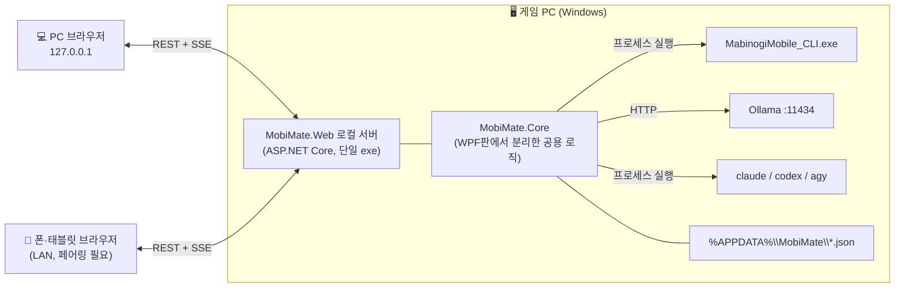

# MobiMate Web — 요구사양서 (v1.5)

> **브랜치**: `webapp` · **기준 버전**: `master@f64d2f7` (WPF 데스크톱판) · **리뷰**: v1.0·v1.1·v1.2 각각 서브에이전트 리뷰 승인 (높음 0건)
> **v1.3 변경**: WPF판 v1.1.0(`master@83c7f7e`)에서 추가된 요구사양과 실측 노하우를 반영했다 (§4 이식 매트릭스, §4.2 실측 사실, §4.3 숙제 트래커 판정 원칙, §5.11 스마트 숙제 트래커, §9 단계 계획).
> **v1.4 변경**: WPF판 v1.2.0(`master@7e6f28b`)에서 채용할 수 있는 기능을 반영했다: 4대 점수(마도저항 추가), 어비스·레이드 컷오프 추천(§5.12 FR-CO), 에린 시간 원형 표시, 레이드 클리어 확인 제안(H-11), 동적 빌드 버전. **엑셀·구글 시트 동기화는 채용하지 않는다** (承雲 결정, §10 Q6).
> **v1.5 변경**: 첫 실사용 뒤 承雲의 개선 요구를 §11로 추가했다(메인 화면을 캐릭터 전체 현황으로, 16:9 반쪽 화면 기준 배치, 점수 색상, 즐겨찾기, 가공 분류, 레이더 표시, AI 도우미 버튼). 보안 기능은 모두 제거한다(§10 Q8). 숙제 개선은 보류.
> **목표**: WPF판의 기능과 UI 골격을 그대로 이어받아 **브라우저에서 동작하는 웹앱**으로 옮긴다. 이 과정에서 UI를 예쁘고 효율적으로 다시 설계한다.
> **원칙**: 웹앱 코드는 모두 `web/` 아래에 두고, `webapp` 브랜치에만 있다. WPF판(`master`)과는 **요구사양 문서만 공유하고 코드·빌드·데이터는 완전히 분리**한다. 두 브랜치는 서로 병합하지 않는다.

---

## 0. 용어

| 용어 | 뜻 |
|---|---|
| 게임 CLI | 넥슨 제공 `MabinogiMobile_CLI.exe` (MM AI 에이전트). 게임 데이터 조회·조작의 유일한 통로 |
| 로컬 서버 | 게임 PC에서 실행되는 웹앱 백엔드. 게임 CLI·Ollama·CLI 에이전트를 대신 호출한다 |
| 클라이언트 | 브라우저에서 열리는 웹 UI (PC 브라우저, 같은 네트워크의 폰·태블릿·폴더블폰) |
| WPF판 | `master` 브랜치의 기존 데스크톱 앱 |

---

## 1. 배경과 목표

### 1.1 왜 웹앱인가
1. **세컨드 스크린 (주요 기능)**: 게임은 PC 전체 화면으로 두고, 상황판과 채팅은 **폰·태블릿·폴더블폰 브라우저**로 본다. WPF판은 게임과 같은 모니터를 나눠 써야 했다. 모바일 기기는 PC 브라우저와 **동등한 1급 클라이언트**로 설계한다 (§6.5).
2. **UI 표현력**: 반응형 레이아웃, 부드러운 전환, 차트, 다크/라이트 테마를 WPF보다 적은 비용으로 구현한다.
3. **배포 단순화 유지**: 여전히 단일 실행 파일 하나로 배포한다. 실행하면 로컬 서버가 뜨고 브라우저가 자동으로 열린다.

### 1.2 핵심 제약 (아키텍처를 결정하는 사실)
- 게임 CLI는 **게임이 실행 중인 Windows PC의 로컬 프로세스**다. 브라우저는 로컬 exe를 실행할 수 없다.
- 따라서 웹앱은 **"게임 PC의 로컬 서버 + 브라우저 UI"** 구조가 필수다. 순수 정적 웹사이트나 클라우드 호스팅으로는 성립하지 않는다.
- Ollama(`localhost:11434`)와 CLI 에이전트(`claude`, `codex`, `agy`)도 게임 PC에 있으므로 모두 로컬 서버를 거쳐 호출한다. 클라이언트가 직접 호출하지 않는다 (CORS 문제와 LAN 노출을 함께 해결).

### 1.3 목표 / 비목표

| 구분 | 내용 |
|---|---|
| 목표 | WPF판 기능 100% 이식 (§4 이식 매트릭스), UI 전면 재설계 (§6) |
| 목표 | **폰·태블릿·폴더블폰 세컨드 스크린을 주요 기능으로** 제공 (§6.5): 기기 종류와 접힘 상태에 맞춰 레이아웃이 바뀌고, 모든 P0 기능을 모바일에서도 쓸 수 있다 |
| 목표 | WPF판과 **코드·빌드·저장 데이터를 완전히 분리**한다. Core는 WPF판 파일을 복사해 출발했지만 이후 독립적으로 발전한다 (Q2) |
| 목표 | WPF판과 같은 저장 파일 형식 유지 → 두 앱이 같은 캐릭터 기록·페르소나를 공유 |
| 비목표 | 인터넷 공개 호스팅, 다중 사용자 계정, 클라우드 동기화 |
| 비목표 | 게임 CLI 명령 추가·변경 (넥슨 제공 28종 스펙 안에서만 동작) |
| 비목표 | WPF판 폐기 (당분간 병행 유지) |

---

## 2. 시스템 구성



### 2.1 기술 스택 (권장안)

| 계층 | 선택 | 이유 |
|---|---|---|
| 공용 로직 | **`MobiMate.Core` 클래스 라이브러리 (.NET 8)** | `GameCliService`, `ChatPlanService`, `PersonaTemplates(Data)`, `SnapshotManager`, `AiEngineManager`, `BuiltInGuideEngine`, `AdaptiveRefreshController`를 WPF 의존성 없이 분리해 재사용. 870개 대사 풀과 기존 테스트 자산을 다시 쓰지 않는다 |
| 백엔드 | **ASP.NET Core Minimal API (.NET 8)** | Core를 그대로 참조. 정적 파일 내장 후 단일 exe로 배포 |
| 실시간 전송 | **SSE (Server-Sent Events)** | 서버→클라이언트 단방향 푸시(상태 갱신·토스트·채집 진행)에 충분하고 WebSocket보다 단순 |
| 프론트엔드 | **Vite + React + TypeScript** | 컴포넌트 단위 UI, 타입 안정성, 빌드 결과를 exe에 내장 |
| 스타일 | **CSS 변수 기반 디자인 토큰 + CSS Modules** | 다크/라이트 테마 전환, 외부 UI 프레임워크 의존 최소화 |
| 서버 상태 | **TanStack Query** | 영역별 캐시, 재시도, 백그라운드 갱신 |
| 폰트 | **IBM Plex Sans KR + Barlow Semi Condensed (내장 번들)** | 한글 가독성과 수치 가독성. 오프라인에서도 동작하도록 CDN 대신 번들 (S1 시안에서 확정, 상세설계 §4.6) |
| 테스트 | xUnit (Core·API) · Vitest (프론트) · Playwright (E2E) | 기존 xUnit 테스트를 Core로 옮겨 계속 통과시킨다 |

> **대안 검토**: Node.js 백엔드로 새로 짜는 방안도 있다. 하지만 대사 풀 1,126줄과 스냅샷·엔진 로직을 다시 옮겨야 하고, WPF판과 로직이 갈라진다. 그래서 채택하지 않았다.

### 2.2 디렉터리 구조 (예정)

```
web/
├─ REQUIREMENTS.md            ← 본 문서
├─ src/
│  ├─ MobiMate.Core/          ← WPF판에서 분리한 공용 로직 (UI 의존 0)
│  ├─ MobiMate.Web/           ← ASP.NET Core 로컬 서버 + 내장 정적 파일
│  └─ client/                 ← Vite + React + TS
└─ tests/
   ├─ MobiMate.Core.Tests/    ← 기존 xUnit 이관 + 신규
   ├─ MobiMate.Web.Tests/     ← API 통합 테스트 (가짜 CLI 사용)
   └─ e2e/                    ← Playwright
```

> WPF판(`master`)과 웹앱(`webapp`)은 별개 프로젝트다. `webapp` 브랜치에는 WPF 코드가 없고, `master` 브랜치에는 웹 코드가 없다. 두 브랜치는 서로 다른 작업 폴더(git worktree: `V:\workspace\MobiMate\master` = master, `V:\workspace\MobiMate\webapp` = webapp, 저장소는 `V:\workspace\MobiMate\.git` bare)에서 다룬다. 공통 요구사양 문서(루트 `REQUIREMENTS.md`, `API_SPEC_SAMPLES.md`, `0x-상세설계*.md`)는 양쪽에 사본으로 둔다.

---

## 3. 비기능 요구사항

| ID | 항목 | 요구 |
|---|---|---|
| NFR-01 | 실행 | exe 더블클릭 → 로컬 서버 기동 → 기본 브라우저 자동 오픈까지 **3초 이내** |
| NFR-02 | 배포 | 단일 exe(.NET 8 런타임 의존) + 메신저 전송용 zip. `dotnet publish` 한 번으로 둘 다 생성 |
| NFR-03 | 네트워크 기본값 | 첫 실행 때는 **`127.0.0.1`에만 바인딩**한다. LAN 노출은 사용자가 명시적으로 켰을 때만 한다. 대신 첫 실행 온보딩에 **"📱 폰으로 보기" 카드를 가장 먼저** 보여서 클릭 한 번으로 LAN 모드 켜기와 QR 페어링까지 끝낸다 (FR-MB-10). 처음 켤 때 Windows 방화벽 허용 창이 한 번 뜬다는 점을 온보딩에서 미리 알린다. LAN 모드 설정은 다음 실행에도 유지하되, **현재 Windows 네트워크 프로필이 '개인'일 때만** 실제로 LAN에 바인딩한다. '공용' 네트워크(카페 와이파이 등)에서는 `127.0.0.1`로 되돌리고 그 이유를 배너로 알린다. 네트워크 프로필은 기동할 때, 10초마다, 네트워크 변경 이벤트(`NetworkChange.NetworkAddressChanged`) 때 다시 확인한다. **변경 이벤트가 오면 LAN 엔드포인트를 즉시 내리고**(허용 호스트에서 빼고 LAN 연결을 닫음), 2초 뒤부터 '개인' 판정이 **두 번 연속** 나와야 다시 연다. 전환 직후 NLM이 이전 범주를 돌려주는 경우에 대비한다 |
| NFR-04 | 포트 | 기본 `17800`. 로컬 전용 모드에서는 포트가 사용 중이면 다음 빈 포트를 자동으로 고르고 콘솔·트레이에 표시한다. **LAN 모드에서는 포트를 고정한다** (폰 바로가기가 깨지지 않도록). 포트가 사용 중이면 자동으로 바꾸지 않는다. 대신 **로컬 전용 모드로 대체 기동**해서(빈 포트 자동 선택) PC 브라우저의 설정 화면에 들어갈 수 있게 하고, "LAN 포트 17800 사용 중 — 포트를 바꾸거나 점유한 프로그램을 종료하세요" 배너를 띄운다. 포트를 바꾸면 기기들은 QR을 다시 찍어야 한다. 공용 네트워크라서 `127.0.0.1`로 되돌아갈 때(NFR-03)도 로컬 전용 모드 규칙을 따른다 |
| NFR-05 | 보안 | **§3.1 보안 요구사항**을 따른다 (localhost 포함 모든 요청 인증) |
| NFR-06 | CLI 직렬화 | 게임 CLI 호출은 **2개 레인**으로 나눈다. ① 일반 레인: 조회·짧은 조작을 서버 전역 단일 큐(`SemaphoreSlim(1,1)`)로 직렬화. ② 장시간 레인: `execute_gathering`(최대 120초) 전용, 동시 1건. `stop_action`은 두 레인을 모두 우회하는 **우선 경로**로 즉시 실행한다 (채집 중 병행 실행 가능 여부는 S2에서 가짜 CLI + 실기로 실측하고, 불가하면 대안을 상세설계에 기록) |
| NFR-07 | 중복 조회 방지 | 같은 조회 명령은 서버 캐시(TTL 3초)로 합친다. PC와 폰이 동시에 열어도 CLI 호출이 두 배가 되지 않는다 |
| NFR-08 | 안전한 인자 전달 | CLI·에이전트 인자는 `ArgumentList`로만 전달. JSON 본문은 **반드시 직렬화기로 생성** (문자열 보간 금지) |
| NFR-09 | 응답성 | 조회 API p95 ≤ CLI 실행 시간 + 50ms (**큐 대기 시간 제외**, 서버 로그에 대기·실행 시간을 따로 기록). UI 첫 화면(스켈레톤) 표시 ≤ 1초 |
| NFR-10 | 반응형 | 폭 320px(폴더블 커버 화면) ~ 2560px(와이드) 전 구간에서 가로 스크롤 없이 동작한다. 기기 판별은 User-Agent가 아니라 **창 크기 클래스 + 입력 방식 + 화면 분할 상태**로 한다 (§6.5) |
| NFR-11 | 접근성 | 키보드만으로 전 기능 조작 가능. 색 대비 WCAG AA. 상태를 색에만 의존하지 않고 아이콘·텍스트를 함께 쓴다 |
| NFR-12 | 오프라인 | 인터넷 없이 100% 동작 (폰트·아이콘·라이브러리 모두 번들). 외부 요청은 사용자가 고른 AI 엔진뿐 |
| NFR-13 | 저장 호환 | 웹앱은 **전용 폴더 `%APPDATA%\MobiMateWeb\`** 를 쓴다. 파일 이름과 형식(`character_snapshots.json`, `character_history_db.json`, `custom_personas.json`, `homework_records.json`)은 WPF판과 같게 유지한다. 단 `homework_records.json`은 계정 공통 레코드를 추가하므로(H-8) 웹앱 형식으로 변환해서 가져오고, 캐릭터를 알 수 없는 `Default_Player` 레코드는 버린다. 기록 파일마다 **웹앱 쪽 파일이 없고** WPF판 폴더(`%APPDATA%\MobiMate\`)에 같은 파일이 있으면 **복사해서 가져온다**(원본에는 쓰지 않음). 그래서 웹앱을 먼저 쓰기 시작한 뒤에 WPF판에서 새로 생긴 파일(예: 숙제 기록)도 가져올 수 있다. 손상 파일 격리·복구 동작도 이식한다 |
| NFR-14 | 동시 실행 | 웹앱과 WPF판은 저장 폴더가 다르므로 동시에 실행해도 저장 파일이 충돌하지 않는다. 남는 경합은 게임 CLI 호출 하나뿐이다(두 프로세스가 동시에 CLI를 부름). 그래서 웹앱이 기동할 때 WPF판 프로세스(`MobiMate.exe`)가 감지되면 "두 앱이 동시에 게임을 조작할 수 있습니다" 경고 배너를 띄운다. 웹앱 안에서는 원자적 쓰기(임시 파일 → 교체)로 저장 파일 손상을 막는다 |
| NFR-15 | 로깅 | 서버 로그는 `%APPDATA%\MobiMate\logs\`에 일 단위 저장. 채팅 본문 등 개인 대화는 기본적으로 기록하지 않는다 |
| NFR-16 | 버전 | 빌드 시각으로 버전 `<주>.<부>.MMdd.HHmm`을 만든다(`IncludeSourceRevisionInInformationalVersion=false`, Git 해시 없이). 네 자리 모두 표시한다(현재 `ToString(3)`은 HHmm을 자른다). 브라우저 탭 제목·설정 화면·트레이 툴팁·`/api/meta`에 같은 값을 보인다. 배포물 이름·로그 첫 줄에도 남긴다 (WPF판 v1.2.0 방식) |

### 3.1 보안 요구사항 (SEC) — v1.5에서 대부분 폐지 (§10 Q8)

承雲의 결정(2026-09-25)으로 **인증·출처 검사를 모두 없앴다.** 기동 코드, 기기 쿠키, 페어링 코드, CSRF 토큰, Host·Origin 검사, 기기 목록·폐기와 이에 딸린 SSE 강제 종료·401 화면이 없다. PC는 `http://127.0.0.1:17800`을 바로 열고, 폰·태블릿은 같은 와이파이에서 주소(QR)로 바로 접속한다. 개인 데이터는 서버에 두지 않고 게임·AI 호출 기능만 있어 대단한 보안이 필요하지 않다고 본다.

남는 규칙은 아래 셋이다.

| ID | 요구 |
|---|---|
| SEC-A | **LAN 끄기는 즉시 효과**: LAN 모드를 끄거나 개인 네트워크를 벗어나면 그 주소로 들어오는 요청은 421(`LAN_OFF`)로 거절하고 열린 SSE 연결을 닫는다. 루프백(이 PC)은 항상 통과한다. LAN은 개인 네트워크에서만 열린다(NFR-03) |
| SEC-B | **CLI 경로 검증 (구 SEC-08·09)**: CLI 경로는 로컬 드라이브의 존재하는 `MabinogiMobile_CLI.exe`만 허용하고 UNC·네트워크 드라이브·상대 경로는 거부한다. **경로 변경은 게임 PC(루프백)에서만** 한다 — 같은 와이파이의 다른 기기가 서버가 실행할 파일을 바꾸게 둘 수는 없다 |
| SEC-C | **위험 수용 (구 SEC-10)**: LAN은 평문 HTTP이고 인증이 없다. 같은 와이파이의 다른 사람이나 악성 웹페이지가 게임 채팅 전송·채집·유료 AI 호출을 요청할 수 있다. 承雲이 받아들인다. 화면에 "공용 와이파이에서는 켜지 마세요"라고 안내한다 |

---

## 4. 기능 이식 매트릭스 (WPF판 → 웹앱)

우선순위 **P0** = 첫 릴리스 필수 · **P1** = 첫 릴리스 목표 · **P2** = 후속

| 영역 | WPF판 기능 | 웹앱 | 우선 |
|---|---|---|---|
| 헤더 | 캐릭터 식별(서버·직업·레벨·칭호), 전투력 + 세션 변화량, 위치·날씨·에린 시간, 연결 램프 | 상단 바로 이식 | P0 |
| 헤더 | 캐릭터 별칭(닉네임) 설정 팝업 + 온보딩 말풍선 | 인라인 편집으로 이식 | P1 |
| 헤더 | 📌 항상 위 | 브라우저 한계로 대체: **PiP 미니 상황판**(FR-OV-04) + PWA 창 | P2 |
| 헤더 | 🛑 긴급 정지 (ESC) | 상시 버튼 + 페이지 포커스 시 ESC | P0 |
| 스탯 | 4대 점수, 전투 9대 스탯, 성기사 6종, 실시간 행동 상태 | 이식. v1.2.0부터 4대 점수는 **전투력·마도저항·생활력·매력**이다(아래 v1.2.0 추가분) | P0 |
| 가방 | 무게 게이지(95% 주의 / 100% 위험), 세션 변화량 | 이식 | P0 |
| 가방 | 가방·계정창고·캐릭터창고 600여 종 검색·필터, 잠금 표시 | 가상 스크롤로 이식 | P0 |
| 가방 | ⚖️ 무게 다이어트 필터 (세션 급증 → 대량 보유 순 정렬) | 이식 | P0 |
| 재화 | 28종 재화 카드, 세션 누적 획득(골드·날개·냥토큰) | 이식 | P0 |
| 미션 | 일일 11 / 주간 15 진행률, **완료 미션 제외** 목록, 전부 완료 배너 | 이식 | P0 |
| 생활 | 가공 대기열 + 남은 시간 카운트다운 + 수거 | 이식 (클라이언트 1초 카운트다운) | P0 |
| 생활 | 스마트 채집 도우미: 150종, 5개 분류(벌목·채광·농축산·약초·기타), 목표치 프리셋(5/50/100/200/300, ±1/±5), 가방 합산 부족 수량, 채집 시작 | 이식 + **부족 수량을 `count`로 실제 전달** (D-06) | P0 |
| 레이더 | (v1.1.0) 관계 우선 정렬(파티 > 친구 > 길드원 > 기타) → 전투력 높은 순 → 가까운 순, 인원수 헤더 `(N명)`, 나보다 강한 유저 배지, `Lv.100 (길드 없음)`·`115,058 (전투 중)` 표기, 직업·레벨 분리 | 이식 (FR-DT-06) | P0 |
| 매크로 | 📋 일일 숙제 점검 · ⚖️ 가방 다이어트 · 📥 작업대 수거 · 🛑 긴급 행동 정지 | 퀵 액션으로 이식 | P0 |
| 게임 채팅 | 50자 제한, 카운터, 빈 입력 차단, 전송 로그(성공/실패) | 이식 | P0 |
| 게임 채팅 | 10대 감정 → 이모지 + 소셜 액션 자동 부착, 부정어·제외어 방어, 실시간 미리보기, 2단계 전송 | 이식 (Core `ChatPlanService` 재사용) | P0 |
| 아무말 | 페르소나 5종 + 커스텀, 12대 상황 분류, 870개 대사 풀, LLM 생성 + 내장 폴백 | 이식 | P0 |
| 아무말 | 💬 한마디 → 입력창에 채우기 (자동 전송 아님) | 이식 | P0 |
| 아무말 | 커스텀 페르소나 생성·저장 (AppData) | 이식 + **수정·삭제 UI 추가** | P1 |
| AI | 엔진 자동 감지(내장 가이드 / Ollama / claude·codex·agy), 기본값 = 내장 가이드, 유료 엔진은 수동 선택만 | 이식 | P0 |
| AI | 내장 가이드 모드에서는 커스텀 페르소나 추가 버튼 숨김 + 커스텀 선택 중이면 기본 페르소나로 자동 롤백 + 안내 배지 | 이식 | P0 |
| AI | 게임 상태를 시스템 컨텍스트로 주입해 질의응답 | 이식 | P0 |
| AI | 문장형 가이드 쉘프(6개 카드) | 이식 | P0 |
| AI | 자연어 명령 디스패치(정지·숙제·다이어트·수거·채집) | 이식 | P0 |
| 갱신 | 적응형 자동 새로고침 (15초 → 활동 없으면 +15초씩, 최대 300초, 활동 시 리셋) | 이식 (페이지 숨김 시 일시정지 추가) | P0 |
| 갱신 | 탭 전환 시 이전 요청 취소 | 이식 (`AbortController`) | P0 |
| 알림 | 인앱 토스트 | 이식 | P0 |
| 기록 | 캐릭터 히스토리 DB (저장만 하고 UI 없음) | **신규: 성장 추이 차트** | P2 |


**WPF판 v1.1.0 추가분** (`master@83c7f7e`, 2026-09-24)

| 영역 | WPF판 기능 | 웹앱 | 우선 |
|---|---|---|---|
| 숙제 | **스마트 숙제 트래커**: 인게임 콘텐츠 가이드 기준 일일·주간 숙제 31종, 자동 감지 + 수동 체크, 매일 06시·매주 월 06시 리셋, 카운트다운, 필드 보스 택1 공유, 전체 체크 초기화, 인게임 미션 서브뷰 | 이식 + **판정 규칙 강화**(§4.3) + 계정 공통 항목 분리. 미션 화면을 숙제 화면에 통합 (§5.11) | **P0** |
| 헤더 | 에린 시간 **연도 표시 복원**: `에린 시간 2959년 4월 23일 15:51 ☀️ (낮)` | ~~이식 (연도 포함)~~ → v1.2.0의 **원형 표시**로 대체 (K-11) | P0 |
| 헤더·레이더 | 직업별 아이콘 | 이식: 직업별 **SVG 아이콘 세트**(이모지 대신, §6.4 아이콘 원칙) | P1 |
| 생활 | 가공 남은 시간 `3시간 3분 15초` 형식, 수거 대기 `수거 대기 ✅` | 이식 (FR-DT-05) | P0 |
| 생활 | 채집 도우미 검색창을 분류 줄 맨 앞에 배치 | 이식 (FR-DT-05) | P0 |
| 아무말 | **AI 페르소나 생성**: 자연어 요청("공주기사 느낌") → AI가 이름·이모지·말투 지침을 JSON으로 생성, AI가 없거나 실패하면 규칙 기반 생성으로 대체 | 이식 (FR-CH-07) | P1 |
| 안정성 | 전역 예외 로그(`crash_ui.log`), 기동 추적 로그(`startup_trace.log`) 순환 | 서버 로그(NFR-15)로 대체 + 클라이언트 오류를 서버로 보고(FR-ST-03) | P1 |

**WPF판 v1.2.0 추가분** (`master@7e6f28b`, 2026-09-25)

| 영역 | WPF판 기능 | 웹앱 | 우선 |
|---|---|---|---|
| 스탯 | **4대 점수 = 전투력·마도저항·생활력·매력** 4열 카드. 기본 스탯(힘·솜씨·지력·행운·의지)과 성기사 스탯은 기본 화면에서 뺐다. 마도저항 세션 변화량 | 이식: 상단 바·개요에 4대 점수, 전투력·마도저항은 세션 변화량 표시. 기본·성기사 스탯은 스탯 화면의 "상세 스탯" 접힘 영역으로만 둔다 | P0 |
| 대시보드 | **어비스·레이드 컷오프 추천**: 4개 콘텐츠 12개 난이도(인게임 실측), 전투력·마도저항 2중 입장 조건, 마도저항 무관용·전투력 압도 90% 추천 규칙, 3행 카드(입장·추천 / 압도 달성률 / 상위 난이도 가이드) | 이식 (§5.12 FR-CO). 판정은 Core 순수 로직, 기준표는 카탈로그 파일로 분리, 색은 화면 토큰으로 | **P0** |
| 헤더 | 에린 시간 **실측 원형 보존**: `에린 시간 2960-0-20 13:47 ☀️ (낮)` (엔진의 월이 0부터 시작해 "0월"로 왜곡되던 문제 회피) | 이식 (K-11). v1.1.0의 연도·월 분해 표시를 대체 | P0 |
| 헤더 | 캐릭터명 대형화, 우측 제어 버튼 원형 아이콘화(🛑·🔄) + 툴팁 | S4 시안에 반영(아이콘은 SVG 세트, §6.4) | P0 |
| 숙제 | **Layer 5 레이드 사후 감지**: 계정 주간 미션("레이드 1회 토벌") 완료 + 보유 중인 레이드 증표(`원정의 증거: * 레이드`)가 1종일 때 그 레이드를 자동 완료 | **변형 이식**: 자동 완료하지 않고 "클리어 추정 — 확인" 제안만 한다 (H-11, FR-HW-17) | P1 |
| 빌드 | 빌드 시각 기반 동적 버전 `v1.2.MMdd.HHmm`, 창 제목에 상시 표시 | 이식: 웹앱 버전 `<주>.<부>.MMdd.HHmm`을 브라우저 탭 제목·설정 화면·트레이 툴팁·`/api/meta`에 표시 (NFR-16) | P1 |
| 배포 | 배포 폴더 `dist` 단일화 + zip 자동 생성 + 프로젝트 루트에 exe 복사 | `web/dist` 단일화 + zip만 이식. 루트 복사는 하지 않는다(작업 트리에 산출물을 두지 않음) | P1 |
| 연동 | ClosedXML 엑셀 동기화(`마비노기_모바일_캐릭터육성.xlsx`), 구글 드라이브 경로 탐색, 구글 시트(Apps Script) | **채용하지 않음** (承雲 결정, §10 Q6) | — |

### 4.1 이식하면서 함께 고칠 WPF판 결함

| # | 결함 | 조치 |
|---|---|---|
| D-01 | `InGameChatterService.TriggerChatterAsync`는 CLI 스펙에 없는 `send_chat` + JSON 본문을 쓴다. UI에서는 호출하지 않고 테스트에서만 쓰는 **죽은 코드이자 잠재 결함**이다 (실제 "한마디"는 입력창만 채운다) | Core로 옮길 때 이 경로를 제거한다. 모든 채팅 전송은 `SendGameChatAsync`(`write_chat` + argv) 하나로 통일한다 |
| D-02 | `execute_gathering`·`complete_altering_work` JSON 본문을 문자열 보간으로 만든다 (아이템명에 `"`가 있으면 깨짐) | `JsonSerializer`로 생성 (NFR-08) |
| D-03 | 커스텀 페르소나로 LLM 호출이 실패하거나 2.5초 타임아웃이 나면 내장 폴백이 **악덕영애 대사**로 나간다 (내장 엔진 모드에서는 자동 롤백 덕분에 드러나지 않는다) | 커스텀 페르소나의 폴백은 중립 일반 대사 풀을 쓰고, "AI 응답 지연으로 기본 대사를 넣었습니다" 토스트를 띄운다 |
| D-04 | 가방 경고 기준이 문서(80/90%)와 코드(95/100%)에서 다르다 | 최신 피드백을 반영한 코드 기준 **95% 주의 / 100% 위험**으로 확정 |
| D-05 | `InGameChatterService`가 WPF `DispatcherTimer`에 의존한다 | Core에서는 타이머와 `IntervalSeconds`를 제거하고, 수동 "한마디" 전용인 현재 동작만 이식한다 |
| D-06 | 채집 도우미가 부족 수량을 계산만 하고 `execute_gathering`에는 `displayName`만 보낸다. CLI 스펙은 `{"displayName","count"}`라서 목표치 기능이 실제로는 동작하지 않는다 | 부족 수량을 `count`로 전달한다. `count` 미지원·무시 여부는 S2에서 실측한다 |
| D-07 | 자연어 디스패치가 `Contains("정지")`로 판정해서 "정지 기능 알려줘" 같은 질문도 긴급 정지를 실행한다. 자연어 채집은 확인 없이 날개를 쓴다 | FR-AI-05의 판정 규칙과 확인 절차로 바꾼다 |
| D-08 | 아무말 대잔치의 가방 과적 판정이 정규식 `(\d+)%`를 쓴다. 화면 문구가 `854.6 / 1030.0 (83.0%)`처럼 소수점을 포함하므로 `0%`만 읽혀, **100%를 넘어도 과적 대사가 나오지 않는다** (S2 테스트에서 발견) | 소수점까지 읽는 `(\d+(?:\.\d+)?)\s*%`로 바꾸고 회귀 테스트를 둔다 |

---

### 4.2 WPF판에서 얻은 게임 CLI 실측 사실 (설계 전제)

WPF판 v1.1.0 개발 중 실제 게임으로 확인된 사실이다. 웹앱 설계는 이 사실을 전제로 한다.

| # | 사실 | 설계에 주는 영향 |
|---|---|---|
| K-01 | `get_daily_missions`(11개)·`get_weekly_missions`(15개)는 **계정 단위 도전과제**다. 예: "레이드 1회 토벌 1/1"은 부캐릭터가 해도 완료된다 | 캐릭터별 숙제(레이드 3종, 소환의 결계 등) 판정 근거로 쓰지 않는다. 1:1로 대응하는 미션만 쓴다 |
| K-02 | (출처: Antigravity 작업 계획서 2026-09-24, 코드로는 미확인) `get_quests` 퀘스트 트래커는 **슬롯이 4~5개**뿐이고, 이벤트·메인 퀘스트가 자리를 차지하면 숙제 퀘스트가 보이지 않는다 | 목록에 없다고 미완료·완료를 추정하지 않는다 |
| K-03 | (출처: 같은 계획서, 미확인) 레이드·어비스·요일 던전은 던전 메뉴에서 **직접 입장**하는 경우가 많아 퀘스트 목록에 잡히지 않는다 | 이런 숙제는 수동 체크가 기본이다 |
| K-04 | 퀘스트 제목·목표 문구에 **유니티 리치텍스트 태그**(`<color=orange>…</color>`)가 섞여 있고, 띄어쓰기가 일정하지 않다 | 비교 전에 태그를 지우고 공백을 없앤다 |
| K-05 | `get_activity`에 `AutoPlayTargetDisplayName`(자동 전투 대상), `get_current_environment`에 `GameSpaceDisplayName`(공간명)이 있다 | 보스 교전·던전 입장을 "진행 중" 신호로 쓸 수 있다 |
| K-06 | 인게임 초기화: **일일 매일 06:00, 주간 매주 월요일 06:00** | 한국 표준시(KST) 기준으로 계산한다 |
| K-07 | 인게임 콘텐츠 가이드 구성: 일일 달성 3종(검은 구멍·요일 던전·망령의 탑), 주간 달성 6종(소환의 결계·검은 구멍·필드 보스·레이드·어비스·뱅가드 브리치) | 숙제 분류의 기준 |
| K-08 | `get_near_pcs`에 `HasGuild`가 있어 "길드 없음"을 구분할 수 있다 | 레이더 표기 |
| K-09 | 가공 `RemainingSeconds`는 수 시간(예: 10995초)까지 간다 | 시·분·초로 표시한다 |
| K-10 | (v1.2.0) `get_my_info`에 `ArcaneResistance`(마도저항)·`LivingScore`·`AttractivenessScore`가 있다. 실측 예: 전투력 102,832 / 마도저항 4,736 / 생활력 18,526 / 매력 26,999 | 4대 점수와 컷오프 판정의 입력 |
| K-11 | (v1.2.0) `erinnNow`의 월은 **0부터 시작**한다 (예: `2960-0-20 13:47`). 분해해서 "N월"로 쓰면 "0월"이 나온다 | 문자열 원형을 그대로 보여 주고, 시각(HH:mm)으로 낮(06~18시)·밤 배지만 붙인다 |
| K-12 | (v1.2.0) 레이드 클리어 보상 재화 `원정의 증거: <보스> 레이드`가 `get_currencies`에 나온다. 이름에 줄바꿈 없는 공백(`\u00A0`)이 섞일 수 있다. **실측 필요**: 이 재화가 주를 넘겨 쌓이는지, 계정 재화인지 캐릭터 재화인지, 우편으로 받는 경로가 있는지 | 비교 전에 공백을 정규화한다. 쌓이는 재화일 수 있으므로 보유 자체는 이번 주 클리어의 근거로 쓰지 않는다 (H-11). 계정 재화로 확인되면 FR-HW-17을 끈다 |
| K-13 | (v1.2.0) 어비스 6단계·화이트 서큐버스 2단계·에이렐 2단계·카브락 2단계의 입장·권장·압도 전투력과 입장·압도 마도저항 (承雲 인게임 실측, 2026-09-25) | 컷오프 카탈로그의 초깃값 (FR-CO-01). 게임 업데이트로 바뀌면 카탈로그만 고친다 |

### 4.3 숙제 트래커 판정 원칙 — WPF판 구현과 다르게 하는 점

WPF판 v1.1.0의 목표 "오탐율 0%"는 그대로 따른다. 다만 코드(`HomeworkTrackerService.cs`, `HomeworkRepository.cs`)를 확인한 결과 아래 경우에는 오탐이나 상태 꼬임이 생길 수 있다. 웹앱은 오른쪽 방식으로 구현한다.

| # | WPF판 v1.1.0 동작 | 문제 | 웹앱 방식 |
|---|---|---|---|
| H-1 | 보스가 자동 전투 대상이거나 이름이 맞는 공간에서 전투 중이면 **완료** 처리 (Layer 3) | 교전 시작 ≠ 처치. 게다가 "동굴", "광기", "물길", "허상" 같은 일반어 키워드로 다른 던전에서도 완료될 수 있다 | 교전·입장은 **"진행 중"** 표시만 한다. 완료는 사용자가 한 번 눌러 확인한다(FR-HW-06) |
| H-2 | 퀘스트 제목이 맞고 **목표 중 하나라도** 완료면 완료 (Layer 2) | 여러 단계 퀘스트가 첫 단계만 끝나도 완료된다 | 제목이 맞고 **모든 목표가 완료**일 때만 완료 |
| H-3 | 1:1 미션 판정이 키워드 **부분 포함**으로 매칭 (예: 요일 던전 키워드 "던전") | 계정 미션 "오늘도 던전 한 바퀴(던전 3회)"로 요일 던전이 완료될 수 있다 | 1:1 미션은 숙제별로 지정한 **미션 제목과 정확히 일치**(태그·공백 정규화 후)할 때만 |
| H-4 | 가공 대기열에 완료된 작업이 **있기만 하면** "가공시설 수거" 완료 | 수거하지 않았는데 완료된다 | 앱에서 수거에 성공했거나, 완료 작업이 대기열에서 사라진 것을 관찰했을 때 완료 |
| H-5 | 주기 리셋이 **완료된 항목만** 초기화 | 사용자가 체크를 해제한 항목은 수동 우선 표시(`ManualOverride`)가 **영구히** 남아 그 항목의 자동 감지가 다시는 동작하지 않는다. 부분 진행도도 다음 주기로 넘어간다 | 리셋 때 그 주기의 **모든 항목**을 초기화(진행도·자동/수동 표시 포함) |
| H-6 | 리셋 시각을 **PC 로컬 시간**으로 계산 | PC 시간대가 한국이 아니면 틀린다 | **KST(Asia/Seoul)** 기준 |
| H-7 | 필드 보스 공유 풀 ID(`field_boss_weekly`)가 저장소 코드와 화면 모델 코드에 각각 박혀 있다 (현재 값은 같아 동작은 정상) | 한쪽만 바꾸면 "주간 택1" 표시가 깨진다 | 공유 풀 ID는 카탈로그 한 곳에서만 정의하고 화면은 카탈로그를 참조 |
| H-8 | 계정 공통 항목(상점 교환, 주간 미션 완수)을 **캐릭터별**로 저장 | 캐릭터를 바꾸면 계정 항목이 다시 미완료로 보인다 | 계정 공통 레코드를 따로 둔다 |
| H-9 | 저장할 때마다 파일 전체를 다시 읽고, 임시 파일 이름이 고정(`homework_records.json.tmp`)이며, 예외가 나면 호출자에게 그대로 던진다 | 예외 시 화면 갱신이 끊길 수 있고, 서버처럼 여러 요청이 동시에 저장하면 충돌한다 | `JsonFileStore`(고유 임시 파일 + 원자적 교체 + 파일별 잠금) |
| H-11 | (v1.2.0) 레이드 사후 감지(Layer 5): 계정 주간 미션에 "출정"·"레이드"가 들어간 미션이 완료이고, 보유 중인 `원정의 증거 … 레이드` 재화가 1종이면 그 레이드를 **자동 완료** | ① 증표 재화는 주를 넘겨 쌓이므로 지난주 증표가 남아 있으면 이번 주에 돌지 않아도 완료된다. ② 주간 미션은 계정 단위라(K-01) 부캐릭터가 돌아도 조건이 충족된다. ③ 미션 조건이 `Description.Contains("레이드")`처럼 느슨하고, `CurrentCount >= 1`이라 미션이 부분 진행만 돼도 통과한다. ④ 공백 정규화 **전에** `Contains("원정의 증거")`로 걸러서 이름에 `\u00A0`가 섞이면 놓친다. ⑤ 레이드 키워드를 부분 일치로 비교한다 | 자동 완료하지 않는다. **같은 캐릭터를 연속 관찰했을 때 그 레이드 증표 수량이 이번 주기 안에서 늘었으면** 카드에 "클리어 추정 — 확인" 제안을 띄우고, 사용자가 한 번 눌러 확정한다 (FR-HW-17). 보유량만으로는 제안도 하지 않는다 |
| H-10 | 퀘스트 판정(Layer 2)·교전 판정(Layer 3)이 **판정 방식과 상관없이 모든 항목**에 적용된다. 교전 판정은 전투 중이 아니어도 자동 사냥(`IsAutoPlaying`)이면 통과하고, 공간명 대신 채널명만 맞아도 통과한다. 퀘스트 판정은 제목이 달라도 **목표 설명**만 맞으면 완료한다 | 수동 전용 상점 항목이 "성수"·"데카" 같은 키워드로 자동 완료될 수 있고, "검은 구멍" 하나가 일일·주간 두 항목을 동시에 완료시킨다 | 항목마다 카탈로그에 지정한 **판정 방식 하나만** 적용한다. 목표가 0개인 퀘스트는 완료 근거로 쓰지 않는다 |

## 5. 기능 요구사항 상세

### 5.1 연결·상태 (FR-CN)
- **FR-CN-01** 서버는 게임 CLI `status`를 **고정 10초 주기**로 확인한다 (서버의 유일한 자체 폴링). 결과를 `connected | disconnected | cli_missing` 셋 중 하나로 SSE 푸시한다. 데이터 갱신은 서버가 폴링하지 않고 클라이언트가 요청한다 (FR-RF).
- **FR-CN-02** `cli_missing`이면 전체 화면 안내를 띄운다: CLI 기본 경로, 환경변수 `MABINOGI_MOBILE_CLI` 설정법, "MM AI 에이전트" 활성화 방법.
- **FR-CN-03** `disconnected`이면 데이터를 지우지 않는다. 마지막 값을 흐리게 표시하고 "N분 전 데이터" 배지를 단다.
- **FR-CN-04** 모든 조회 응답에 `fetchedAt`을 포함한다. 카드마다 신선도(상대 시간)를 표시한다.

### 5.2 개요 대시보드 (FR-OV) — 신규 기본 화면
WPF판은 6개 탭 중 하나만 보여서, v2.1 요구사양의 "한눈에 보는 상황판" 목표가 흐려졌다. 웹앱은 **개요 화면을 첫 화면으로** 되살린다.
- **FR-OV-01** 한 화면에 요약 카드 8종: **4대 점수**(전투력·마도저항은 +세션 변화, 생활력·매력), **콘텐츠 추천**(어비스·레이드 4종의 추천 난이도와 상태 배지 한 줄씩, FR-CO-07), 가방 무게 게이지, 재화 3종(+세션 획득), **숙제 진행 링(일일 달성 x/y, 주간 달성 x/y) + 다음 리셋까지 남은 시간**, 가공 대기열(다음 완료까지 남은 시간), 주변 길드원·파티원 수, 현재 행동 상태. 숙제 카드를 누르면 남은 숙제 목록을 그 자리에서 띄운다(FR-OV-02 규칙과 같음).
- **FR-OV-02** 카드를 누르면 해당 상세 화면으로 이동한다. 단, **숙제 카드(일일·주간 진행 링)는 개요를 벗어나지 않고 남은 숙제 목록(제목·설명·진행도)을 바로 띄운다** (PC·태블릿은 대화상자, Compact는 하단 시트). 목록 아래 "숙제 화면에서 전체 보기"(`/homework?tab=missions`)로 상세 화면에 갈 수 있다. 세컨드 스크린에서 화면 전환 없이 확인하기 위해서다.
- **FR-OV-03** 경고 요약 스트립: 가방 95% 이상, 수거 가능한 가공물, 남은 일일 숙제(일일 달성·계정 미션)가 있으면 상단에 칩으로 표시한다. 칩을 누르면 해당 퀵 액션을 실행한다.
- **FR-OV-04 (P2)** Document Picture-in-Picture(크로미움 계열)로 전투력·무게·숙제 미니 상황판을 띄운다. "항상 위"를 대체한다. 지원하지 않는 브라우저에서는 버튼을 숨긴다.

### 5.3 상세 화면 (FR-DT)
WPF판 6개 탭을 그대로 옮기되 개요와 같은 카드 언어로 통일한다.

| ID | 화면 | 요구 |
|---|---|---|
| FR-DT-01 | 📊 스탯 | 4대 점수 대형 수치, 전투 스탯 9종 그리드, 성기사 6종, 체력·만복도 바, 버프 개수, 행동 상태 램프 |
| FR-DT-02 | 🎒 가방·창고 | 무게 게이지 + 세션 변화, 위치 세그먼트(전체/가방/계정창고/캐릭터창고/⚖️다이어트), 검색(이름·카테고리, 150ms 디바운스), 가상 스크롤 표, 잠금 아이콘, 세션 증가량 배지 |
| FR-DT-03 | 💰 재화 | 28종 카드 그리드, 핵심 3종 상단 고정, 세션 누적 증감 색상(증가 초록 / 감소 빨강) |
| FR-DT-04 | 📋 미션 | (v1.3) 별도 화면을 없애고 **숙제 화면의 "인게임 미션" 탭**으로 통합한다 (FR-HW-12). 일일·주간 진행 바, 미완료만 목록, 전부 완료 시 축하 배너, "완료 포함 보기" 토글 |
| FR-DT-05 | 🌿 생활 | 가공 대기열(남은 시간을 `3시간 3분 15초` 형식으로 표시하며 1초 카운트다운, 완료는 `수거 대기`로 강조, 개별·일괄 수거), 스마트 채집 도우미(**검색창을 분류 칩 줄 맨 앞에 배치**, 분류 칩, 목표치 프리셋·±조정, 보유/목표/부족, 도구 미보유 비활성, 채집 시작 확인) |
| FR-DT-06 | 👥 레이더 | 헤더에 인원수 `주변 플레이어 (N명)`. 정렬: 관계(파티원 > 친구 > 길드원 > 기타) → 전투력 높은 순 → 가까운 순. 행: 직업 아이콘·직업명, `Lv.100` + 관계 배지 또는 `(길드 없음)`, 전투력(전투 중이면 `(전투 중)`), 나보다 전투력이 높으면 "강함" 배지, 거리. 길드원만 보기 필터 |

- **FR-DT-07** 채집 시작 전에 "정령의 날개 5개 소모"를 확인 다이얼로그로 알린다 (자연어 채집 포함, FR-AI-05). `execute_gathering` 결과(`completed / started / stopped`, `gained`)를 토스트로 보여준다.
- **FR-DT-08** 채집은 최대 120초 걸리는 장시간 요청이다. 서버는 즉시 `202 Accepted` + 작업 ID를 반환하고, 장시간 레인(NFR-06)에서 실행한 뒤 결과를 SSE로 알린다. 그동안 조회와 긴급 정지는 막히지 않는다. 채집이 이미 진행 중이면 새 채집 요청은 `409`로 거절한다.

### 5.4 퀵 액션·긴급 정지 (FR-AC)
- **FR-AC-01** 상단 바에 상시 표시: 🛑 긴급 정지. 누르면 확인 없이 바로 `stop_action`을 호출한다 (안전 기능이므로).
- **FR-AC-02** 퀵 액션 4종: 📋 일일 숙제 점검, ⚖️ 가방 다이어트, 📥 작업대 수거, 🛑 행동 정지. 동작은 WPF판과 동일하다.
- **FR-AC-03** 단축키: `Esc` 긴급 정지 (단, 입력창·다이얼로그에 포커스가 있으면 먼저 그것을 닫음), `Ctrl+K` 명령 팔레트 (P1), `1`~`7` 화면 전환, `/` 채팅 입력 포커스. `1`~`7`과 `/`는 입력 요소(`input`, `textarea`, `contenteditable`)에 포커스가 있으면 동작하지 않는다.
- **FR-AC-04 (P1)** 명령 팔레트: 화면 이동, 퀵 액션, 채집 아이템 이름 검색 → 채집 시작, 페르소나 전환을 한 곳에서 검색·실행한다.

### 5.5 인게임 채팅 (FR-GC)
- **FR-GC-01** 입력 → Enter 또는 전송 버튼 → `write_chat`. 빈 입력·공백 전송 차단. 개행은 공백으로 치환한다.
- **FR-GC-02** 글자 수 카운터 `n / 50`. 45자 이상 경고색, 50자 초과 입력 차단. 글자 수 규칙은 **서버 Core 한 곳에서 정의**하고 클라이언트 카운터와 서버 절단이 같은 규칙을 쓴다. 잠정 규칙은 "유니코드 코드포인트 기준, 이모지 1자, 서러게이트 페어를 쪼개지 않음"이다. 게임이 실제로 세는 단위(코드포인트 / UTF-16 / 바이트)는 TST-07에서 실측하고 규칙을 확정한다. 현재 WPF판은 UTF-16 `Length`로 자르는데, 이 경우 이모지가 2자로 계산된다.
- **FR-GC-03** 입력 중 실시간 미리보기 `자동: 😊 /손인사1` (Core `ChatPlanService.GetPreviewHint`). 미리보기를 끄고 원문 그대로 보내는 토글을 둔다 (P1).
- **FR-GC-04** 2단계 전송: ① 이모지를 붙인 대사 → ② 성공 시에만 150ms 뒤 소셜 액션. 로그에 `✓ 안녕하세요 😊 (행동: /손인사1)` 형태로 기록한다.
- **FR-GC-05** 전송 로그: 시각, 결과(성공/실패 + 사유), 출처(직접 / 아무말:페르소나). 실패 항목에는 "다시 보내기" 버튼. 로그는 세션 동안 서버가 보관하고 새로 접속한 기기에도 보인다.
- **FR-GC-06** 연타 방지: 전송 중에는 버튼을 비활성화한다. 1초 안에 같은 문구를 다시 보내면 무시한다.

### 5.6 아무말 대잔치 (FR-CH)
- **FR-CH-01** 페르소나 선택: 🌹 악덕영애, 💰 구두쇠 영감, ☀️ 안녕하닝 모닝이야, 🌊 갱상도 아재, ✨ 아이돌 댄서, 커스텀 목록.
- **FR-CH-02** 💬 한마디: 현재 상황(직업·위치·행동·가방·골드·에린 시간)으로 12대 카테고리를 판정한다. 선택된 AI 엔진(2.5초 타임아웃) 또는 내장 대사 풀로 대사를 만들어 **입력창에 채운다** (자동 전송 안 함).
- **FR-CH-03** 생성된 대사도 FR-GC 규칙(50자, 이모지·액션)을 똑같이 거친다.
- **FR-CH-04** 커스텀 페르소나: 이름, 이모지, 말투 프롬프트 입력 → `custom_personas.json`에 저장. 목록에서 수정·삭제 (P1). 커스텀은 AI 엔진이 연결되었을 때만 고유 말투가 나온다고 UI에 안내한다 (D-03).
- **FR-CH-07 (P1) AI 페르소나 생성**: "공주기사 느낌으로 만들어줘"처럼 자연어로 요청하면 AI 엔진이 이름·이모지·말투 지침(2~3문장)을 JSON으로 만든다. 결과는 편집 가능한 초안으로 보여 주고, 사용자가 저장해야 커스텀 페르소나가 된다. AI 엔진이 내장 가이드이거나 응답이 실패·JSON 형식 오류이면 규칙 기반으로 초안을 만든다(요청 문구에서 이름을 뽑고 기본 말투 틀을 채움).
- **FR-CH-05** 가방 과적 판정은 `(\d+)%` 파싱 결과가 100 이상일 때만 (WPF v7 규칙 유지).

### 5.7 AI 도우미 (FR-AI)
- **FR-AI-01** 엔진 감지: 서버 기동 시 + "다시 찾기" 버튼. 내장 가이드(항상) / Ollama 모델들(1.5초 프로빙) / `where.exe claude·codex·agy`(1초 프로빙).
- **FR-AI-02** 기본 엔진은 **내장 가이드 고정**. 사용자가 고른 엔진은 서버 설정에 저장하고 다음 기동 때 복원한다. 유료 CLI 엔진은 자동 선택 대상에서 절대 제외한다.
- **FR-AI-03** 엔진 목록에 비용 배지를 붙인다: `무료·내장`, `무료·로컬`, `계정 과금`. 유료 엔진을 고르면 1회 확인한다.
- **FR-AI-04** 질의 시 현재 게임 상태(서버·직업·레벨·전투력·행동·위치·가방)를 시스템 컨텍스트로 주입한다. 응답은 **`POST /api/ai/ask`의 응답 본문 스트림**(`fetch` + `ReadableStream`, NDJSON)으로 요청한 클라이언트에게만 보낸다. 브로드캐스트 채널(`/api/events`)로는 보내지 않는다. Ollama는 `stream: true`로 토큰 단위로, CLI 엔진은 완료 후 한 번에 보낸다.
- **FR-AI-05** 자연어 명령 디스패치를 LLM 호출 전에 가로챈다. 판정 규칙은 다음과 같다.
  - **정지**: 입력 전체가 명령형 단문일 때만 실행한다. 공백·문장부호를 뺀 입력이 `정지`, `멈춰`, `스톱`, `그만`에 선택적 어미(`해`, `해줘`, `!`)만 붙은 형태여야 한다. "정지 기능 알려줘"처럼 질문이면 LLM으로 넘긴다.
  - **숙제 점검**: 숙제, 일일 미션, 일일미션 → 숙제 화면 이동(`/homework`, 일일 탭) + 남은 숙제 요약. 조회만 하므로 부작용이 없다.
  - **다이어트**: 다이어트, 가방 정리, 무게 줄여 → 가방 화면 다이어트 필터. 조회만 한다.
  - **수거**: 수거, 작업대, 가공물 → 수거 가능 목록 카드와 [수거] 버튼을 보여준다. 바로 실행하지 않는다.
  - **채집**: 채집, 캐줘, 캐라, 캐러, 모아줘, 수집, 낚시, 낚아 + 채집 가능 아이템명(긴 이름 우선 매칭) → **확인 카드**(아이템명, 목표 수량, 날개 5개 소모)를 보여준다. 사용자가 [시작]을 눌러야 실행한다 (D-07).
- **FR-AI-06** 가이드 쉘프 6개 문장 카드. 내장 가이드 모드에서는 대화 영역 상단에 크게, LLM 모드에서는 입력창 위 칩으로 작게 보인다.
- **FR-AI-07** 대화 말풍선에 Markdown(목록·굵게·코드)을 렌더링한다. HTML은 이스케이프한다. 답변 복사 버튼을 둔다.
- **FR-AI-08** 생성 중 "중지" 버튼으로 요청을 취소한다. CLI 에이전트는 프로세스 트리를 종료하고 Ollama는 요청을 끊는다.
- **FR-AI-09** 웰컴 메시지는 1줄. 엔진 전환 알림은 대화창이 아니라 토스트로만 보낸다.

### 5.8 자동 갱신 (FR-RF)
- **FR-RF-01** 적응형 주기는 **클라이언트마다 따로** 돈다: 기본 15초, 그 클라이언트에서 활동이 없으면 틱마다 +15초 (최대 300초), 그 클라이언트에서 클릭·키 입력·터치·화면 전환이 있으면 15초로 리셋. 규칙은 Core `AdaptiveRefreshController`와 같게 TS로 구현하고, 같은 테스트 벡터로 검증한다. 여러 기기의 중복 조회는 서버 캐시(NFR-07)가 합친다.
- **FR-RF-02** 브라우저 탭이 숨겨지면(`visibilitychange`) 해당 클라이언트의 갱신을 멈춘다. 다시 보이면 즉시 1회 갱신한다.
- **FR-RF-03** 갱신 범위: 상단 바(`status`·`get_my_info`·`get_activity`·`get_current_environment`) + **현재 보고 있는 화면**의 데이터만. 개요 화면은 요약에 필요한 명령을 모두 조회한다.
- **FR-RF-04** 수동 새로고침 버튼은 현재 화면만 즉시 갱신하고 주기를 리셋한다.

### 5.9 캐릭터 기록 (FR-HS)
- **FR-HS-01** 캐릭터 식별은 `서버명_직업` 키 + 레벨·칭호 보조 매칭 (WPF판 `SnapshotManager` 그대로).
- **FR-HS-02** 세션 기준점(앱 기동 후 첫 수신)과 직전 틱 두 기준을 유지한다. UI에는 세션 누적을 기본으로 보이고, 툴팁에 직전 대비 변화를 보인다.
- **FR-HS-03 (P2)** 성장 추이: 히스토리 DB로 전투력·골드·생활력 추이를 7일/30일 차트로 그린다.

### 5.10 설정 (FR-ST)
- **FR-ST-01** 설정 화면: 테마(시스템/다크/라이트), 글자 크기(보통/크게/아주 크게 — WPF판 대형 폰트 요구 계승), CLI 경로, LAN 모드와 페어링 기기 관리, 자동 갱신 최대 주기, 이모지·액션 자동 부착 기본값.
- **FR-ST-03 (P1)** 클라이언트에서 처리되지 않은 오류(`window.onerror`, `unhandledrejection`)는 `/api/client-errors`로 보내 서버 로그에 남긴다(개인 데이터 제외, 분당 10건 제한).
- **FR-ST-02** 설정은 서버의 `%APPDATA%\MobiMate\web_settings.json`에 저장한다. 테마·글자 크기처럼 기기마다 다른 값은 브라우저 `localStorage`에 둔다.

---

### 5.11 스마트 숙제 트래커 (FR-HW) — v1.3 신규, P0

WPF판 v1.1.0에서 가장 호평받은 기능이다. 콘텐츠 목록과 사용 흐름은 WPF판을 따르고, 판정은 §4.3 원칙으로 강화한다.

- **FR-HW-01 콘텐츠 카탈로그**: 숙제 정의(ID·분류·주기·공유 범위·판정 방식·제목·설명·아이콘·목표 수·보상 요약·공유 풀·매칭 규칙)는 코드가 아닌 **카탈로그 데이터(JSON, 앱에 내장)**로 관리한다. 초기 목록은 WPF판 31종과 같다.

| 분류 | 항목 | 주기 | 공유 범위 | 판정 방식 |
|---|---|---|---|---|
| 일일 달성 | 검은 구멍, 요일 던전, 망령의 탑 | 일일 | 캐릭터 | 수동 + 진행 신호 (공간명은 실측 후 카탈로그에 채움) |
| 주간 달성 | 소환의 결계 1~7단계, 검은 구멍 주간 1~7단계 | 주간 | 캐릭터 | **수동 단계 카운터**(0~7, `+1`/`−1`) + 진행 신호 |
| 주간 달성 | 뱅가드 브리치 | 주간 | 캐릭터 | 퀘스트 전 목표 완료 + 수동. 퀘스트 제목 `[긴급 의뢰] 뱅가드 브리치`는 WPF판 계획서 기준이며 **실측 필요** (실측 전에는 수동) |
| 필드 보스 | 페리, 크라브바흐, 크라마, 드로흐에넴, 토르모그, 앙그르바한 | 주간, **택1 공유 풀** | 캐릭터 | 수동 + 진행 신호(보스명) |
| 레이드 | 카브락, 에이렐, 화이트 서큐버스 | 주간 | 캐릭터 | 수동 + 진행 신호(보스명) |
| 어비스 | 허상의 정박지, 광기의 동굴, 흩어진 물길 | 주간 | 캐릭터 | 수동 + 진행 신호(공간명) |
| 계정 미션 | 에린 접속, 던전 3회 토벌, 재료 3회 채집, 일일 미션 완수 | 일일 | **계정** | 1:1 미션 / 미션 전체 개수 |
| 계정 미션 | 주간 미션 완수 | 주간 | **계정** | 미션 전체 개수 |
| 길드 | 길드 미션 & 기부 | 주간 | 캐릭터 (길드 기부가 캐릭터 단위일 수 있어 WPF판과 같이 둠, 실측 필요) | 수동 (근거 미션 제목을 실측하면 1:1 미션으로 전환) |
| 생활 | 가공시설 수거 | 일일 | 캐릭터 | 수거 관찰 (FR-HW-05) |
| 상점·교환 | 일일 무료 패션 소환, 조각난 보석 보물상자, 은동전 상자 교환 | 일일 | 계정 | 수동 전용 |
| 상점·교환 | 하트 토큰 성수 교환, 할인 패션 티켓 구매, 할인 펫 티켓 구매 | 주간 | 계정 | 수동 전용 |

> WPF판은 계정 미션 근거 항목(접속·던전 3회·재료 3회·일일 미션 완수)을 캐릭터별로 두었다. 미션은 계정 단위이므로(K-01) 웹앱은 계정 공통으로 옮긴다. 그래야 부캐릭터에서 본캐릭터의 미션 진행으로 숙제가 완료되는 오탐이 없다.

- **FR-HW-02 공유 범위**: 항목마다 캐릭터별 / 계정 공통을 구분한다(상점·교환, 주간 미션 완수 등은 계정 공통). 계정 공통 항목은 한 번 체크하면 모든 캐릭터에서 완료로 보인다 (H-8). CLI가 계정 ID를 주지 않으므로 **이 PC의 게임 계정 1개**를 전제로 한다.
- **FR-HW-03 리셋**: 일일 매일 06:00, 주간 매주 월요일 06:00, **KST 기준** (H-6). 리셋 시각이 지나면 그 주기의 모든 항목의 진행도·완료·자동/수동 표시를 지운다 (H-5). 서버가 꺼져 있다가 켜져도 마지막 리셋 시각과 비교해 밀린 리셋을 적용한다.
- **FR-HW-04 판정 원칙 (오탐 0)**: 자동 **완료**는 다음 두 가지 확정 증거일 때만 한다.
  1. **1:1 미션**: 카탈로그에 지정한 미션 제목(태그·공백 정규화 후)과 **정확히 일치**하는 일일·주간 미션의 진행도 (에린 접속, 던전 3회, 재료 3회 채집, 일일·주간 미션 완수 개수, 길드 미션) (H-3, K-01)
  2. **퀘스트 전 목표 완료**: 카탈로그의 퀘스트 제목 패턴과 일치하는 퀘스트의 **모든 목표**가 완료 (H-2, K-02, K-04)
- **FR-HW-05 가공 수거 판정**: 다음 둘 중 하나일 때만 "가공시설 수거"를 완료로 한다 (H-4). ① 앱에서 `complete_altering_work`가 성공했다. ② **같은 캐릭터 키**에서 **연속으로 성공한 두 조회**를 비교했을 때 (시설명, 작업명)별 완료 작업 수가 줄었다. 작업에 ID가 없으므로 개수로 비교하며, 조회 실패·빈 응답·캐릭터 전환 직후의 조회는 비교에 쓰지 않는다.
- **FR-HW-06 진행 신호**: 보스가 자동 전투 대상이거나(`AutoPlayTargetDisplayName`) 숙제 공간(`GameSpaceDisplayName`, 카탈로그의 고유 공간명과 정확히 일치)에서 전투 중이면 카드에 **"진행 중"** 배지를 달고 "완료로 표시" 버튼을 강조한다. 자동으로 완료하지 않는다 (H-1, K-05).
- **FR-HW-07 매칭 규칙**: 비교 전 유니티 태그 제거 + 공백 제거. "던전", "동굴", "채집", "요일"처럼 여러 콘텐츠에 겹치는 일반어는 단독 매칭 키로 쓰지 않는다 (카탈로그 검증 테스트로 강제).
- **FR-HW-08 수동 우선**: 사용자가 누른 상태(완료 ↔ 미완료)는 그 주기 동안 자동 판정이 덮어쓰지 않는다. 리셋 때 해제된다.
- **FR-HW-09 래치**: 완료된 항목은 퀘스트가 목록에서 사라져도 리셋 전까지 완료를 유지한다.
- **FR-HW-10 필드 보스 공유 풀**: 6종 중 하나를 완료하면 풀이 완료되고, 나머지 5종은 "택1 완료"로 흐리게 표시한다(개별 완료로 세지 않음). 완료한 항목을 해제하면 풀 전체가 미완료로 돌아간다. 진행 통계에서 풀은 1건으로 센다.
- **FR-HW-11 전체 체크 초기화**: 현재 캐릭터(+ 선택 시 계정 공통)의 이번 주기 체크를 모두 지운다. 되돌릴 수 없으므로 확인 대화상자를 거친다.
- **FR-HW-12 화면**:
  - 상단: 일일·주간 진행 링과 다음 리셋 카운트다운, 탭(전체 / 일일 달성 / 주간 달성 / 필드 보스 / 레이드 / 어비스 / 생활·계정 / 상점·교환 / **인게임 미션**)
  - 카드 그리드: Large·Expanded 2~3열, Medium 2열, Compact 1열. 미완료 먼저, 그다음 분류 순
  - 카드: 아이콘·제목·설명·진행 `x/y`·판정 배지(⚡ 자동 완료 / ✍ 수동 완료 / ● 진행 중 / 택1 완료 / 미완료)·보상 요약. **카드 전체를 한 번 누르면 토글**(터치 44px 이상)
  - "인게임 미션" 탭은 기존 미션 화면(일일 11 · 주간 15, FR-DT-04)을 그대로 담는다
- **FR-HW-13 판정 근거 표시**: 자동 완료 카드는 근거(예: "일일 미션 '오늘도 던전 한 바퀴' 3/3", "퀘스트 '[긴급 의뢰] 뱅가드 브리치' 목표 전부 완료")를 길게 누르기·툴팁으로 보여 준다. 오탐이 보이면 사용자가 바로 판단할 수 있게 하기 위해서다.
- **FR-HW-14 저장**: `%APPDATA%\MobiMateWeb\homework_records.json` (캐릭터별 레코드 + 계정 공통 레코드). 웹앱 쪽에 이 파일이 없으면 WPF판 기록을 변환해서 가져온다 (NFR-13, 파일별 규칙). **한계**: 캐릭터 키가 `서버_직업`이므로 직업을 바꾸면 기록이 이어지지 않고, 같은 서버·같은 직업 캐릭터 둘은 기록이 섞인다(스냅샷 기록과 같은 한계).
- **FR-HW-15 (P1) 리셋 알림**: 주간 리셋 1시간 전에 미완료 주간 숙제가 있으면 인앱 알림·진동(FR-MB-14)을 보낸다.
- **FR-HW-17 (P1) 레이드 클리어 확인 제안** (H-11): 캐릭터별로 레이드 증표 재화 `원정의 증거: <보스> 레이드`의 마지막 관찰 수량을 기록 파일에 저장한다. **같은 캐릭터 키, 같은 주간 주기 안에서, 사이에 다른 캐릭터 관찰 없이** 다음 관찰(조회 성공)의 수량이 늘었으면 해당 레이드 카드에 "🔎 클리어 추정 — 눌러서 확인" 배지를 띄운다. 누르면 수동 완료와 같다. 제안은 자동 완료로 세지 않고, 주기가 바뀌면 사라진다. 수량이 줄면(사용) 기준값만 낮춘다. 한 구간에서 얻고 쓴 경우(순증가 0 이하)는 놓치는 것을 받아들인다. 여러 레이드 증표가 함께 늘면 각각 제안한다. 증표 이름과 레이드 항목의 대응은 카탈로그에 정확한 이름으로 둔다(공백 정규화 후 완전 일치). **응답 목록에 없는 증표는 0개로 보지 않고** 기준값을 그대로 둔다(불완전한 목록 → 0 → 늘어남 오탐 방지). 마지막 관찰 캐릭터는 기록 파일에 저장해 재기동 뒤에도 "사이에 다른 캐릭터 관찰"을 판단하고, 캐릭터가 바뀐 관찰에서는 기준값을 지우기만 한다(재화 캐시가 이전 캐릭터 것일 수 있음). 사용자가 이번 주기에 수동으로 설정한 항목에는 제안을 띄우지 않는다. 제안은 `{ code: "raidTokenIncreased", item, from, to }`로 주고 문구는 화면이 만든다. 재화 조회는 숙제·개요 조회 묶음과 캐릭터가 바뀐 직후에 한다(WPF `7d2dae5`처럼 재화 화면에 묶지 않는다).
- **FR-HW-16 (P2) 카탈로그 갱신**: 게임 업데이트로 콘텐츠가 바뀌면 카탈로그 파일만 바꿔 반영한다. 사용자 폴더의 `homework_catalog.override.json`이 있으면 내장 카탈로그 위에 덮어쓴다.

### 5.12 어비스·레이드 컷오프 추천 (FR-CO) — v1.4 신규, P0
WPF판 v1.2.0의 판정 규칙을 그대로 따른다. 판정은 Core의 순수 함수로 두고, 화면 문구·색은 클라이언트가 정한다.
- **FR-CO-01 기준표**: 콘텐츠(어비스·화이트 서큐버스·에이렐·카브락)마다 난이도 목록과 난이도별 `입장 전투력 / 권장 전투력 / 압도 전투력 / 입장 마도저항 / 압도 마도저항`(마도저항 0이면 조건 없음)을 둔다. **목록 순서가 난이도 순서**다(쉬운 것부터). 로드할 때 `입장 ≤ 권장 ≤ 압도 전투력`, `압도 전투력 > 0`, `입장 마도저항 ≤ 압도 마도저항`(압도가 0이 아닐 때), 입장 전투력 오름차순을 검증하고 어기면 그 콘텐츠를 빼고 경고한다. 초깃값은 K-13. 내장 카탈로그(`cutoff_catalog.json`) 위에 사용자 폴더의 `cutoff_catalog.override.json`이 있으면 덮어쓴다(FR-HW-16과 같은 방식).
- **FR-CO-02 입장 가능**: 전투력과 마도저항이 **둘 다** 입장 기준 이상인 난이도 중 가장 높은 것. 하나도 없으면 "입장 불가"와 첫 난이도 기준으로 모자란 전투력·마도저항을 알린다.
- **FR-CO-03 추천 난이도**: 입장 가능한 난이도 중 ① 마도저항이 압도 마도저항 이상(**무관용**, 1이라도 모자라면 제외)이고 ② 전투력이 권장 이상이면서 압도 전투력의 90%(`압도 × 9 / 10`, 정수 나눗셈) 이상인 가장 높은 난이도. 없으면 ①만 만족하는 가장 높은 난이도, 그것도 없으면 입장 가능한 가장 높은 난이도.
- **FR-CO-04 상태**: 추천 난이도 기준으로 `압도`(전투력 ≥ 압도 전투력, 마도저항 조건 충족) / `압도 근접`(전투력 ≥ `압도 × 9 / 10`(정수 나눗셈), 마도저항 조건 충족) / `턱걸이`(그 외). 압도가 아니면 달성률 `min(99, 전투력 × 100 / 압도 전투력)`%(64비트 정수 나눗셈)와 남은 전투력, 모자란 마도저항을 준다(99% 상한·버림으로 "100%인데 압도 아님"을 막는다). WPF판은 실수 계산이라 드물게 1%p 낮게 나온다(예: 42,750 / 75,000 → WPF 56%, 웹 57%). 웹은 정확한 정수 값을 쓴다.
- **FR-CO-05 상위 난이도 가이드**: 추천 바로 위 난이도에 필요한 전투력 `max(권장, 압도의 90%)`와 압도 마도저항까지 남은 양을 준다. 둘 다 충족이면 "즉시 도전 가능", 최고 난이도면 "최고 난이도 도전 가능".
- **FR-CO-06 입력**: 헤더 조회(`get_my_info`)의 전투력·마도저항. 조회 실패 시 마지막 값으로 계산하고 신선도 배지를 단다(FR-CN-03).
- **FR-CO-07 화면**: 개요의 "콘텐츠 추천" 카드는 콘텐츠당 한 줄(아이콘·이름·추천 난이도·상태 배지). 상세(스탯 화면의 "콘텐츠 추천" 영역)는 WPF판의 3행 카드: 1행 입장·추천 난이도와 배지, 2행 압도 달성률과 남은 전투력, 3행 상위 난이도 가이드(강조색 `accent-lime`, 두 테마에서 대비 4.5:1 이상). Compact에서는 1열, 그 외 2열. **(웹 추가, P1)** 카드를 누르면 난이도 표 전체와 내 위치를 보여 준다.
- **FR-CO-08 API**: `GET /api/cutoffs` → `{ combat, mdef, stale, contents: [ { id, name, icon, maxEntryTier, recommendedTier, status(locked|marginal|near|overwhelm), overwhelmPct, combatToOverwhelm, mdefShort, next: { tier, combatShort, mdefShort, readyNow } | null(최고 난이도), entryShort: { tier, combatShort, mdefShort } | null(입장 가능) } ] }`. `fetchedAt`은 마지막으로 헤더를 받은 시각이고, 이번 갱신이 실패했으면 `stale=true`. `/api/overview`에도 같은 결과를 싣는다.

## 6. UI/UX 재설계

### 6.1 WPF판 UI의 문제
1. **화면 절반을 채팅이 고정 점유한다**: 상하 1:1 분할 때문에 정보 탭이 좁고 스크롤이 잦다.
2. **정보가 탭 뒤에 숨는다**: 가방 무게와 미션을 동시에 보려면 탭을 오가야 한다.
3. **대형 폰트를 일괄 적용했다**: 모든 글자를 키워서 핵심 수치와 보조 정보의 위계가 사라졌다.
4. **버튼 스타일이 제각각이다**: 퀵 액션, 필터, 프리셋 버튼의 크기·색이 섞여 있다.
5. **색만으로 상태를 전한다**: 초록/주황/빨강만으로 정상·주의·위험을 구분한다.

### 6.2 설계 원칙
- **한눈에 → 한 번에**: 개요 화면이 첫 화면이다. 경고는 요약 스트립으로 올리고, 조치는 원클릭으로 한다.
- **위계 있는 타이포**: 핵심 수치만 크게(28~36px), 라벨은 작게(12~13px), 본문 15~16px. "글자 크기" 설정으로 전체 배율을 조정한다.
- **채팅은 도크로**: 게임 채팅과 AI를 오른쪽 **접이식 커뮤니케이션 도크**로 옮긴다. 필요할 때 펼치고, 폭은 드래그로 조절한다.
- **일관된 컴포넌트**: 버튼·칩·세그먼트·카드·배지 5종을 디자인 토큰 하나로 통일한다.
- **상태 = 색 + 아이콘 + 문구**: 예) `⚠ 96% 주의`.

### 6.3 레이아웃

**데스크톱 (≥ 1200px)**
```
┌──────────────────────────────────────────────────────────────────────────────────────┐
│ ● 아이라 · 격투가 Lv.100  "이거밖에 안 되심?"   ⚔ 88,737 ▲150   📍페카 고분 ☀ 15:51 │ 🛑 정지 │ ⟳ │ ⚙ │
├────┬─────────────────────────────────────────────────────────────┬───────────────────┤
│ ◉  │ ⚠ 가방 96%  ·  📥 수거 가능 2건  ·  📋 일일 미션 3개 남음     │ [게임 채팅 | AI]   │
│개요│─────────────────────────────────────────────────────────────│                   │
│ 📊 │ ┌──────────┐ ┌──────────┐ ┌──────────────────────┐           │ 15:20 ✓ 던바튼…😊 │
│ 🎒 │ │ ⚔ 전투력  │ │ 🎒 가방   │ │ 💰 골드 11,144,590   │           │ 15:22 ✓ 길드…🥳   │
│ 💰 │ │ 88,737   │ │ ███████▒ │ │    ▲ +120,000        │           │                   │
│ 📋 │ │ ▲ +150   │ │ 96% 주의 │ │ 날개 18,854 · 냥 124K │           │ 페르소나 🌹 ▾  💬 │
│ 🌿 │ └──────────┘ └──────────┘ └──────────────────────┘           │ ┌───────────────┐ │
│ 👥 │ ┌──────────┐ ┌──────────┐ ┌──────────┐ ┌──────────┐          │ │ 입력…   12/50 │ │
│    │ │ 📋 일일   │ │ 📆 주간   │ │ ⚗ 가공    │ │ 👥 주변   │          │ └───────────────┘ │
│ ⚙  │ │ ◔ 8/11   │ │ ◑ 9/15   │ │ 2:25 남음 │ │ 길드 3명  │          │ 자동: 😊 /손인사1 │
│    │ └──────────┘ └──────────┘ └──────────┘ └──────────┘          │                   │
└────┴─────────────────────────────────────────────────────────────┴───────────────────┘
 내비 레일(64px)            메인 콘텐츠 (유동)                        도크(360px, 접기·폭조절)
```

**태블릿·폴더블 펼침 (600 ~ 1199px)**: 내비 레일은 유지한다. 도크는 폭이 840px 이상이면 옆 패널로, 그보다 좁으면 오른쪽 오버레이 시트(토글)로 연다. 자세한 규칙은 §6.5를 따른다.

**폰·폴더블 커버 (< 600px)**: 하단 탭 바(개요·**숙제**·가방·생활·채팅)를 쓴다. 스탯·재화·레이더는 "더보기"에 넣는다. 🛑 정지는 우하단 플로팅 버튼으로 항상 노출하고, 채팅·AI는 전체 화면 시트로 연다. 자세한 규칙은 §6.5를 따른다.

### 6.4 비주얼 디자인 방향
- **테마**: "모던 게이밍 다크"(WPF v5)를 계승하되 채도를 낮추고 층위를 명확히 한다. 라이트 테마도 제공한다.
- **토큰**: 확정값은 상세설계 §4.6과 시안(`design/mockup.html`)의 `:root`를 따른다. S1에서 주 강조색을 인디고에서 **청록**(정령의 날개)으로 바꿨고, 골드는 재화에만, 상태색(ok·warn·danger)은 강조색과 따로 쓴다.
- **모서리** 카드 16px · 버튼 10px · 칩 999px (상세설계 §4.6). **간격** 4px 단위(4/8/12/16/24/32).
- **모션**: 수치 변화 시 카운트업(300ms), 변화량 배지 펄스 1회, 카드 호버 시 살짝 떠오름. `prefers-reduced-motion`이면 모두 끈다.
- **숫자**: `font-variant-numeric: tabular-nums`로 자릿수 흔들림 방지. 큰 수는 `124K`처럼 축약하고 툴팁에 전체 값을 보인다.
- **빈 상태·로딩**: 스켈레톤 카드. 오류는 카드 안에서 인라인 재시도로 처리한다 (전체 화면 오류 금지).

### 6.5 폰·태블릿·폴더블 세컨드 스크린 (FR-MB) — 주요 기능

**기준 기기(承雲 보유)**: 아이폰 12, 아이패드 에어 4, 갤럭시 탭 S10 울트라, 갤럭시 트라이폴드. iOS Safari 계열 2종과 삼성 계열 2종이므로 두 브라우저 엔진을 모두 1급으로 지원한다. 이 기기에 없는 폴더블 자세(책·테이블톱)는 일반 규칙으로만 두고, 실기 검증 대상에서 뺀다.

모바일 기기는 "축소판"이 아니다. 게임 옆에 세워 두고 오래 보는 **세컨드 스크린**이 기본 사용 장면이다. 폰, 태블릿, 폴더블폰(바 형태 Z Fold 계열, 조개 형태 Z Flip 계열)을 모두 고려한다.

#### (1) 창 크기 클래스 (레이아웃 기준)

기기 이름이 아니라 **현재 창의 폭**으로 레이아웃을 정한다. 폴더블은 접고 펼칠 때 클래스가 실시간으로 바뀐다.

| 클래스 | 폭 | 대표 기기·상태 | 내비게이션 | 채팅·AI | 개요 카드 열 |
|---|---|---|---|---|---|
| Compact | < 600px | **아이폰 12**(390px), **트라이폴드 접힘**(바 형태), 태블릿 분할 화면 | 하단 탭 바 | 전체 화면 시트 | 핵심 수치 카드 1열, 작은 진행 카드(미션 링·가공·주변) 2열 |
| Medium | 600 ~ 839px | **아이패드 에어 4 세로**(820px), 폴더블 펼침 세로 | 내비 레일 | 오른쪽 오버레이 시트 | 2열 |
| Expanded | 840 ~ 1199px | **아이패드 에어 4 가로**(1180px), **트라이폴드 완전히 펼침** | 내비 레일 | **옆 패널(도크 320px) 고정** | 1~2열 (본문 폭 약 450~800px) |
| Large | ≥ 1200px | PC, **갤럭시 탭 S10 울트라** 가로 | 내비 레일 | 옆 패널(도크 360px, 폭 조절) | 2~4열 (본문 폭에 따라 자동) |

- **FR-MB-01** 위 4개 클래스를 CSS 미디어 쿼리로 구현한다. 개요 카드 열 수는 본문 영역 폭 기준 컨테이너 쿼리로 정한다. **높이가 480px 미만이면**(가로로 든 폰 등) 폭 클래스와 관계없이 ① 상단 바를 한 줄로 접고 ② 도크를 옆 패널이 아닌 오버레이 시트로 연다.
- **FR-MB-02** 비율 가정 금지: 트라이폴드를 완전히 펼친 화면은 가로세로 비율이 태블릿에 가깝고, 폴더블 펼침 화면은 정사각에 가깝다. "세로로 길다" 또는 "가로로 넓다"를 가정한 배치(예: 고정 16:9 카드)를 쓰지 않는다.

#### (2) 폴더블 전용 요구

- **FR-MB-03 접기·펼치기 연속성**: 접힘 상태가 바뀌어 창 크기가 달라져도 **새로고침 없이** 상태를 유지한다. 유지 대상은 현재 화면, 스크롤 위치, 채팅·AI 입력 초안, 열린 시트, 진행 중인 AI 응답이다. 예를 들어 커버 화면에서 채팅 시트를 연 채 펼치면 Expanded 레이아웃의 옆 패널로 이어서 보인다.
- **FR-MB-04 반접힘 2분할 (책 자세)**: 트라이폴드처럼 접힌 선이 보이지 않는 화면은 **완전히 펼쳤을 때 하나의 화면**으로 취급한다 (접힌 선이 둘이어도 같다) (FR-MB-01 폭 기준 레이아웃). 브라우저가 Viewport Segments(`horizontal-viewport-segments: 2`, `env(viewport-segment-*)`)로 화면이 둘로 나뉘었다고 알리는 경우(반쯤 접은 책 자세 등)에만, 콘텐츠가 접힌 선을 가로지르지 않게 **좌: 개요·목록 / 우: 상세 또는 채팅**으로 나눈다. API를 지원하지 않는 브라우저(Samsung Internet 포함 가능성)에서는 폭 기준 레이아웃으로 자연스럽게 대체한다. 실제로 어느 브라우저·자세에서 구역이 나뉘는지는 TST-05b에서 확인한다.
- **FR-MB-05 테이블톱(플렉스) 자세**: 폴더블을 반쯤 접어 세운 상태(`vertical-viewport-segments: 2`)에서는 **위쪽 = 개요 상황판, 아래쪽 = 채팅 입력·퀵 액션·🛑 정지**로 배치한다. 책상에 세워 두는 세컨드 스크린에 가장 알맞은 자세다. FR-MB-04와 마찬가지로 API를 지원하지 않으면 적용하지 않는다.
- **FR-MB-06 커버 화면 글랜스 모드**: 폭 **360px 미만**에서는 개요 카드를 "전투력·가방·미션·정지" 4개 핵심으로 줄인 **글랜스 모드**를 기본으로 한다. 나머지는 스크롤로 본다. 큰 숫자는 `124K`처럼 축약한다. 사용자가 끌 수 있다 (FR-MB-16).

#### (3) 터치·모바일 브라우저 대응

- **FR-MB-07 터치 우선 조작**: 터치 대상은 최소 44×44px(권장 48px)이다. 마우스 호버에만 의존하는 정보(툴팁)는 탭·길게 누르기로도 볼 수 있어야 한다 (`pointer: coarse`일 때 자동 전환). 한 손 조작을 위해 주요 조작(탭 바, 전송, 정지)은 화면 아래쪽 40% 안에 둔다.
- **FR-MB-08 모바일 뷰포트**: `<meta name="viewport" content="width=device-width, initial-scale=1, viewport-fit=cover, interactive-widget=resizes-content">`를 쓴다. `100dvh`로 주소창 표시·숨김에 대응한다. `env(safe-area-inset-*)`로 노치와 제스처 바를 피한다(`viewport-fit=cover`가 없으면 값이 0이 된다). 가상 키보드가 올라오면 채팅 입력창이 키보드 바로 위에 붙어 있어야 한다. `interactive-widget`를 지원하지 않는 브라우저에서는 `visualViewport`로 보정한다.
- **FR-MB-08a 제스처**: 아래로 당겨 새로고침(앱 자체 구현. 브라우저 기본 동작과 겹치지 않게 스크롤 영역에 `overscroll-behavior-y: contain`), 시트는 아래로 쓸어 닫기를 지원한다. 좌우 스와이프 화면 전환은 가로 스크롤 목록과 충돌하므로 쓰지 않는다.
- **FR-MB-09 화면 켜두기**: 세컨드 스크린은 화면이 꺼지면 쓸모가 없다. 그래서 "화면 켜두기" 토글을 둔다. Screen Wake Lock API는 보안 컨텍스트에서만 동작하므로 PC 브라우저(localhost)에서만 쓸 수 있다. **LAN HTTP로 접속한 폰·태블릿에서는 항상 음소거 루프 영상 방식**으로 대체한다. 대체 방식이 기기에서 동작하는지는 S1 시안 단계에서 실기로 검증한다. 안 되면 기기 설정의 화면 꺼짐 시간을 바꾸도록 안내한다.

#### (4) 연결·페어링 경험

- **FR-MB-10 QR로 접속 (페어링 없음)**: PC 화면의 "📱 폰으로 보기"를 누르면 LAN 모드가 켜지고 접속 주소 QR이 뜬다. 폰 카메라로 QR을 찍으면 그 주소가 열려 **입력 없이** 바로 쓸 수 있다. 코드·인증은 없고 QR은 주소를 편하게 넘기는 용도다. QR에 담는 호스트는 FR-MB-13을 따른다.
- **FR-MB-11 홈 화면 바로가기**: 페어링이 끝나면 "홈 화면에 추가" 방법을 안내한다. LAN HTTP에서는 서비스 워커를 쓸 수 없으므로 완전한 PWA 설치 대신 바로가기와 웹 앱 매니페스트 수준으로 제공한다.
- **FR-MB-12 끊김 복구**: 폰이 잠들었다 깨거나, 와이파이가 바뀌거나, PC 서버가 재시작되면 SSE를 다시 연결한다. `EventSource` 기본 재연결에 맡기지 않고, 직접 지수 백오프(1→2→4→…최대 30초)로 재연결하며 `visibilitychange`로 깨어나면 즉시 한 번 시도한다. 재연결되면 현재 화면을 즉시 갱신한다. 연결이 끊긴 동안에는 상단에 "PC와 연결 끊김 · 재시도 중" 배너를 띄우고, 조작 버튼(전송·채집·수거·숙제 체크)은 보내지 않아 전송 여부를 헷갈리지 않게 한다. **긴급 정지는 예외로 끊김 표시 중에도 보낸다**(안전 기능이고, SSE만 끊기고 HTTP는 살아 있을 수 있다). 실패하면 "게임에서 직접 멈춰 주세요"라고 알린다. 재연결 중 **401을 받으면 재시도를 멈추고** "다시 페어링하세요" 화면(QR 안내)으로 바꾼다.
- **FR-MB-13 PC 주소 고정 (mDNS)**: `localStorage`(테마·글자 크기 등 이 기기 설정)는 호스트 이름마다 따로 저장된다. 그래서 IP와 이름을 섞어 쓰면 설정이 갈라진다. 서버는 LAN 모드에서 mDNS 이름 `mobimate.local`을 알린다. 폰이 `.local` 이름을 해석하는지는 서버가 미리 알 수 없으므로 기기마다 이렇게 판정한다. ① QR은 항상 **IP 주소**로 연다(반드시 열림, 주소에 `?n=<이름>`을 붙인다). ② 열린 페이지가 `http://mobimate.local:<port>/api/ping`(서버 인스턴스 ID만 반환, 어느 출처든 읽을 수 있음) 접근을 1.5초 안에 시도한다. ③ 성공하고 인스턴스 ID가 같으면 `mobimate.local` 주소로 옮겨 간다. 실패하면 IP 주소에 그대로 머문다. 이름으로 연 기기는 PC의 IP가 바뀌어도 바로가기와 설정이 유지된다. Windows·.NET에는 사용자 지정 mDNS 이름을 알리는 기본 기능이 없으므로 mDNS 응답기를 직접 구현했다(S3b). 해석이 안 되는 기기는 IP로 된 QR을 쓰고, IP가 바뀌면 QR을 다시 찍는다.
- **FR-MB-14 모바일 알림 대체**: 서비스 워커 없이는 백그라운드 푸시 알림을 쓸 수 없다. 그래서 화면이 켜져 있는 동안 **인앱 알림 + 진동**으로 가공 완료, 채집 완료, 가방 100% 도달을 알린다. `navigator.vibrate`는 안드로이드에서만 동작하고(iOS 미지원), 페이지에서 사용자 조작이 한 번 있은 뒤에만 동작한다. 지원하지 않으면 인앱 알림만 띄운다.

#### (5) 기기 간 동기화

- **FR-MB-15 여러 기기 동시 사용**: PC와 폰이 동시에 붙어 있을 때 **서버 상태가 기준인 항목**은 채팅 전송 로그, 현재 페르소나, AI 엔진 선택, 서버 설정(CLI 경로, LAN 모드, 포트, 자동 갱신 최대 주기, 이모지·액션 자동 부착 기본값)이다. 한쪽에서 바꾸면 SSE로 다른 쪽에 즉시 반영된다. AI 대화 내용은 기기별로 따로 둔다 (FR-AI-04).
- **FR-MB-16 기기별 설정**: 테마, 글자 크기, 글랜스 모드, 화면 켜두기, 도크 폭·접힘 상태는 기기마다 따로 저장한다 (`localStorage`).

---

## 7. 로컬 서버 API (초안)

모든 응답은 `{ data, fetchedAt }` 또는 `{ error: { code, message } }` 형식이다. **인증은 없다** (§3.1, Q8). 🔒 표시는 상태를 바꾸는 요청이라는 뜻일 뿐 별도 검사는 없다. 🏠 = 게임 PC(루프백)에서만 허용(SEC-B).

| 메서드 | 경로 | 게임 CLI / 동작 |
|---|---|---|
| GET | `/api/ping` | 서버 인스턴스 ID 반환, CORS `*` (FR-MB-13 mDNS 판정용) |
| GET | `/api/session` | `{ kind: "local" \| "lan" }` — 이 화면을 연 곳이 게임 PC인지 폰·태블릿인지(PC 전용 버튼 표시용) |
| GET | `/api/status` | `status` |
| GET | `/api/header` | `get_my_info` + `get_activity` + `get_current_environment` + 세션 델타 |
| GET | `/api/overview` | 개요 카드 7종 집계 |
| GET | `/api/character` | `get_my_info` + `get_activity` |
| GET | `/api/inventory` | `get_my_info`(Vitals) + `get_items` + 세션 증가량 |
| GET | `/api/currencies` | `get_currencies` + 세션 델타 |
| GET | `/api/missions` | `get_daily_missions` + `get_weekly_missions` |
| GET | `/api/life` | `get_altering_works` + `get_gatherable_items` + 가방 보유 합산 |
| GET | `/api/nearby` | `get_near_pcs` |
| GET | `/api/homework?category=` | 숙제 카드 목록 + 진행 통계 + 다음 리셋 시각 (평가에 `get_daily_missions`·`get_weekly_missions`·`get_quests`·`get_activity`·`get_current_environment`·`get_altering_works` 사용, 조회 캐시 공유) |
| PUT 🔒 | `/api/homework/{id}` | 수동 설정 (FR-HW-08). 본문 `{completed: bool}` 또는 단계 카운터 `{count: n}`. 뒤집기가 아니라 **목표 상태를 지정**하므로 여러 기기에서 동시에 눌러도 결과가 같다 |
| POST 🔒 | `/api/homework/reset` | 전체 체크 초기화 (본문 `{scope: "character" \| "characterAndAccount"}`) |
| POST 🔒 | `/api/personas/generate` | AI 페르소나 초안 생성 (FR-CH-07, 저장하지 않음) |
| POST | `/api/client-errors` | 클라이언트 오류 보고 (FR-ST-03) |
| POST 🔒 | `/api/actions/stop` | `stop_action` (우선 경로, NFR-06) |
| POST 🔒 | `/api/actions/collect` | `complete_altering_work` (본문 `{displayName?}` — 없으면 완료된 첫 작업) |
| POST 🔒 | `/api/actions/gather` | `execute_gathering {displayName, count}` → `202` + `jobId` / 진행 중이면 `409` |
| POST 🔒 | `/api/chat/game` | `ChatPlanService` → `write_chat` ×(1~2) |
| GET | `/api/chat/game/log` | 세션 전송 로그 |
| POST | `/api/chat/game/preview` | 이모지·액션 미리보기 + 글자 수 (부작용 없음. 클라이언트 로직 이중화 방지) |
| POST 🔒 | `/api/chatter/line` | 페르소나 한마디 생성 (AI 엔진 호출 가능) |
| GET · POST 🔒 · PUT 🔒 · DELETE 🔒 | `/api/personas` | 커스텀 페르소나 CRUD |
| GET · POST 🔒 `/discover` · PUT 🔒 `/current` | `/api/ai/engines` | 엔진 목록·재탐색·선택 |
| POST 🔒 | `/api/ai/ask` | 디스패치 → 엔진 질의 (응답 본문 NDJSON 스트림, FR-AI-04) |
| PUT 🔒 | `/api/profile/nickname` | 캐릭터 별칭 |
| GET · PUT 🔒 | `/api/settings` | 서버 설정 (CLI 경로·LAN 모드 항목은 🏠) |
| GET | `/api/lan/share` | 폰·태블릿 접속 주소(QR용): `{ urlIp, urlName, addresses }`. LAN이 꺼져 있으면 409 |
| GET | `/api/events` | SSE: `hello`, `status`, `header`, `toast`, `gather`, `chat.logged`, `state.changed`, `homework.changed`, `ping` (AI 대화는 보내지 않음. 데이터 형식은 상세설계 §3.5) |

---

## 8. 테스트·검증 요구

| ID | 요구 |
|---|---|
| TST-01 | 기존 `tests/MobiMate.Tests` xUnit을 Core 테스트로 이관해 100% 통과한다. 단, D-01·D-05로 제거하는 API(`TriggerChatterAsync`, `IntervalSeconds`)를 검증하던 테스트는 **변경 사유를 테스트 파일 주석에 기록하고 대체 테스트로 바꾼다** |
| TST-02 | **가짜 CLI**(`fake-cli.exe` 또는 `IGameCli` 대체 구현)로 28종 명령의 실측 응답(`API_SPEC_SAMPLES.md`)을 재생한다. 지연·타임아웃·오류 주입이 가능해야 한다. 게임 없이 서버·UI 전체를 테스트할 수 있어야 한다 |
| TST-03 | API 통합 테스트: 정상·타임아웃·CLI 없음·JSON 파싱 실패·동시 요청 직렬화. LAN: 꺼진 주소 421, LAN 내리면 열린 SSE 즉시 종료, CLI 경로는 PC에서만 변경. 인증 없이 호출됨. **채집 진행 중 `stop_action`이 1초 안에 CLI에 전달됨** |
| TST-04 | 프론트 단위 테스트: 50자 카운터(이모지 포함), 무게 경고 경계값(94.9/95/99.9/100), 필터·정렬 |
| TST-05 | Playwright E2E 핵심 흐름(개요 → 채집 시작 → 토스트, 채팅 전송, 긴급 정지, AI 질의)을 다음 뷰포트에서 모두 통과한다: PC 1440×900, 갤럭시 탭 S10 울트라 가로(실측값, 잠정 1480×924), 아이패드 에어 4 가로 1180×820·세로 820×1180, 트라이폴드 펼침(실측값, 잠정 1080×790)·접힘(실측값, 잠정 384×850), 아이폰 12 390×844·가로 844×390. 터치 에뮬레이션(`hasTouch`)을 켜고, WebKit(iOS 대응)과 Chromium(삼성 대응) 두 엔진으로 실행한다. 삼성 기기와 트라이폴드의 잠정값은 S1 실측(M8) 후 교체한다 |
| TST-05a | 폴더블 전환 테스트: 같은 페이지에서 뷰포트를 344px ↔ 720px로 바꿔 FR-MB-03 상태 유지(입력 초안, 열린 시트, 스크롤)를 검증한다. 2분할·테이블톱 레이아웃(FR-MB-04·05)은 Playwright에서 CDP `Emulation.setDisplayFeaturesOverride`로 접힘 선을 주입해 자동 검증한다 |
| TST-05b | 실기 점검(수동): 아이폰 12·아이패드 에어 4는 Safari, 갤럭시 탭 S10 울트라·트라이폴드는 Samsung Internet과 Chrome으로 확인한다. 항목: QR 페어링, `mobimate.local` 해석, 트라이폴드 접기↔펼치기 상태 유지, 탭 S10 울트라 멀티 윈도우(분할) 전환, 아이패드 회전, 가상 키보드와 입력창 위치, 화면 켜두기 대체 방식, 절전 후 재연결, 진동 알림(삼성 기기만) |
| TST-06 | 접근성 자동 점검(axe) 위반 0건 (serious 이상) |
| TST-09 | 숙제 판정 회귀: §4.3 H-1~H-10 각각을 재현하는 입력에서 오탐·상태 꼬임이 없음. KST 경계(일요일 23:59 → 월요일 06:00, 05:59 → 06:00), 서버가 리셋 시각을 건너뛰고 켜진 경우, 공유 풀 해제, 계정 공통 항목의 캐릭터 전환 |
| TST-11 | 컷오프 판정: WPF판 `DungeonCutoffTests`의 사례(마스터 목록, 2중 입장 컷, 실측 캐릭터 102,832/4,736, 저스펙 입장 불가, 상위 가이드 문구 조건)를 Core 테스트로 옮겨 같은 결과. 마도저항 1 부족 시 추천 강등, 압도 99% 상한 경계, 카탈로그 덮어쓰기 |
| TST-10 | 카탈로그 검증: ID 중복 없음, 공유 풀 ID 일관, 일반어 단독 매칭 키 없음(FR-HW-07), 카탈로그의 1:1 미션 제목과 퀘스트 제목 패턴 중 `API_SPEC_SAMPLES.md`에 있는 것은 샘플 문구와 정확히 일치. 샘플에 없는 제목(주간·길드 미션, 뱅가드 브리치 퀘스트 등)은 "실측 필요" 표시가 있어야 하고, 실측 전에는 해당 항목이 수동으로 동작 |
| TST-07 | 실제 게임 연동 스모크 테스트는 承雲 PC에서 수동 체크리스트로 수행한다. 실측 항목: 채팅 50자 한도 단위(FR-GC-02), `execute_gathering`의 `count` 반영(D-06), 채집 중 `stop_action` 병행 실행(NFR-06) |
| TST-08 | (삭제) 역병합(S8) 취소로 두 앱이 저장 파일을 공유하지 않으므로 불필요 |

---

## 9. 단계별 추진 계획

각 단계는 **계획 → 서브에이전트 리뷰 → 구현 → 서브에이전트 리뷰 → 테스트 → 서브에이전트 리뷰** 순서를 따른다.

| 단계 | 산출물 | 완료 기준 |
|---|---|---|
| S0 | 본 요구사양서 | 리뷰 승인 (높은 중요도 결함 0건) |
| S1 | 상세설계서 + UI 시안(HTML 목업) | 承雲 시안 확인 |
| S2 | `MobiMate.Core` 분리 + 테스트 이관 + 가짜 CLI | TST-01·02 통과 |
| S2.5 | **Core 보강 (WPF v1.1.0 반영)**: 숙제 트래커 Core(카탈로그·KST 리셋·판정·저장·WPF 기록 변환), 모델 필드(`AutoPlayTargetDisplayName`, `GameSpaceDisplayName`, `HasGuild`, 퀘스트 모델), 레이더 정렬·가공 시간 형식·에린 시간 연도, AI 페르소나 생성, 가짜 CLI 샘플 보강(태그 포함 퀘스트, 계정 미션 오탐 유도 데이터) | TST-09·10 통과 |
| S3 | 로컬 서버 API + SSE + 보안(바인딩·페어링) + 숙제 API (보안·페어링은 S7에서 제거, Q8) | TST-03 통과 |
| S3c | **WPF v1.2.0 반영 (Core + API)**: 4대 점수·마도저항 세션 변화량(스냅샷 필드, `CharacterHistoryRecord.ArcaneResistance`와 "마도저항이 바뀌면 이력 기록" 조건 포함), 캐릭터 전환 시 재화 재조회, 컷오프 카탈로그·판정·`/api/cutoffs`, 에린 시간 원형 표시, 레이드 증표 증가 관찰 → 확인 제안(FR-HW-17), 동적 빌드 버전(NFR-16) | TST-11 통과 |
| S4 | 시안 갱신(숙제 화면·개요 숙제·**4대 점수·콘텐츠 추천** 카드·상단 바 아이콘 버튼·내비 변경) 후 프론트엔드: 셸(레일·상단 바·도크) + 개요 + 상세 화면(스탯·가방·재화·숙제·생활·레이더). 시안 갱신은 시안 파일 대신 실제 화면(가짜 CLI)으로 확인한다 | P0 화면 동작 |
| S5 | 채팅·아무말·AI 도크 | P0 전체 동작, TST-04·05 |
| S6 | 패키징(단일 exe + zip, 브라우저 자동 오픈) + 실기 스모크 | TST-06·07, 배포물 생성. **구현 (2026-09-25)**: 화면을 exe에 넣은 단일 파일(`dotnet publish -c Release` 한 번으로 화면 빌드·exe·zip), Playwright E2E(설치된 Edge, 8개 뷰포트) + axe 접근성 0건, 실기 점검표 `web/실기점검-체크리스트.md`. 연결 끊김 배너는 E2E로 재현되지 않아 단위 테스트로 검증 |
| S7 | P1 → P2 순차 | 항목별. **남은 일 (2026-09-25 점검)**: ① 모바일 알림 빈틈(FR-MB-14, P0) — 가공 완료·가방 100% 알림과 진동(지금은 채집 완료 알림만 있음) ② 별칭 인라인 편집 + 안내 말풍선(서버 `PUT /api/profile/nickname`은 있음) ③ 화면 오류 보고(FR-ST-03, 서버 `/api/client-errors`는 있음) ④ 명령 팔레트 `Ctrl+K`(FR-AC-04) ⑤ 주간 리셋 1시간 전 알림(FR-HW-15) ⑥ 직업별 SVG 아이콘 6계열(WPF `GetJobIcon` 분류). P2: PiP 미니 상황판(FR-OV-04), 성장 추이 차트(FR-HS-03), 카탈로그 덮어쓰기(FR-HW-16). FR-GC-03 원문 전송은 "자동 이모티콘" 끄기로 충족. **⓪ 보안 기능 제거(Q8, 承雲 결정)는 구현 완료 (2026-10-01).** 이어서 이어서 §11 v1.5 개선 요구를 진행한다(순서는 §11.10). 숙제 개선은 보류.** 모두 끝나면 버전 0.9 → 1.0 |
| S8 | (취소) WPF판과 코드를 분리하기로 해서 역병합하지 않는다. WPF판 결함 수정은 `master`에서 따로 진행한다(`08-분석보고-WPF판_결함목록_인수인계.md`) | — |

---

## 10. 결정 사항

> 기준 기기: 아이폰 12, 아이패드 에어 4, 갤럭시 탭 S10 울트라, 갤럭시 트라이폴드 (承雲 보유, §6.5).

| # | 질문 | 결정 |
|---|---|---|
| Q1 | 폰·태블릿 접속의 위상 | ✅ **확정 (承雲)**: 주요 기능. 폰·태블릿·폴더블폰을 모두 고려한다 (§6.5 FR-MB) |
| Q2 | WPF판도 Core를 참조하도록 master에 역병합할지 | ✅ **변경 확정 (承雲, 2026-09-23)**: 역병합하지 않는다. 두 브랜치는 요구사양 문서만 공유하고 코드·빌드는 완전히 분리한다 (처음 결정은 "역병합한다"였다) |
| Q3 | 기본 테마 | 제안: 다크 (시스템 설정 따르기 옵션 제공) |
| Q4 | 원격 저장소 | ✅ **확정**: Gitea `seungwoonlee/mobimate`. SSH(22번 포트)가 막혀 있어 HTTP `http://192.168.0.2:8418/seungwoonlee/mobimate.git`로 연결했다 |
| Q6 | WPF판 v1.2.0의 엑셀·구글 시트 동기화를 채용할지 | ✅ **확정 (承雲, 2026-09-25)**: 채용하지 않는다 |
| Q7 | 웹앱 버전 표기 | 제안: `<주>.<부>.MMdd.HHmm` (WPF판과 같은 방식, 주·부 번호는 웹앱 독자). 첫 릴리스 전까지 `0.9` |
| Q8 | 보안 기능(기동 코드·기기 쿠키·페어링 코드·CSRF 토큰·Host/Origin 검사)을 유지할지 | ✅ **확정 (承雲, 2026-09-25)**: **모두 제거한다.** 대단한 보안이 필요하지 않고, 기동 코드 URL이 접속을 복잡하게 만든다. PC는 `http://127.0.0.1:17800`을 코드 없이 바로 연다. LAN 모드에서는 같은 와이파이의 기기가 주소(또는 QR에 담긴 주소)로 바로 접속한다. QR은 주소를 편하게 넘기는 용도로만 남긴다. 기기 관리 화면·세션 API도 함께 정리한다. 영향 받는 요구: SEC-01~10, FR-MB 페어링 항목, TST-03 보안 테스트(삭제 또는 개정). 남는 위험(같은 와이파이 사용자·악성 웹페이지가 게임 채팅 전송·채집을 요청할 수 있음)은 承雲이 받아들인다 |
| Q5 | LAN 통신에 HTTPS(자체 서명 인증서)를 쓸지 | 제안: **쓰지 않음**. 폰 브라우저의 인증서 경고 때문에 사용성이 크게 떨어진다. SEC-10의 위험 수용과 완화책으로 대신한다. 이 때문에 LAN에서는 Wake Lock, 서비스 워커(PWA 설치·푸시)를 쓸 수 없다. 대체안은 FR-MB-09·11·14에 있다. 모바일을 주요 기능으로 올렸으므로 S1 실기 검증 결과가 나쁘면 로컬 인증서 방식을 다시 검토한다 |

---

## 11. v1.5 개선 요구 (承雲, 2026-09-27)

> 첫 실사용 뒤 承雲이 낸 개선 요구다. S7에서 §10 Q8(보안 기능 제거) 다음으로 진행한다. **숙제 관련(개요의 일일·주간 숙제, 숙제 탭)은 承雲이 세부를 다시 정할 때까지 보류한다.**
> 표의 "확인 필요"는 구현 전에 게임 실측이나 承雲 확인이 필요한 점이다.

### 11.1 메인 화면: 내 캐릭터 전체 현황 (FR-AL)

- **FR-AL-01** 앱을 열면 가장 먼저 보이는 화면(기본 경로 `/`)을 **내 캐릭터 전체 현황 대시보드**로 바꾼다. 지금의 개인 "개요"는 그대로 두고 두 번째 화면으로 옮긴다.
- **FR-AL-02** 캐릭터마다 카드 하나: 별칭(없으면 서버·직업), 직업·레벨·칭호, 전투력·마도저항·생활력·매력(§11.4 색상 규칙), 골드·데카, 마지막 확인 시각. 카드를 누르면 그 캐릭터의 기록을 본다.
- **FR-AL-03** 게임 CLI는 **지금 접속한 캐릭터만** 알려 준다. 그래서 다른 캐릭터는 마지막으로 관찰한 값(캐릭터 기록)을 보여 주고 "N시간 전" 표시를 붙인다. 지금 접속한 캐릭터는 실시간 값과 "접속 중" 배지를 단다.
- **한계 (承雲 확인)**: 캐릭터 이름은 CLI가 주지 않는다. 캐릭터 키가 `서버_직업`이라서 같은 서버·같은 직업 캐릭터 둘은 구분되지 않는다(FR-HS-01과 같은 한계). 별칭(P1)으로 알아보기 쉽게 한다.

### 11.2 화면 배치: 16:9 화면 절반을 기준으로 (FR-LY)

- **FR-LY-01** 주 사용 환경은 **16:9 모니터를 좌우로 나눈 반쪽 창**이다(FHD 기준 약 960×1040, QHD 기준 약 1280×1400). 이 크기를 1순위 기준 화면으로 삼아 카드 배치·글자 크기·도크를 다시 맞춘다. E2E 뷰포트에도 추가한다.
- **FR-LY-02** 16:9 전체 화면에서 채팅 도크를 켰을 때 가운데 빈 공간이 크지 않도록 본문 폭과 카드 열 수를 넓은 화면에 맞게 늘린다.
- **FR-LY-03** 좌상단 캐릭터 영역을 크게 키운다. 캐릭터명(별칭)·클래스·레벨·칭호와 전투력·마도저항을 한 묶음으로 큼지막하게 보여 준다.
- **FR-LY-04** 상단의 위치·날씨·에린 시간(`티르코네일 · 맑음 · 에린 2960-2-27 21:14`)을 글자 한 줄 대신 **그래픽**으로 보여 준다. 예: 날씨 일러스트 아이콘, 낮·밤 표시가 있는 에린 시계, 지역 이름 배지.
- **FR-LY-05** 다크 모드 안에서도 **색상 패턴(테마)을 여러 개** 두고 설정에서 고른다(예: 기본 남색, 먹색, 보라, 숲). 선택은 기기마다 저장한다. 모든 테마는 접근성 대비 기준(TST-06)을 지킨다.

### 11.3 개인 개요 (FR-OV 변경)

- **FR-OV-10** 점수의 중요도: **전투력·마도저항**을 가장 크게, 그다음에 **생활력·매력**을 둔다.
- **FR-OV-11** 보유 재화는 **골드 → 데카 → M캐시 → 정령의 날개** 네 가지만, 이 순서로 보여 준다.
- **FR-OV-12** 가공 대기열은 가공 종류별로 묶는다: 금속·목재·가죽·옷감·약품·식재료 가공. 종류마다 진행 중·완료 개수와 가장 먼저 끝나는 시간을 보여 준다(분류 규칙은 FR-DT-20).
- **FR-OV-13** 주변 플레이어는 "3명"처럼 수만 보여 주지 않고, 한 명씩 **직업·레벨·칭호**를 보여 준다(레이더 규칙 FR-DT-30·31과 같은 정렬·색상).
- **FR-OV-14** 콘텐츠 추천은 `입장 가능: 지옥1 · 추천: 매우 어려움` 형식으로 보여 준다.
- 일일·주간 숙제 카드: **보류**.

### 11.4 스탯 탭 (FR-DT 변경)

- **FR-DT-10 전투력 재확인**: 가끔 전투력이 실제보다 3,000쯤 낮게 읽힌다. 게임 로딩 순간(펫 등)의 문제로 보인다. 새로 읽은 전투력이 저장된 값보다 낮으면 바로 받아들이지 않고 **몇 초 뒤 다시 읽는다**(예: 5초 간격 최대 2회). 그중 가장 높은 값을 쓴다. 다시 읽어도 계속 낮으면 실제 하락(장비 교체 등)으로 보고 받아들인다. 재확인하는 동안에는 이전 값을 그대로 보여 준다. 세션 변화량과 캐릭터 기록도 같은 규칙을 따른다.
- **FR-DT-11 점수 색상 (게임과 같게)**:

  | 점수 | 기준 | 색 |
  |---|---|---|
  | 전투력 | 103,000 이상 | 연보라 |
  | 마도저항 | 4,400 이상 | 붉은 계통 |
  | 매력 | 8,000 미만 | 파랑 |
  | 매력 | 8,000 ~ 15,000 미만 | 보라 |
  | 매력 | 15,000 ~ 37,000 미만 | 핑크 |
  | 매력 | 37,000 이상 | 골드 |

  기준 아래의 전투력·마도저항은 기본 글자색이다. 이 규칙은 스탯 탭뿐 아니라 상단 바·개요·전체 현황에도 똑같이 쓴다. 테마(FR-LY-05)가 바뀌어도 알아볼 수 있는 색으로 정하고 대비를 검사한다. 매력 "골드"는 §6.4의 "골드는 재화에만" 원칙의 예외로, 재화 골드와 구분되는 매력 전용 색 토큰을 따로 둔다.
- **FR-DT-12** 생명·만복도 막대에 상태에 맞는 색을 넣는다(예: 넉넉함·보통·부족).
- **FR-DT-13** 데코 점수를 전투력·마도저항·생활력·매력과 같은 크기로 그 옆에 둔다(5대 점수).
- **FR-DT-14** 상세 스탯(STR·DEX 등 세부 수치) 영역은 없앤다.

### 11.5 가방 탭

- **FR-DT-15 즐겨찾기**: 아이템을 누르면 즐겨찾기로 표시하고, 다시 누르면 푼다. 즐겨찾기 아이템은 목록 맨 위에 보여 준다.
- **FR-DT-16** 개수 변화 추적(세션 변화량)은 **즐겨찾기 아이템만** 보여 준다.
- 즐겨찾기는 PC 서버에 저장해 모든 기기가 같이 본다(FR-MB-15와 같은 방식). 아이템 이름 기준으로 캐릭터 공통(承雲 확인).

### 11.6 재화 탭

- **FR-DT-17** 맨 위에 **골드·데카·M캐시**를 크게 둔다. 나머지 재화는 종류별로 묶어 보여 준다(예: 토큰류, 성장 재료, 이용권·기타). 확인 필요: 묶음 분류표(게임의 전체 재화 이름 목록).

### 11.7 생활 탭

- **FR-DT-20 가공 대기열 분류**: 모두 나열하지 않고 **가공 종류별로 묶는다**(금속·목재·가죽·옷감·약품·식재료). 판정 순서: ① 가공품 이름 표(아래, 承雲 확인) → ② 작업대 이름(`FacilityName`: 제련로 → 금속, 가죽 작업대 → 가죽, 베틀 → 옷감, 약품 작업대 → 약품 등) → ③ 이름 키워드(초안) → ④ "기타".
  분류표는 코드에 박지 않고 데이터 파일(내장 + 사용자 폴더 덮어쓰기, FR-HW-16과 같은 방식)로 두어 承雲의 수정 요청을 파일만 고쳐 반영한다.
  같은 이름을 다른 재료로 만드는 가공(예: 단단한 통나무로 만드는 최상급 목재)은 CLI가 재료를 주지 않으므로 이름으로만 묶는다(같은 종류라 문제없다).

  | 종류 | 가공품 (承雲 확인, 2026-09-27) |
  |---|---|
  | 금속 가공 | 철괴(광석), 철괴(철 광석), 강철괴, 합금강괴, 타르, 특수강괴, 은합금괴(마력 깃든 돌로 만드는 것 포함), 운철괴 |
  | 목재 가공 | 목재, 목재+, 상급 목재, 상급 목재+, 부드러운 목재, 단단한 목재, 최상급 목재(단단한 통나무로 만드는 것 포함), 최상급 목재+, 구름결 막대, 특급 목재 |
  | 가죽 가공 | 가죽, 가죽+, 상급 가죽, 상급 가죽+, 최상급 가죽(반짝이는 이끼로 만드는 것 포함), 최상급 가죽+, 특급 가죽 |
  | 옷감 가공 | 초안: 작업대가 베틀이거나 이름에 옷감·실·실크·천이 들어가면 |
  | 약품 가공 | 초안: 작업대가 약품 작업대이거나 이름에 포션·물약·엘릭서·해독제·붕대가 들어가면 |
  | 식재료 가공 | 초안: 작업대가 요리·조리 계열이거나 이름에 밀가루·버터·치즈·소스·반죽·기름이 들어가면 |

  약품·식재료·옷감은 종류가 많아 초안 규칙으로 시작한다. 틀리거나 "기타"로 빠지는 것은 承雲이 알려 주면 분류표에 더한다. 기타로 빠진 가공품 이름은 서버 로그에 한 번씩 남겨 분류표 보강에 쓴다.
- **FR-DT-21 채집 도우미 즐겨찾기**: 가방처럼 즐겨찾기를 두고 즐겨찾기 재료를 맨 위에 보여 준다. 각 줄은 **보유량을 먼저** 보여 준다.
- **FR-DT-22** 채집 목표 수량의 기본값을 **100개**로 한다.

### 11.8 레이더 탭

- **FR-DT-30 정렬**: 파티원은 기존 FR-DT-06대로 맨 위에 두고(承雲 확인), 그 아래를 **친구 > 길드원 > 그 외** 순서로 나눈다(파티원 > 친구 > 길드원 > 그 외). 같은 묶음 안에서는 지금처럼 전투력 높은 순 → 가까운 순.
- **FR-DT-31 강조**: 친구와 길드원은 각각 다른 색 + **굵은 글씨**로 눈에 띄게 한다.
- **FR-DT-32 한 줄 형식**: **클래스 - 레벨 - 전투력 - 칭호** 순서. 캐릭터 이름은 CLI가 주지 않아 표시할 수 없다.
- **FR-DT-33** "강함" 배지를 없앤다. 나보다 전투력이 높으면 **전투력 숫자의 색**으로만 표시한다.
- **FR-DT-34** `내 전투력 99,559 기준 · 3명 표시` 같은 요약 줄을 없앤다.

### 11.9 채팅 도크 — AI 도우미 기본 내장 모드

- **FR-AI-20** 내장 모드의 도우미 버튼을 다시 구성한다. 글로 된 준비된 답변은 쓸모가 적다. 그래서 "일일 미션과 요일 던전" 버튼처럼 **앱의 해당 화면으로 바로 이동**하는 버튼으로 바꾼다. 예: 전체 현황, 내 스탯·콘텐츠 추천, 가방 즐겨찾기, 재화, 가공 현황, 채집 도우미, 주변 플레이어, 설정. 버튼 목록은 설계 단계에서 확정한다.
- **FR-AI-21** 버튼은 **한 줄에 하나씩, 전체 폭으로** 세로로 쌓는다. 가로 스크롤은 없다.

### 11.10 진행 순서 (제안)

1. §10 Q8 보안 기능 제거
2. 메인 화면 전환(§11.1) + 16:9 반쪽 기준 배치·상단 캐릭터 영역·상단 그래픽·테마(§11.2)
3. 개요·스탯·가방·재화·생활·레이더(§11.3~11.8), 전투력 재확인(FR-DT-10)은 서버 쪽이라 먼저 해도 된다
4. AI 도우미 버튼 재구성(§11.9)
5. 기존 P1 잔여(별칭 편집·오류 보고·명령 팔레트·리셋 알림·직업 아이콘·모바일 알림)
6. 숙제 개선(承雲 세부 확정 후)
